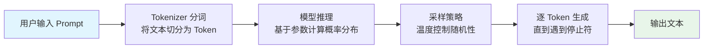
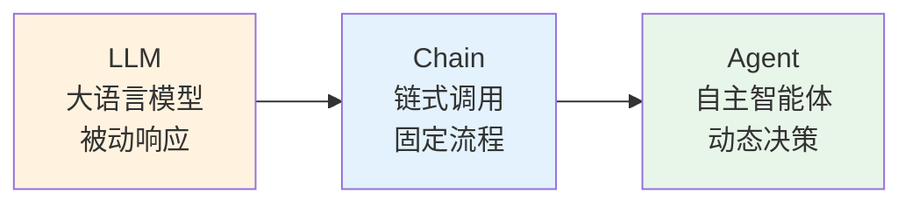
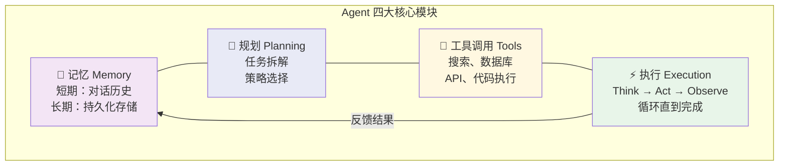
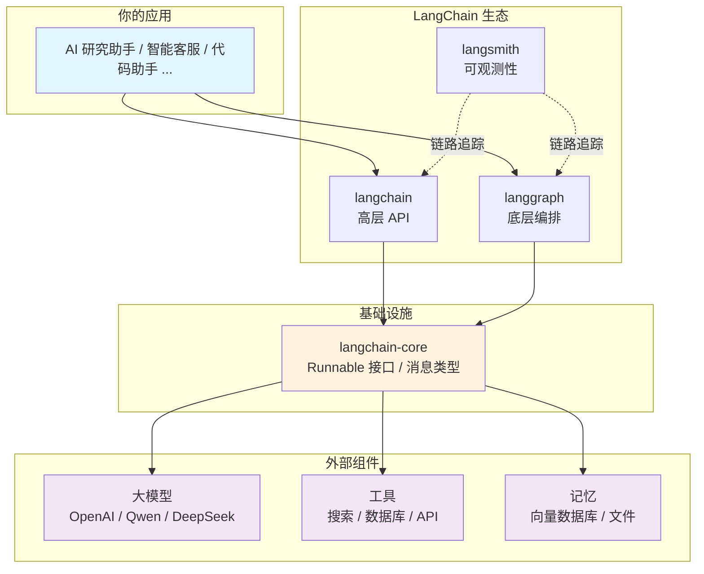

## 一、本章导学

如果你正在阅读这篇文章，大概率已经和 ChatGPT、通义千问、DeepSeek 等 AI 产品聊过天。你可能会问：既然大模型已经这么聪明了，为什么还需要学 Agent？为什么还需要 LangChain？

**因为"能聊天"和"能办事"之间，隔着一整条技术鸿沟。**
一个只会聊天的 AI，就像一个只会纸上谈兵的军师——它能给你完美的计划，但没法替你执行。而 Agent（智能体）就是那个既能思考又能动手的角色：它会自己搜索资料、调用工具、修正策略，直到任务真正完成。

本章将带你理解这条从 LLM 到 Agent 的演进之路：

- **学习目标**：理解 LLM 和 Agent 的本质区别，掌握参数、Token、温度、上下文窗口等基础概念，明白"为什么需要 LangChain"。
- **前置知识**：Python 基础语法，了解基本的命令行操作。
- **最终效果**：读完本章后，你能清晰地向别人解释 LLM 是什么、Agent 是什么、它们之间差了什么，以及 LangChain 在其中扮演什么角色。

> LangChain 在 2025 年发布了 1.0 正式版，API 全面重构，包结构大改，很多 0.x 时代的教程已经失效。本系列基于 LangChain 1.0+ 全新 API 编写，配合 LangGraph 官方编排框架，带你从 LLM 基础概念一路走到生产级 Agent 部署。无论你是刚接触 AI Agent 的新手，还是从 0.x 迁移过来的老用户，都能找到适合自己的学习路径。
>
> 本系列共 21 篇，从零系统讲解 LangChain 1.0 和 LangGraph 的核心概念与实战技巧，覆盖基础入门、核心能力、工作流编排、RAG 系统、生产实战五大板块。

---

## 二、LLM 基础概念速查
在深入 Agent 之前，先快速过一遍大模型的几个核心概念。如果你已经熟悉这些，可以跳到第三节。这里用最精简的方式帮你建立认知框架。
### 2.1 参数（Parameters）
我们经常看到 Qwen2.5-7B、DeepSeek-R1-671B 这样的命名，后面的数字代表模型拥有的参数量（B = Billion，十亿）。参数量可以理解为模型的"脑容量"——参数越大，能力越强，但所需的计算资源也越大。

|   参数量   | 适用场景                |
| :-----: | ------------------- |
|  1.5B   | 移动端轻量级任务（智能硬件、简单问答） |
|  7B-8B  | 个人开发者测试、中小企业本地部署    |
| 14B-32B | 企业级应用（文档分析、金融风控）    |
|  70B+   | 大规模云服务、复杂多模态任务      |
|         |                     |

对于学习和开发阶段，7B-8B 的模型是推荐的起点。本系列全程使用 Qwen3-8B，通过硅基流动（SiliconFlow）的 API 调用。
### 2.2 Token
Token 是大模型处理文本的基本单位，也是计费和性能衡量的通用标准。一个 Token 可以是一个中文词语、一个中文字、一个英文单词、一个数字或一个标点符号。

|维度|换算关系|
| ---------------| ----------------------------|
|中文|1 个汉字 ≈ 1-2 个 Token|
|英文|1 个英文单词 ≈ 1-2 个 Token|
|1000 字中文文章|约 1000-2000 个 Token|

Token 的生成速度直接影响用户体验：

| 速度（tokens/秒） | 用户体验          |
| :----------: | ------------- |
|     3-5      | 逐字显示，能感受到打字过程 |
|    20-30     | 接近流畅的句子生成     |
|     100+     | 大段内容喷涌而出      |

### 2.3 温度（Temperature）
温度是一个控制模型输出随机性的参数，取值范围通常在 0 到 2 之间。大模型在生成每个词时，会为所有可能的词计算一个概率分布，温度的作用就是调整这个分布的"锐度"。

|温度范围|输出特点|典型应用场景|
| :--------: | ------------------| ----------------------------|
|0 ~ 0.3|确定、一致、可重复|代码生成、事实问答、技术文档|
|0.5 ~ 0.8|自然、流畅、有创意|通用聊天、内容创作、头脑风暴|
|1.0 ~ 1.5+|高度随机、创意极强|写诗、实验性写作、艺术创作|

以"今天的天气真\_\_\_\_"为例：低温时模型几乎必定选"好"；中温时可能选"不错"或"晴朗"；高温时甚至可能蹦出"披萨"。
### 2.4 上下文窗口（Context Window）
上下文窗口是大模型单次对话能处理的最大 Token 数量，可以理解为模型的"短期记忆容量"。GPT-4 Turbo 的上下文窗口是 128K Token，Claude 3.5 达到了 200K，而一些最新模型已经突破 1M。

上下文窗口决定了两个关键能力：一是**单次输入的最大长度**（你能塞给它多少内容），二是**对话轮次的上限**（聊多少轮后它会开始"忘记"前面的内容）。
理解这四个概念后，我们来看一个完整的 LLM 工作流程：



上图展示了 LLM 从接收到用户输入到输出文本的完整过程。注意：整个过程是**单向的、无状态的**——模型不会记住上一次对话，不会主动查询外部信息，也不会执行任何操作。它只是在做一件事：根据输入预测下一个最可能的 Token。

接下来，我们看看这个"只会预测下一个词"的系统，到底有哪些做不到的事。

---

## 三、从 LLM 到 Agent 的演进

### 3.1 LLM 的本质与局限

大语言模型（Large Language Model，LLM）的核心能力是预测——给定一段输入文本（Prompt），计算下一个最可能出现的词（Token）。它本质上是一个**参数化的概率模型**，更像一个静态的"知识库 + 推理引擎"。

理解这一点很重要，因为 LLM 的所有能力和局限都源于这个本质。它能写出通顺的代码、流畅的文章、甚至模拟推理过程，但它存在三个根本性的局限：

**局限一：没有行动能力。**    LLM 只能生成文本，不能执行动作。它不能帮你搜索网页、读取文件、查询数据库、发送邮件。它的一切输出都停留在"文字"层面。

**局限二：没有持久记忆。**    每次对话都是独立的，模型不记得上一轮聊了什么（除非你把历史对话塞进 Prompt）。一旦超出上下文窗口的限制，前面的内容就会被截断遗忘。

**局限三：没有实时信息。**    模型的知识截止于训练数据的最后时间点。你问它"今天北京的天气"，它无法给出准确答案，因为它无法访问互联网。

用一个生活化的比喻：LLM 就像一位博学但被困在图书馆里的学者——他读过万卷书，能给你精彩的答案，但他出不了图书馆的门，看不到窗外的实时世界，也无法帮你寄一封信。

### 3.2 Agent：给 LLM 装上"手脚"

如果把 LLM 比作一个"超级大脑"，那么 Agent 就是给这个大脑装上了"手脚、眼睛和记忆"。Agent（智能体）是一个以 LLM 为核心推理引擎、能够自主完成复杂任务的系统。

用户说"帮我查一下北京明天的天气，然后订一张去北京的机票"。LLM 只能回答"我无法访问实时数据"，或者需要你分别写代码调用天气 API 和机票 API。而 Agent 会自己判断需要调用两个工具：先调天气工具获取信息，再调机票工具完成预订，全程自主决策。

这不是科幻，这是现在。下面这张图展示了从 LLM 到 Agent 的演进路径：



上图展示了三个阶段：LLM 只能被动响应；Chain 时代可以通过固定流程串联多个步骤；而 Agent 能够根据目标动态决策，自主选择工具和策略。

### 3.3 Agent 四大核心模块

一个完整的 Agent 系统由四大模块组成，缺一不可：


上图展示了 Agent 的四大模块及其协作关系。每个模块的职责如下：
**记忆（Memory）**   ：LLM 本身是无状态的，但 Agent 需要"记住"对话历史、中间结果和用户偏好。记忆分为两层——短期记忆（当前对话的上下文）和长期记忆（跨会话的持久化存储，如向量数据库）。

**规划（Planning）**   ：面对复杂任务，Agent 需要将目标拆解为可执行的子步骤，并选择合适的执行策略。常见的规划方法包括 ReAct（Reasoning + Acting）、Plan-and-Execute 等。

**工具调用（Tools）**   ：Agent 通过调用外部工具来突破 LLM 的能力边界。工具可以是搜索引擎、数据库查询、代码解释器、文件系统操作、第三方 API 等。LLM 的 Function Calling 能力是工具调用的基础，但 Agent 能自主判断何时调用、调用哪个工具。

**执行（Execution）**   ：Agent 遵循 Think → Act → Observe 的闭环循环执行任务。每一步都会观察执行结果，判断是否需要调整策略，直到任务完成或明确无法继续。

下面这个对比表更直观地展示了 LLM 和 Agent 在各维度的差异：

|维度|LLM|Agent|
| --------| -------------------------------------| --------------------------------------------------|
|自主性|一次性交互，用户问一句答一句|Think → Act → Observe 闭环，循环执行直到任务完成|
|工具使用|Function Calling 需要在代码层手动触发|自主判断何时调用工具，并将结果整合进推理链|
|记忆机制|受限于上下文窗口，超出即遗忘|多级记忆架构：短期记忆 + 长期持久化存储|
|交互模式|问答式（Q&A）|任务式（给定目标，自主完成）|
|输出形式|纯文本|文本 + 实际操作（搜索、查询、调用 API 等）|

理解了这些差异，你就明白为什么我们需要一个框架来桥接 LLM 和 Agent——因为从"被动响应"到"主动执行"，中间需要大量的基础设施。这就是 LangChain 的用武之地。

---

## 四、LangChain：Agent 开发的瑞士军刀

### 4.1 为什么需要 LangChain

假设你想构建一个"AI 研究助手"——它能搜索论文、总结内容、整理笔记、生成报告。如果不使用框架，你需要自己解决以下问题：

- 如何统一调用不同厂商的模型（OpenAI、Anthropic、通义千问……）？
- 如何管理对话历史和上下文窗口？
- 如何定义和注册工具，让模型知道有哪些工具可用？
- 如何实现 Think → Act → Observe 的循环逻辑？
- 如何处理工具调用的错误和重试？
- 如何追踪和调试 Agent 的执行过程？

每一个问题都需要几十到几百行代码。把这些代码抽象出来、标准化、封装成可复用的组件——这就是框架的价值。
　
**LangChain** 是一个 AI 应用开发框架，它的核心价值在于：提供标准化的接口来连接模型、工具、记忆、检索等组件，让你像搭积木一样组合出复杂的 AI 应用。**

### 4.2 LangChain 核心能力
LangChain 1.0 已经发展为一个包含多个包的生态系统：

|包名|职责|说明|
| ----| ---------------| ----------------------------------------------------------------|
|`langchain-core`|核心抽象层|定义 Runnable 接口、消息类型、工具协议等基础组件，几乎零外部依赖|
|`langchain`|高层 Agent 框架|提供 `create_agent` 等开箱即用的 API|
|`langgraph`|底层编排框架|基于有状态图精确控制每一步执行逻辑|
|`langsmith`|可观测性平台|执行链路追踪和评估能力|

一个关键的设计决策：`langgraph` 不依赖 `langchain`，它只依赖 `langchain-core`。这意味着你可以在不安装庞大 `langchain` 包的情况下，用 LangGraph 构建复杂的 AI 应用。

**选型原则**：简单场景用 LangChain 高层 API，复杂场景用 LangGraph，所有生产场景用 LangSmith 保障可观测性。


上图展示了 LangChain 生态的分层架构。你的应用通过 `langchain` 或 `langgraph` 与核心层交互，核心层再统一对接各种外部组件（模型、工具、记忆）。这种分层设计让你可以自由替换底层组件，而不影响上层业务逻辑。

### 4.3 环境准备与 API Key 配置
理论讲完了，让我们动手搭建开发环境。本系列使用 Python 3.10+，通过硅基流动（SiliconFlow）的 API 调用 Qwen3-8B 模型。

#### 注册硅基流动
注册登录硅基流动官网（https://cloud.siliconflow.cn），申请 API Key


然后在模型广场选择你需要的模型，比如 `Qwen/Qwen3-8B`


#### 安装依赖

```bash
# 创建虚拟环境（推荐）
python -m venv venv

# 激活虚拟环境
# Windows:
venv\Scripts\activate
# macOS / Linux:
source venv/bin/activate

# 安装核心包
pip install langchain langchain-core langgraph langchain-openai

# 安装环境变量管理工具
pip install python-dotenv
```

#### 配置 API Key

API Key 是调用大模型服务的凭证，**绝不能硬编码在代码里**。正确的做法是使用 `.env` 文件管理：

在项目根目录创建 `.env` 文件：

```bash
# .env 文件 — 请勿提交到 Git 仓库！
SILICONFLOW_API_KEY=sk-your-api-key-here
```

在 Python 中加载环境变量：

```python
from dotenv import load_dotenv
import os

load_dotenv()  # 加载 .env 文件中的环境变量

api_key = os.getenv("SILICONFLOW_API_KEY")
print(f"API Key 已加载: {api_key[:8]}...")  # 只显示前 8 位，确认加载成功
```

运行结果：

```
API Key 已加载: sk-xxxxxx...
```

#### 配置 .gitignore

为了防止 API Key 泄露，务必在 `.gitignore` 中添加：

```bash
# .gitignore
.env
venv/
__pycache__/
```

#### 验证环境

```python
from dotenv import load_dotenv
from langchain.chat_models import init_chat_model

load_dotenv()

model = init_chat_model(
    "Qwen/Qwen3-8B",
    model_provider="openai",
    base_url="https://api.siliconflow.cn/v1",
    temperature=0.7,
)

response = model.invoke("你好，请用一句话介绍你自己。")
print(response.content)
```

运行结果：

```
你好！我是通义千问，阿里云自主研发的大语言模型，能够理解和生成多种语言的内容，致力于为你提供有帮助的回答。
```

如果你看到类似的输出，恭喜——你的开发环境已经就绪，大模型已经能正常响应了。从下一章开始，我们将基于这个环境构建真正的 Agent 应用。

---

## 五、本章小结

回顾一下本章的核心知识点：

1. **LLM 本质上是一个参数化的概率模型**，核心能力是"预测下一个最可能的 Token"。
2. **参数量**决定模型的"脑容量"，7B-8B 是学习和开发阶段的推荐起点。
3. **Token** 是模型处理文本的基本单位，也是计费标准，1000 字中文约消耗 1000-2000 个 Token。
4. **温度**控制输出的随机性，低温适合精确任务，中温适合通用场景，高温适合创意写作。
5. **上下文窗口**是模型的"短期记忆容量"，决定了单次对话能处理的最大信息量。
6. **LLM 有三个根本局限**：没有行动能力、没有持久记忆、没有实时信息。
7. **Agent = LLM + 记忆 + 规划 + 工具调用 + 执行**，形成 Think → Act → Observe 的闭环。
8. **LangChain 是 Agent 开发框架**，提供标准化接口连接模型、工具、记忆等组件，让你专注业务逻辑。

**下章预告**：下一篇我们将正式搭建开发环境，配置 LangChain + LangGraph，编写并运行你的第一个 Agent 程序——一个能够自主调用工具、完成多步推理的智能体。

---

## 六、扩展阅读

- [LangChain 官方文档](https://python.langchain.com/) — 框架的完整 API 参考和教程
- [LangGraph 官方文档](https://langchain-ai.github.io/langgraph/) — Agent 编排框架的详细指南
- [LangSmith 平台](https://smith.langchain.com/) — Agent 执行链路追踪与评估工具
- [硅基流动（SiliconFlow）](https://siliconflow.cn/) — 本系列使用的模型 API 服务商
- [ReAct 论文：Reasoning and Acting](https://arxiv.org/abs/2210.03629) — Agent 规划策略的经典论文
- [What is an AI Agent?](https://www.langchain.com/state-of-ai-agents) — LangChain 发布的 Agent 行业报告