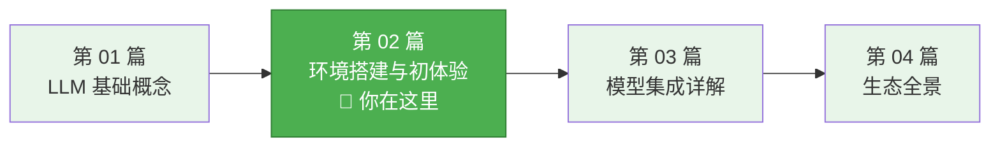
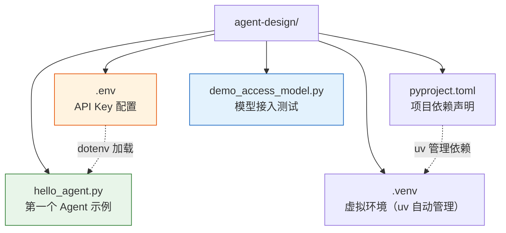
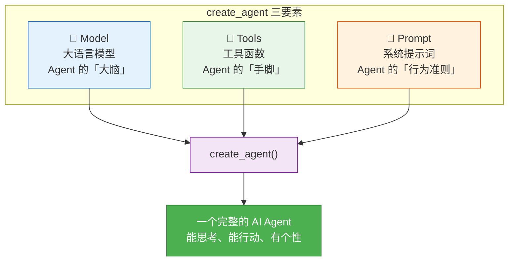
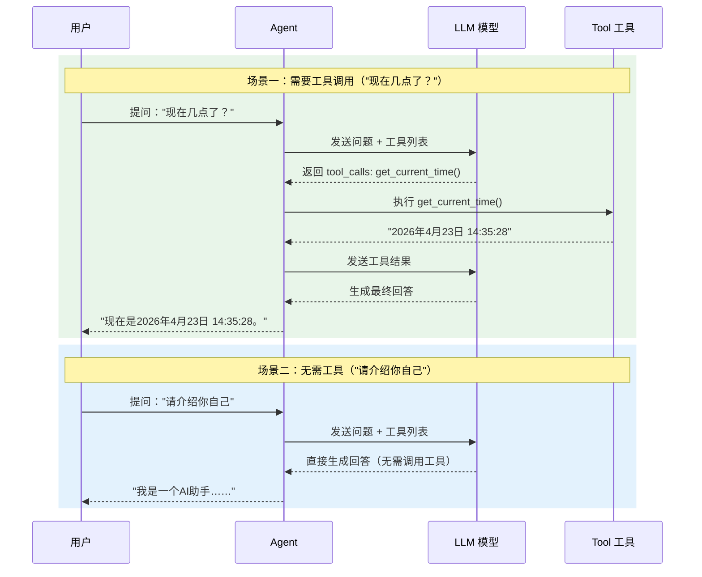

# 02-环境搭建与初体验

# 环境搭建与初体验

## 一、本章导学

　　　　欢迎来到 LangChain 实战的第一站。在上一篇中，我们理解了从 LLM 到 Agent 的演进逻辑——LLM 是"大脑"，工具是"手脚"，框架是"神经系统"。现在，我们要亲自动手搭建这条神经系统，让一个真正的 Agent 跑起来。

　　　　**学习目标**：

- 搭建完整的 LangChain 1.0 开发环境
- 理解 `create_agent` 的三要素：Model、Tools、Prompt
- 编写并运行第一个具备工具调用能力的 AI Agent

　　**前置知识**：已完成第 01 篇的学习，了解 LLM 基本概念、Token、温度参数等基础知识。

　　**最终效果**：一个能查询时间、做简单计算、自由对话的 AI Agent。



　　　　上图展示了本篇在整个系列中的位置——承上启下，是从理论走向实战的关键节点。

## 二、环境搭建

### 2.1 Python 环境准备

　　　　LangChain 1.0 要求 Python 3.10 及以上。推荐使用 Python 3.11 或 3.12，这两个版本在性能和兼容性方面表现最佳。先检查当前版本：

```bash
python --version
# 输出: Python 3.12.x
```

　　　　如果你还没有安装 Python，或者版本过低，推荐使用 **uv** 来管理。uv 是用 Rust 编写的 Python 包管理器，安装速度比传统 pip 快 10-100 倍，而且自带 Python 版本管理能力。

　　**方式一：使用 uv（推荐）**

```bash
# 安装 uv（Windows PowerShell）
powershell -ExecutionPolicy ByPass -c "irm https://astral.sh/uv/install.ps1 | iex"

# macOS / Linux
curl -LsSf https://astral.sh/uv/install.sh | sh
```

　　　　安装完成后，创建项目并初始化：

```bash
# 创建项目根目录
mkdir agent-design
cd agent-design

# 使用 uv 初始化项目
uv init

# 锁定 Python 版本
uv python pin 3.12

# 验证 Python 版本（必须使用 uv run python）
uv run python --version
# 输出: Python 3.12.x
```

　　**方式二：使用 pip + venv（传统方式）**

```bash
python -m venv langchain-env

# Windows 激活
langchain-env\Scripts\activate

# macOS / Linux 激活
source langchain-env/bin/activate
```

　　　　两种方式都可以完成环境准备，uv 在安装速度上有明显优势，长期开发更推荐使用。

### 2.2 安装 LangChain 1.0

　　　　LangChain 1.0 的包结构做了大幅精简。核心安装只需要几个包：

```bash
# 使用 uv
uv add langchain
uv add langgraph
uv add langchain-openai
uv add python-dotenv

# 使用 pip
pip install langchain langgraph langchain-openai python-dotenv
```

　　　　每个包的职责如下：

|包名|作用|是否必须|
| ----| -----------------------------------| --------|
|`langchain`|主包，提供 `create_agent` 等高层 API|✅ 必须|
|`langgraph`|图编排框架，`create_agent` 底层依赖|✅ 必须|
|`langchain-openai`|OpenAI 兼容模型的适配层|✅ 必须|
|`langchain-core`|核心抽象层（被 langchain 自动安装）|自动|
|`langchain-community`|第三方集成（搜索、计算器等）|按需|
|`python-dotenv`|从 `.env` 文件加载环境变量|✅ 推荐|

　　　　一个常见误区：很多人以为安装了 `langchain` 就能直接用 OpenAI 的模型，实际上还需要单独安装 `langchain-openai`。这是有意为之的设计——每个模型提供商的集成是独立的包，避免安装不需要的依赖。

　　　　安装完成后验证版本：

```bash
# 使用 uv
uv run python -c "import langchain; print(langchain.__version__)"

# 使用 pip
python -c "import langchain; print(langchain.__version__)"
```

```
1.2.15
```

> 确保 langchain 版本 ≥ 1.0.0，`create_agent` 是 1.0 之后的新 API。

### 2.3 API Key 配置

　　　　在开始编码之前，需要准备一个可用的大模型 API。对于国内开发者，推荐使用**硅基流动（SiliconFlow）**   平台——它是一站式大模型云服务平台，提供多种开源模型的 API 服务，学习初期可以使用免费额度，大幅降低学习成本。

#### 2.3.1 注册硅基流动并获取 API Key

　　　　注册登录[硅基流动](https://cloud.siliconflow.cn)官网，进入"API 密钥"页面，点击"创建密钥"，复制生成的 API Key。

　　　　然后在模型广场搜索 `Qwen/Qwen3-8B`，复制模型名称备用。

#### 2.3.2 配置 .env 文件

　　　　在项目根目录创建 `.env` 文件：

```env
# 替换为你的 SiliconFlow API Key
OPENAI_API_KEY=sk-YOUR_API_KEY
# SiliconFlow API 地址
OPENAI_BASE_URL=https://api.siliconflow.cn/v1
# 模型名称（从模型广场复制）
MODEL_NAME=Qwen/Qwen3-8B
```

#### 2.3.3 其他平台配置

　　　　如果你使用其他模型提供商，只需更换 `.env` 中的三个配置项，上层代码完全不用改动：

|平台|`OPENAI_BASE_URL`|`MODEL_NAME`|
| ----------| -| -|
|硅基流动|`https://api.siliconflow.cn/v1`|`Qwen/Qwen3-8B`|
|DeepSeek|`https://api.deepseek.com`|`deepseek-chat`|
|阿里云百炼|`https://dashscope.aliyuncs.com/compatible-mode/v1`|`qwen-plus`|
|OpenAI|`https://api.openai.com/v1`|`gpt-4o`|

> 安全提示：永远不要把 API Key 硬编码在代码中。`.env` 文件应加入 `.gitignore`，避免提交到版本控制。

　　　　下图展示了完整的项目目录结构：



　　　　如上图所示，项目结构非常简洁：`.env` 管理密钥，`pyproject.toml` 声明依赖，Python 脚本实现功能。uv 会根据 `pyproject.toml` 自动在 `.venv` 中管理虚拟环境。

## 三、create_agent 三要素

　　　　`create_agent` 是 LangChain 1.0 提供的新一代智能体构建 API。创建一个 Agent 只需要三个要素：**Model（模型）、Tools（工具）、Prompt（提示词）**  。它们之间的关系如下：



　　　　上图揭示了 `create_agent` 的核心设计哲学——**三要素正交组合**。你可以独立地替换模型、增减工具、调整提示词，而不影响其他部分。这种解耦设计使得 Agent 的迭代和维护变得非常灵活。

### 3.1 Model：选择大模型

　　　　Model 是 Agent 的"大脑"，负责理解用户意图、决定是否调用工具、生成最终回答。LangChain 通过 `ChatOpenAI` 类（或 `init_chat_model` 函数）统一了不同模型提供商的接口。

```python
from langchain_openai import ChatOpenAI
from dotenv import load_dotenv
import os

load_dotenv()

model = ChatOpenAI(
    api_key=os.getenv("OPENAI_API_KEY"),
    base_url=os.getenv("OPENAI_BASE_URL"),
    model=os.getenv("MODEL_NAME"),
    temperature=0.7,
)
```

　　　　这里的关键设计在于：`ChatOpenAI` 兼容所有 OpenAI API 格式的模型。通过 `base_url` 参数，我们将请求指向硅基流动，而不是 OpenAI 官方。这就是为什么前面说"切换提供商只需改 `.env`，代码不动"。

　　　　先用一个简单的脚本测试模型是否接入成功，创建 `demo_access_model.py`：

```python
# -*- encoding: utf-8 -*-
'''
@File        :   demo_access_model.py
@Time        :   2026/04/25 19:10:03
@Author      :   xcy.小相 
@Version     :   1.0
@Description :   02-环境搭建与初体验
'''

from langchain_openai import ChatOpenAI
from dotenv import load_dotenv
import os

# 加载环境变量
load_dotenv()

# 接入大模型
model = ChatOpenAI(
    api_key=os.getenv("OPENAI_API_KEY"),
    base_url=os.getenv("OPENAI_BASE_URL"),
    model=os.getenv("MODEL_NAME"),
    temperature=0.7,
)

response = model.invoke("你好,请用一句话介绍你自己")
print(f"类型: {type(response).__name__}")
print(f"内容: {response.content}")
print(f"Token 用量: {response.usage_metadata}")
```

　　运行结果：

```bash
 ➜ uv run demo_access_model.py
类型: AIMessage
内容: 我是一个AI助手，具备多领域知识和学习能力，能够帮助您解答问题、完成任务并提供个性化支持。
Token 用量: {'input_tokens': 15, 'output_tokens': 243, 'total_tokens': 258, 'input_token_details': {'cache_read': 0}, 'output_token_details': {'reasoning': 216}}
模型信息: {'token_usage': {'completion_tokens': 243, 'prompt_tokens': 15, 'total_tokens': 258, 'completion_tokens_details': {'accepted_prediction_tokens': None, 'audio_tokens': None, 'reasoning_tokens': 216, 'rejected_prediction_tokens': None}, 'prompt_tokens_details': {'audio_tokens': None, 'cached_tokens': 0}, 'prompt_cache_hit_tokens': 0, 'prompt_cache_miss_tokens': 15}, 'model_provider': 'openai', 'model_name': 'Qwen/Qwen3-8B', 'system_fingerprint': '', 'id': '019dc45d708ff7f03c49fba376165942', 'finish_reason': 'stop', 'logprobs': None} 
```

　　　　模型的返回类型是 `AIMessage` 对象。`content` 是文本输出内容，`usage_metadata` 包含 Token 使用统计，`response_metadata` 包含模型提供商等详细信息。这些元数据为监控 Agent 行为、分析成本提供了基础。

　　　　`temperature` 参数控制输出随机性：工具调用场景建议 0-0.3（确保准确性），日常对话建议 0.5-0.7（平衡创意和一致），创意写作可以设 1.0+。

### 3.2 Tools：定义工具

　　　　Tools 是 Agent 的"手脚"，让它能执行具体动作——查询时间、搜索网页、读取文件等。LangChain 通过 `@tool` 装饰器将普通 Python 函数变成 Agent 可调用的工具。

```python
from langchain.tools import tool

@tool
def get_current_time() -> str:
    """获取当前的日期和时间。当用户询问现在几点、今天几号时使用此工具。"""
    from datetime import datetime
    now = datetime.now()
    return now.strftime("%Y年%m月%d日 %H:%M:%S")

@tool
def add_numbers(a: int, b: int) -> int:
    """将两个整数相加并返回结果。当用户需要做加法计算时使用此工具。"""
    return a + b
```

　　　　定义工具有三个关键点：

1. **​**​ **​`@tool`​**​**​** ** 装饰器**：将普通函数注册为 LangChain Tool
2. **docstring（函数文档字符串）**  ：这是模型理解工具用途的**唯一信息来源**——它决定了模型在什么场景下会调用这个工具。写清楚"什么时候用"比"怎么用"更重要
3. **类型注解**：参数和返回值的类型注解（如 `a: int`, `-> str`）告诉模型和框架这个工具接收什么参数、返回什么数据

　　　　关于工具的更多高级用法（多参数、嵌套工具、MCP 协议等），我们会在第 05 篇深入展开。

### 3.3 Prompt：系统提示词

　　　　Prompt 是 Agent 的"行为准则"，通过 `system_prompt` 参数设定。它定义了 Agent 的角色定位、回复风格和能力边界。

```python
system_prompt = "你是一个友好且乐于助人的AI助手。请用中文回答问题。当可以使用工具时，优先使用工具获取准确信息。"
```

　　　　系统提示词的基础用法很直接——用自然语言描述 Agent 应该怎么做。但提示词工程远不止于此：角色设定、输出格式约束、防幻觉策略、多步骤任务分解……这些高级技巧我们会在第 07 篇专门讲解。

　　　　目前只需记住一个原则：**提示词越具体，Agent 的行为越可预测**。一个好的提示词至少应包含角色定位和能力说明。

## 四、代码实战：第一个 Agent

　　　　环境准备好了，三要素也理解了，现在把它们组合起来，创建一个完整的 AI Agent。

### 4.1 最简 Agent

　　　　先从最简单的开始——一个没有工具的纯对话 Agent：

```python
import os
from dotenv import load_dotenv
from langchain_openai import ChatOpenAI
from langchain.agents import create_agent

load_dotenv()

model = ChatOpenAI(
    api_key=os.getenv("OPENAI_API_KEY"),
    base_url=os.getenv("OPENAI_BASE_URL"),
    model=os.getenv("MODEL_NAME"),
)

agent = create_agent(
    model=model,
    tools=[],
    system_prompt="你是一个友好的AI助手，用中文回答问题。",
)

result = agent.invoke({"messages": [{"role": "user", "content": "你好，请介绍一下你自己"}]})
print(result["messages"][-1].content)
```

　　运行结果：

```bash
➜  uv run hello_agent.py
你好！我是一个AI助手，可以帮你回答各种问题、提供建议和进行对话。有什么我能帮你的吗？
```

　　　　没有工具的 Agent 本质上就是一个增强版的聊天机器人——它受系统提示词约束，但没有"行动"能力。接下来，我们加上工具。

### 4.2 添加工具的 Agent

　　　　创建文件 `hello_agent.py`，这是一个完整的、可直接复制运行的 Agent 示例：

```python
# -*- encoding: utf-8 -*-
'''
@File        :   hello_agent.py
@Time        :   2026/04/25 22:48:20
@Author      :   xcy.小相 
@Version     :   1.0
@Description :   02-环境搭建与初体验
'''

import os
from dotenv import load_dotenv
from langchain_openai import ChatOpenAI
from langchain.agents import create_agent
from langchain.tools import tool

# 加载环境变量
load_dotenv()

# 定义工具函数
@tool
def get_current_time()->str:
    """获取当前的日期和时间。当用户询问现在几点、今天几号时使用此工具。"""
    from datetime import datetime
    return datetime.now().strftime("%Y-%m-%d %H:%M:%S")

@tool
def add_numbers(a:int,b:int)->int:
    """将两个整数相加并返回结果。当用户需要做加法计算时使用此工具。"""
    return a+b

tools = [get_current_time,add_numbers]

# 初始化大模型
model= ChatOpenAI(
    api_key=os.getenv("OPENAI_API_KEY"),
    base_url=os.getenv("OPENAI_BASE_URL"),
    model=os.getenv("MODEL_NAME"),
    temperature=0.7,
)

# 创建智能体
agent = create_agent(
    model=model,
    tools=tools,
    system_prompt="你是一个友好且乐于助人的AI助手。请用中文回答问题。"
    )

questions = [
        "现在几点了？",
        "帮我算一下 387 + 624 的和等于多少？",
        "介绍一下你自己",
]

for question in questions:
    print(f"\n{'='*60}")
    print(f"用户: {question}")
    response = agent.invoke({"messages":[{"role":"user","content":question}]})
    # 打印最新一条回复内容
    ai_message = response["messages"][-1]
    print(f"助手: {ai_message.content}")
```

　　　　代码解析：

1. **导入部分**：`ChatOpenAI`（模型适配器）、`@tool`（工具装饰器）、`create_agent`（Agent 构建 API）
2. **工具定义**：两个简单工具——`get_current_time` 返回当前时间，`add_numbers` 做加法
3. **Agent 创建**：将三要素（model、tools、system_prompt）传入 `create_agent`
4. **调用方式**：`agent.invoke()` 接收包含 `messages` 的字典，返回完整的消息历史
5. **结果提取**：`result["messages"][-1].content` 获取最后一条 AI 消息的文本内容

### 4.3 运行效果展示

```bash
➜ uv run hello_agent.py

============================================================
用户: 现在几点了？
助手: 现在是23点37分55秒。您需要我帮您做些什么吗？

============================================================
用户: 帮我算一下 387 + 624 的和等于多少？
助手: 387加上624等于1011。

============================================================
用户: 介绍一下你自己
助手: 你好！我是一个由通义实验室开发的AI助手，名叫Qwen，基于强大的Qwen模型构建。我的设计目标是成为你的得力伙伴，无论是回答问题、创作文字，还是进行逻辑推理和数学计算，都能提供帮助。比如，我可以帮你查询当前时间，或者计算两个数的和。如果遇到需要调用工具的情况，我会明确提示并使用相应的功能来协助你。有什么问题或需要帮助的地方吗？😊
```

　　　　注意观察三个问题的不同行为：前两个问题触发了工具调用（时间查询、加法计算），第三个是纯对话。Agent **自动判断**了哪些问题需要调用工具——这就是 **ReAct（Reasoning + Acting）模式的核心能力**。

　　　　下图展示了用户与 Agent 之间的完整交互流程：



　　　　上图清晰地展示了 Agent 的两种决策路径：当模型判断需要工具时，执行"思考→调用→整合"的三步循环；当判断不需要工具时，直接生成回答。这个决策过程完全由模型自主完成。

#### 4.3.1 查看完整的消息链路

　　　　如果想深入了解 Agent 的内部思考过程，可以遍历 `result["messages"]`：

```python
result = agent.invoke({"messages": [{"role": "user", "content": "现在几点了？"}]})

for msg in result["messages"]:
    print(f"类型: {type(msg).__name__}")
    print(f"内容: {msg.content}")
    if hasattr(msg, "tool_calls") and msg.tool_calls:
        print(f"工具调用: {msg.tool_calls}")
    print("---")
```

　　运行结果：

```
类型: HumanMessage
内容: 现在几点了？
---
类型: AIMessage
内容:
工具调用: [{'name': 'get_current_time', 'args': {}, 'id': 'call_abc123'}]
---
类型: ToolMessage
内容: 2026年4月23日 14:35:28
---
类型: AIMessage
内容: 现在是2026年4月23日 14:35:28。
---
```

　　　　这就是 Agent 的完整思考链路：`HumanMessage`（用户问题）→ `AIMessage`（含 tool_calls，模型决定调用工具）→ `ToolMessage`（工具执行结果）→ `AIMessage`（最终回答）。LangChain 自动管理了这个消息链路的传递，开发者只需关注工具定义和结果获取。

#### 4.3.2 流式输出

　　　　在实际应用中，等待 Agent 完成全部思考再返回结果可能会让用户等很久。LangChain 提供了流式输出来解决这个问题：

```python
# 值流模式：逐步显示每个执行步骤
for step in agent.stream(
    {"messages": [{"role": "user", "content": "现在几点了？"}]},
    stream_mode="values"
):
    step["messages"][-1].pretty_print()

# 消息流模式：逐 Token 输出最终响应
for token, metadata in agent.stream(
    {"messages": [{"role": "user", "content": "现在几点了？"}]},
    stream_mode="messages"
):
    print(token.content, end="")
```

　　　　两种模式的区别：**值流模式**（values）在每个执行步骤完成后输出中间数据，适合调试和观察决策过程；**消息流模式**（messages）逐 Token 输出最终响应，适合面向用户的聊天界面。在实际开发中，面向用户推荐消息流模式，调试阶段推荐值流模式。

## 五、常见陷阱与调试

　　　　环境搭建和 Agent 开发中有一些常见的"坑"，本节汇总了最常遇到的几个问题及解决方案。

### 5.1 API Key 配置错误

　　**症状**：`openai.AuthenticationError: Incorrect API key provided`

　　　　这是最常见的入门问题。排查步骤：

```python
import os
from dotenv import load_dotenv
load_dotenv()

key = os.getenv("OPENAI_API_KEY")
print(f"API Key 是否加载: {key is not None}")
print(f"API Key 前6位: {key[:6] if key else 'None'}")
```

　　　　常见原因：

- `.env` 文件不在项目根目录（与 `.py` 文件同级）
- 环境变量名拼写错误（应该是 `OPENAI_API_KEY`，不是 `OPENAI_KEY` 或 `API_KEY`）
- API Key 前后有多余的空格或引号（`.env` 文件中值不需要加引号）
- `load_dotenv()` 忘记调用

　　正确的 `.env` 写法（注意没有引号、没有空格）：

```env
OPENAI_API_KEY=sk-abc123def456
OPENAI_BASE_URL=https://api.siliconflow.cn/v1
MODEL_NAME=Qwen/Qwen3-8B
```

### 5.2 包版本冲突

　　**症状**：`ImportError: cannot import name 'create_agent' from 'langchain.agents'`

　　　　`create_agent` 是 LangChain 1.0 的新 API，旧版本中没有。检查并升级：

```bash
pip show langchain langgraph langchain-core
pip install --upgrade langchain langgraph langchain-openai langchain-core
```

　　　　版本兼容性要求：`langchain >= 1.0.0`、`langgraph >= 0.4.0`、`langchain-openai >= 0.3.0`。如果你之前安装过 `langchain` 的 0.x 版本，建议先卸载再重装：

```bash
pip uninstall langchain langchain-core langgraph
pip install langchain langgraph langchain-openai python-dotenv
```

### 5.3 模型名称写错

　　**症状**：`openai.NotFoundError: The model xxx does not exist`

　　　　模型名称必须与平台上的完全一致，包括大小写和斜杠。建议直接从平台的模型广场复制模型名称，避免手动输入出错。

### 5.4 工具没有被调用

　　**症状**：Agent 直接回答了问题，但没有调用定义的工具。

　　　　可能原因：

- **docstring 不够清晰**：模型不知道什么时候该用这个工具。比如 `"""获取时间"""` 比 `"""获取当前的日期和时间。当用户询问现在几点、今天几号时使用此工具。"""` 效果差很多
- **模型不支持 Tool Calling**：部分小模型（< 3B）可能不支持工具调用功能，建议使用 7B 以上的模型
- **问题本身不需要工具**：如果用户问"你好"，Agent 不调用工具直接回答是正确行为

### 5.5 网络连接问题（国内用户）

　　**症状**：`openai.ConnectionError` 或请求超时

　　　　如果你使用硅基流动等国内平台，通常不会有网络问题。但如果直接调用 OpenAI 官方 API，需要确保网络连通。解决方案：

- 使用国内聚合平台（硅基流动、阿里云百炼等）
- 使用本地模型（如 Ollama），完全不需要外网

## 六、本章小结

　　　　本章完成了从零到一的全过程：

　　**核心知识点回顾**：

1. **环境搭建**：使用 uv 或 pip 安装 `langchain`、`langgraph`、`langchain-openai`，通过 `.env` 文件管理 API Key
2. **create_agent 三要素**：Model（大脑）+ Tools（手脚）+ Prompt（行为准则），三者正交组合，可独立替换
3. **工具定义**：`@tool` 装饰器 + 清晰的 docstring + 类型注解，是定义工具的三个关键
4. **Agent 调用**：`invoke()` 同步调用、`stream()` 流式输出，消息链路 `HumanMessage → AIMessage → ToolMessage → AIMessage`
5. **常见陷阱**：API Key 配置、包版本冲突、模型名称拼写、工具 docstring 质量

　　**下章预告**：第 03 篇将带你鸟瞰 LangChain 1.0 的生态系统——七大核心组件、包结构精简、0.x 到 1.0 的迁移要点，以及 LangChain 与 LangGraph 的关系与分工。

## 七、扩展阅读

- [LangChain 官方文档 - create_agent](https://python.langchain.com/docs/how_to/create_agent/)
- [LangChain 官方文档 - Chat Models](https://python.langchain.com/docs/integrations/chat/)
- [硅基流动模型广场](https://cloud.siliconflow.cn/models)
- [uv 官方文档](https://docs.astral.sh/uv/)
- [LangChain AIMessage 字段参考](https://reference.langchain.com/python/langchain-core/messages/ai/AIMessage)
