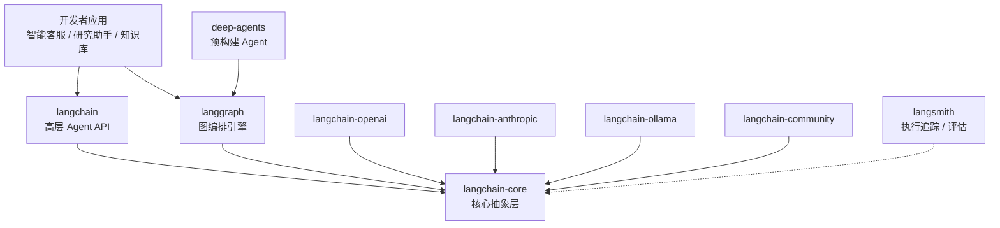
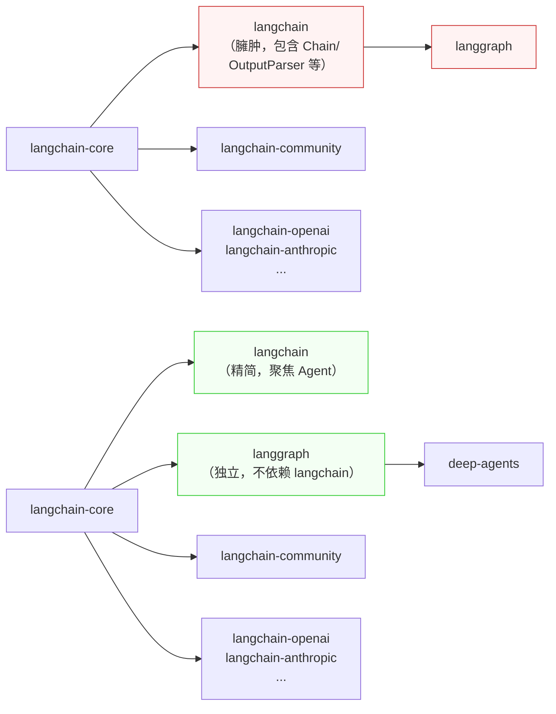
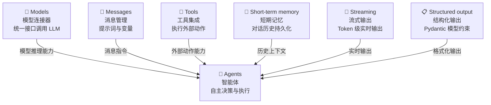

# 03-生态全景与迁移指南

# 生态全景与迁移指南

## 一、本章导学

### 1.1 学习目标

　　　　通过本章的学习，你将：

- 理解 LangChain 1.0 生态系统的全貌，包括七个核心组件和包结构设计
- 掌握 LangChain 从 0.x 到 1.0 的关键变化，建立版本迁移的清晰认知
- 了解 `init_chat_model` 统一接口的设计思想，为下一章实战打下基础
- 了解 LangChain 与 LangGraph 在 1.0 时代的关系与分工

### 1.2 前置知识

　　　　本章假设你已经阅读了本系列的前两篇文章：

- **第 01 篇**：了解 LLM 的本质（Token、参数、温度）、LLM 与 Agent 的区别
- **第 02 篇**：完成开发环境搭建（Python 3.11+、uv 包管理、LangChain 安装）

　　　　如果你已经具备以上基础，可以直接开始本章。

### 1.3 最终效果

　　　　学完本章后，你将理解整个 LangChain 1.0 的包架构、七个核心组件的设计逻辑，以及从 0.x 迁移到 1.0 的关键要点，为后续深入学习每个组件打下基础。

## 二、LangChain 1.0 生态全景

　　　　LangChain 1.0 于 2025 年 10 月 23 日正式发布，标志着这个框架从"快速迭代的原型工具"正式迈入"生产级稳定框架"。1.0 版本的核心变化是：聚焦智能体（Agent）开发，精简包结构，引入标准化接口。

　　　　在深入组件之前，先通过一张全景图了解 LangChain 1.0 的生态全貌。

### 2.1 生态全景图

　　　　下图展示了 LangChain 1.0 的完整生态系统，包括核心框架、编排引擎、模型集成、可观测性平台以及预构建 Agent 等多个层次：



　　　　上图描述了 LangChain 1.0 生态系统的分层架构。最底层是 `langchain-core` 核心抽象层，定义了所有组件共享的接口协议。中间是框架层（langchain + langgraph）和集成层（各厂商适配包）。最上层是应用层（deep-agents 和开发者自己构建的应用）。LangSmith 作为可观测性平台贯穿所有层次。

### 2.2 包结构精简：从 0.x 到 1.0

　　　　LangChain 让开发者最头疼的问题之一就是依赖包关系——在 0.x 时代，包的命名空间混乱、职责重叠，开发者经常搞不清应该 `import` 哪个包。

#### 2.2.1 0.x 时代的包结构

　　　　在 LangChain 0.x 时代，开发者需要面对以下包：

```
langchain                    # 主包，包含几乎所有功能
├── langchain-core           # 核心抽象（后来拆分出来）
├── langchain-community      # 社区集成（从主包拆出）
├── langchain-experimental   # 实验性功能
├── langchain-openai         # OpenAI 集成
├── langchain-anthropic      # Anthropic 集成
├── langchain-google         # Google 集成
├── langchain-mistral        # Mistral 集成
├── ...更多厂商包
└── langgraph                # 图编排引擎
```

　　　　问题在于：`langchain` 主包既包含高层 API（如 `AgentExecutor`），又包含大量历史遗留功能（如各种 Chain、Output Parser），体积臃肿，加载缓慢。开发者经常遇到 `from langchain.chat_models import ChatOpenAI` 和 `from langchain_openai import ChatOpenAI` 哪个才对的问题。

#### 2.2.2 1.0 时代的包结构

　　　　LangChain 1.0 对包的命名空间进行了大幅精简，聚焦于智能体开发的核心构建模块：

|模块|核心内容|说明|
| ----| ------------------| ------------------|
|`langchain.agents`|`create_agent`、`AgentState`|智能体创建核心功能|
|`langchain.messages`|消息类型、内容块、`trim_messages`|从 `langchain-core` 重新导出|
|`langchain.tools`|`@tool`、`BaseTool`、注入工具类|从 `langchain-core` 重新导出|
|`langchain.chat_models`|`init_chat_model`、`BaseChatModel`|统一模型初始化接口|
|`langchain.embeddings`|`Embeddings`、`init_embeddings`|嵌入模型管理|

```python
from langchain.agents import create_agent
from langchain.messages import AIMessage, HumanMessage
from langchain.tools import tool
from langchain.chat_models import init_chat_model
from langchain.embeddings import init_embeddings
```

　　　　这些模块大多从 `langchain-core` 重新导出，为开发者提供了专注而统一的智能体开发接口。旧的导入路径虽然很多仍然可用（通过兼容层），但官方推荐使用上表中的新路径。

#### 2.2.3 包依赖关系

　　　　下图对比了 0.x 和 1.0 两个版本的核心包依赖关系：



　　　　上图清晰地展示了两个版本的架构差异：0.x 中 `langgraph` 依赖 `langchain`，导致图编排也必须引入庞大的主包；1.0 中 `langgraph` 只依赖 `langchain-core`，可以独立使用。同时 `langchain` 主包瘦身，聚焦 Agent 开发。

### 2.3 七大核心组件

　　LangChain 官方将 AI 应用开发拆解为 七个核心组件。每个组件专注一项能力，可独立使用，也可自由组合。下图展示了核心组件之间的关系：



　　上图描述了 LangChain 1.0 核心组件的关系：Agent 处于中心位置，七个核心组件（Models、Messages、Tools、Short-term memory、Streaming、Structured output、Agents）围绕智能体开发提供能力支持。Retrieval（RAG）等能力作为进阶模块，在需要时集成。

> 在 LangChain 0.x 时代，官方文档将组件划分为六大类（Models、Prompts、Tools、Memory、Retrieval、Agents）。1.0 版本发布后，官方重新定义了核心组件：将 Messages（消息管理）、Streaming（流式输出）和 Structured output（结构化输出）提升为核心组件，将 Retrieval 移至进阶能力。同时 Prompts 不再作为独立核心组件，其功能融入 Messages 体系。

#### 2.3.1 Models：模型连接器

　　　　Models 是整个框架的入口。它提供统一的接口来连接各种大模型——无论你用的是 OpenAI、Anthropic 还是本地部署的开源模型，LangChain 都用同一种方式调用。切换模型只需改一行配置，上层业务代码完全不变。

```python
from langchain.chat_models import init_chat_model

# 伪代码示例
gpt_model = init_chat_model("gpt-4o")
claude_model = init_chat_model("claude-sonnet-4-20250514")
qwen_model = init_chat_model("qwen3-8b", model_provider="openai")

response = qwen_model.invoke("什么是 RAG？")
print(response.content)
```

```bash
# 运行结果示例
RAG（Retrieval-Augmented Generation，检索增强生成）是一种将信息检索与大语言模型相结合的技术...
```

#### 2.3.2 Messages：消息管理

　　　　Messages 模块负责管理对话中的所有消息类型——SystemMessage（系统指令）、HumanMessage（用户输入）、AIMessage（模型回复）、ToolMessage（工具执行结果）。它统一了不同角色消息的创建、序列化和传递，是 Agent 与 LLM 交互的基础数据结构。

```python
from langchain.messages import HumanMessage, AIMessage, SystemMessage, ToolMessage

# 构建对话消息列表
messages = [
    SystemMessage(content="你是一个 Python 编程助手。"),
    HumanMessage(content="如何读取一个 JSON 文件？"),
    AIMessage(content="可以使用 Python 的 json 模块..."),
]
```

　　消息管理还提供了实用工具函数，如 trim_messages 用于控制上下文长度，防止超出模型的上下文窗口：　　

```python
from langchain.messages import trim_messages

# 按最大 Token 数裁剪消息历史
trimmed = trim_messages(
    messages,
    max_tokens=4000,
    strategy="last",  # 保留最近的消息
    token_counter=len,  # 实际应用中可用 tiktoken 等 Token 计数器
)
```

> 关于 Prompts：在 0.x 时代，Prompts（提示词模板）是独立的核心组件。1.0 中，提示词模板（如 ChatPromptTemplate）仍然可用，但其功能已融入 Messages 体系。你仍然可以通过 ChatPromptTemplate.from_messages() 创建带变量的动态提示词，但它本质上是消息列表的工厂。

#### 2.3.3 Tools：工具集成

　　　　Tools 模块让 Agent 能够执行动作。通过 `@tool`​ 装饰器，任何 Python 函数都可以变成 Agent 可调用的工具。工具的 **docstring** 是模型理解工具用途的关键信息来源——**它决定了模型在什么场景下会选择调用这个工具**。

```python
from langchain.tools import tool

# 伪代码示例
@tool
def search_web(query: str) -> str:
    """搜索网页获取最新信息。"""
    return f"搜索结果：关于'{query}'的最新信息..."

@tool
def calculate(expression: str) -> str:
    """计算数学表达式的结果。"""
    return str(eval(expression))
```

#### 2.3.4 Memory：记忆机制

　　　　Memory 模块赋予 Agent "记忆力"。LLM 本身是无状态的，每次调用都是独立的。Memory 通过 Checkpointer 机制存储对话历史，并在下次调用时自动加载，让 Agent 能记住之前说过的话。

```python
from langgraph.checkpoint.memory import InMemorySaver
from langchain.agents import create_agent

# 伪代码示例
checkpointer = InMemorySaver()
agent = create_agent(model, tools, checkpointer=checkpointer)

agent.invoke(
    {"messages": [{"role": "user", "content": "我叫张三"}]},
    config={"configurable": {"thread_id": "user-1"}}
)

agent.invoke(
    {"messages": [{"role": "user", "content": "我叫什么？"}]},
    config={"configurable": {"thread_id": "user-1"}}
)
```

```bash
# 运行结果示例
你叫张三。
```

　　　　通过 thread_id 实现会话隔离，不同用户或不同对话线程互不干扰。除了内存后端，还支持 SQLite、PostgreSQL 等持久化方案。

#### 2.3.5 Streaming：流式输出

　　Streaming 让 Agent 能够逐 Token 输出内容，而不是等全部生成完毕再返回。这对于提升用户体验至关重要——用户可以实时看到 AI 的回复过程，而不是面对一个长时间的空白等待。

```python
# 同步流式输出
for chunk in agent.stream({"messages": [{"role": "user", "content": "解释量子计算"}]}):
    print(chunk["messages"][-1].content, end="", flush=True)

# 异步流式输出
async for chunk in agent.astream({"messages": [{"role": "user", "content": "解释量子计算"}]}):
    print(chunk["messages"][-1].content, end="", flush=True)
```

　　流式输出也支持 stream_mode 参数来控制输出粒度：

```python
# "values" 模式：每次输出完整的 state 快照
for state in agent.stream(input, stream_mode="values"):
    print(state)

# "messages" 模式：逐条消息输出（包括工具调用过程）
for msg in agent.stream(input, stream_mode="messages"):
    print(msg)
```

#### 2.3.6 Agents：智能体

　　　　Agents 是前五个组件的"集成器"。它以 LLM 为推理引擎，自主决策调用哪些工具、如何组织回答，形成 Think → Act → Observe 的闭环。Chain 中的执行步骤是预先定义的，但 Agent 中的执行步骤是模型自己决定的。

```python
from langchain.agents import create_agent

# 伪代码示例
agent = create_agent(
    model="qwen3-8b",
    tools=[search_web, calculate],
    system_prompt="你是一个研究助手，可以搜索信息和进行计算。"
)

result = agent.invoke({
    "messages": [{"role": "user", "content": "帮我查一下Python的最新版本"}]
})
```

### 2.4 LangChain 与 LangGraph 的关系

　　　　在 1.0 时代，两者的定位发生了重要变化。**LangChain 的智能体构建于 LangGraph 之上**——`create_agent` 实际上是 `create_react_agent` 的高级封装。可以这样理解两者的分工：

- **LangChain**：提供预构建的快速路径，用几行代码创建一个 Agent
- **LangGraph**：提供完全控制的自定义路径，用图结构精确编排每一步逻辑

　　　　选择原则：需要快速构建智能体用 LangChain，需要精确控制执行流程用 LangGraph。一个关键设计：`langgraph` 不依赖 `langchain`，只依赖 `langchain-core`。这意味着你可以在不安装庞大 `langchain` 包的情况下，用 LangGraph 构建复杂应用。

## 三、0.x → 1.0 迁移指南

　　　　如果你有基于 LangChain 0.x 开发的项目，或者阅读过基于 0.x 的教程资料，本节将帮助你快速了解关键变化，完成迁移。LangChain 官方提供了完整的迁移指南，同时将旧版功能整体迁移至 `langchain-classic` 模块以保证向后兼容。

### 3.1 包名变化

　　　　下表列出了 0.x 到 1.0 的主要包名和命名空间变化：

|0.x 导入路径|1.0 导入路径|变化说明|
| ------------| ------------| ----------------------------------------|
|`from langchain.chat_models import ChatOpenAI`|`from langchain.chat_models import init_chat_model`|统一用 `init_chat_model` 工厂函数|
|`from langchain.llms import OpenAI`|已废弃|LLM 类已废弃，统一使用 Chat Model|
|`from langchain.chains import LLMChain`|已废弃|Chain 模式被 LCEL 管道和 Agent 取代|
|`from langchain.chains import RetrievalQA`|已废弃|用 LangGraph 图或 Agent + Retriever 替代|
|`from langchain.agents import AgentExecutor`|`from langchain.agents import create_agent`|Agent 构建方式完全重构|
|`from langchain.agents import initialize_agent`|`from langchain.agents import create_agent`|API 名变更|
|`from langchain.agents import create_tool_calling_agent`|`from langchain.agents import create_agent`|合并为统一接口|
|`from langchain.prompts import PromptTemplate`|`from langchain.prompts import ChatPromptTemplate`|推荐使用 Chat 版本|
|`from langchain.memory import ConversationBufferMemory`|`from langgraph.checkpoint.memory import InMemorySaver`|记忆机制迁移到 Checkpointer|
|`from langchain.schema import HumanMessage`|`from langchain.messages import HumanMessage`|命名空间调整|
|`from langchain.tools import Tool`|`from langchain.tools import tool`|推荐使用装饰器方式定义工具|
|`from langchain.output_parsers import PydanticOutputParser`|`create_agent(response_format=...)`|结构化输出集成到 Agent|

### 3.2 API 变化

#### 3.2.1 模型初始化：从直接实例化到统一工厂

　　　　0.x 时代，每个模型提供商需要安装对应的包并使用各自的类：

```python
# 0.x 写法 —— 每个厂商一个类
from langchain_openai import ChatOpenAI
from langchain_anthropic import ChatAnthropic

openai_model = ChatOpenAI(model="gpt-4o", api_key="sk-...")
anthropic_model = ChatAnthropic(model="claude-sonnet-4-20250514", api_key="sk-ant-...")
```

```python
# 1.0 写法 —— 统一工厂函数
from langchain.chat_models import init_chat_model

model = init_chat_model("gpt-4o", api_key="sk-...")
model = init_chat_model("claude-sonnet-4-20250514", api_key="sk-ant-...")
model = init_chat_model("qwen3-8b", model_provider="openai")
```

#### 3.2.2 Agent 构建：从 AgentExecutor 到 create_agent

　　　　0.x 时代构建 Agent 需要多个步骤——创建提示词模板、定义 Agent、包装成 AgentExecutor：

```python
# 0.x 写法 —— 繁琐的多步构建
from langchain.agents import create_tool_calling_agent, AgentExecutor
from langchain.prompts import ChatPromptTemplate

prompt = ChatPromptTemplate.from_messages([
    ("system", "你是一个助手"),
    ("user", "{input}"),
    ("placeholder", "{agent_scratchpad}"),
])
agent = create_tool_calling_agent(model, tools, prompt)
executor = AgentExecutor(agent=agent, tools=tools)
result = executor.invoke({"input": "你好"})
```

```python
# 1.0 写法 —— 一行搞定
from langchain.agents import create_agent

agent = create_agent(model="qwen3-8b", tools=tools, system_prompt="你是一个助手")
result = agent.invoke({"messages": [{"role": "user", "content": "你好"}]})
```

　　　　注意输入格式也变了：0.x 使用 `{"input": "..."}` 字典，1.0 使用 `{"messages": [...]}` 消息列表。

#### 3.2.3 记忆机制：从 Memory 类到 Checkpointer

　　　　0.x 使用 Memory 类管理对话历史，1.0 迁移到 LangGraph 的 Checkpointer 机制：

```python
# 0.x 写法
from langchain.memory import ConversationBufferMemory
memory = ConversationBufferMemory(return_messages=True)
```

```python
# 1.0 写法
from langgraph.checkpoint.memory import InMemorySaver
checkpointer = InMemorySaver()
```

　　　　Checkpointer 提供了更强大的持久化能力，支持内存、SQLite、PostgreSQL 等多种后端。

#### 3.2.4 LCEL：管道语法仍然有效

　　　　LCEL（LangChain Expression Language）在 1.0 中仍然可用，它是框架的底层运行机制：

```python
from langchain.output_parsers import StrOutputParser

chain = prompt | model | StrOutputParser()
result = chain.invoke({"question": "什么是RAG？"})
```

　　　　LCEL 通过管道操作符 `|` 将多个 Runnable 组件串联成数据流管道，提供统一的调用方法：`invoke`（同步）、`ainvoke`（异步）、`stream`（流式）、`batch`（批量）。本系列将在后续章节深入讲解 LCEL 和 Runnable 接口。

### 3.3 废弃功能与替代方案

　　　　下表汇总了 0.x 中已被废弃的功能及其 1.0 替代方案：

|废弃功能|废弃原因|1.0 替代方案|
| -------------------| -----------------------| -----------------------------------|
|`LLM` 类（文本补全模型）|行业全面转向对话式模型|统一使用 Chat Model（`init_chat_model`）|
|`LLMChain`|固定的链式结构不够灵活|LCEL 管道语法（`prompt \| model \| parser`）|
|`SequentialChain`、`SimpleSequentialChain`|被更强大的图编排取代|LangGraph 状态图|
|`AgentExecutor`|黑盒循环，难以定制|`create_agent`（简单场景）/ LangGraph（复杂场景）|
|`ConversationBufferMemory` 等系列|与 Chain 强耦合，不灵活|LangGraph Checkpointer|
|`load_tools`、`Tool` 类|接口设计过时|`@tool` 装饰器|
|`StructuredOutputParser`|多步解析，效率低|`create_agent(response_format=...)` 或 `.with_structured_output()`|
|`Callbacks`（旧版回调）|接口设计复杂|`astream_events` 事件流|
|`langchain-experimental`|实验性功能已稳定或移除|功能已合入主包或 LangGraph|

　　　　如果暂时无法迁移，可以安装 `langchain-classic` 包来保持旧代码兼容：

```bash
pip install langchain-classic
```

　　　　`langchain-classic` 保留了 0.x 时代的所有功能，但不会获得新特性。建议在新项目中直接使用 1.0 API。

## 四、本章小结

### 4.1 知识点回顾

　　　　本章我们系统学习了 LangChain 1.0 的生态全景和迁移要点：

1. **生态系统**：LangChain 1.0 包含七个核心组件——Models、Messages、Tools、Short-term memory、Streaming、Structured output、Agents，它们围绕 Agent 这个中心提供能力支持
2. **包结构精简**：从 0.x 的臃肿多包结构到 1.0 的精简聚焦，`langchain` 主包只保留 Agent 开发相关的命名空间，`langgraph` 可独立使用
3. **0.x → 1.0 迁移**：核心变化包括模型初始化统一化（`init_chat_model`）、Agent 构建简化（`create_agent`）、记忆机制迁移到 Checkpointer、Chain 模式被 LCEL 取代
4. **LangChain 与 LangGraph**：1.0 时代两者分工明确——LangChain 提供快速路径，LangGraph 提供完全控制路径

### 4.2 核心迁移对照

　　　　如果你从 0.x 迁移，记住这三个最重要的变化：

```python
# 变化 1：模型初始化
# 0.x: ChatOpenAI(model="gpt-4o")
# 1.0: init_chat_model("gpt-4o")

# 变化 2：Agent 构建
# 0.x: AgentExecutor(agent=create_tool_calling_agent(...), tools=tools)
# 1.0: create_agent(model="...", tools=tools)

# 变化 3：记忆管理
# 0.x: ConversationBufferMemory()
# 1.0: InMemorySaver()  # LangGraph Checkpointer
```

### 4.3 下章预告

　　　　下一章我们将深入模型集成模块——学习 `BaseChatModel` 统一抽象层的设计原理，用 `init_chat_model` 实战接入硅基流动、阿里云 DashScope、智谱 AI 三大国内平台，并掌握 `temperature`、`max_tokens`、`timeout` 等关键参数的调优策略。模型是 Agent 的"大脑"，理解模型集成是后续所有实战的基础。

## 五、扩展阅读

- [LangChain 1.0 官方文档](https://docs.langchain.com/oss/python/langchain/overview) —— 全新设计的官方文档站点，包含完整的 API 参考和示例
- [LangChain 1.0 迁移指南](https://docs.langchain.com/oss/python/migrate/langchain-v1) —— 官方提供的 0.x → 1.0 详细迁移步骤
- [LangGraph 官方文档](https://langchain-ai.github.io/langgraph/) —— LangGraph 图编排引擎的完整文档
- [LangSmith 可观测性平台](https://smith.langchain.com/) —— Agent 执行链路追踪与评估
- [langchain-classic 兼容包](https://pypi.org/project/langchain-classic/) —— 0.x 功能的兼容层，用于渐进式迁移
- [硅基流动 API 文档](https://docs.siliconflow.cn/) —— 国内常用模型推理平台，支持多种开源模型
- [阿里云 DashScope 文档](https://help.aliyun.com/zh/dashscope/) —— 通义千问系列模型的 API 服务
