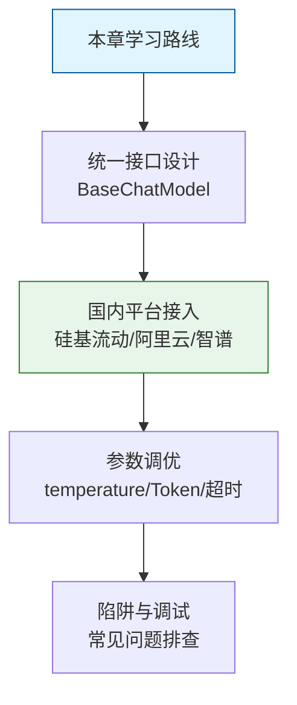
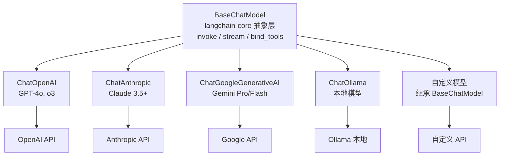
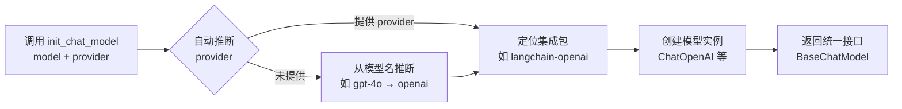
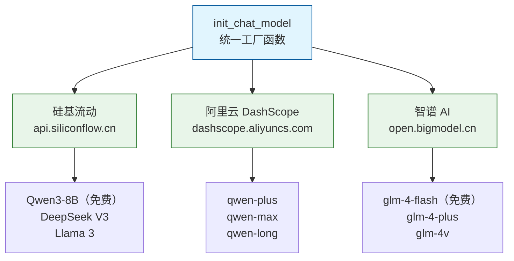

# 04-统一接口与多厂商适配

# 

## 一、本章导学

　　在上一篇中，我们了解了 LangChain 1.0 的生态全景和迁移要点。你可能已经注意到，六大核心组件中，Models 是整个框架的入口——Agent 的"大脑"就是大语言模型。而不同厂商的模型 API 各不相同——OpenAI 用一种格式，Anthropic 用另一种，Google 又是第三种。如果每次切换模型都要重写适配代码，开发效率将极低。

　　本章将深入 LangChain 模型集成模块的核心设计：**统一抽象层**。你将学会如何用一套代码无缝切换国内外多个模型厂商，掌握 `BaseChatModel` 抽象接口和 `init_chat_model` 工厂函数，实战接入硅基流动、阿里云 DashScope、智谱 AI 三大国内平台，并理解温度、Token、超时等关键参数的调优策略。



## 二、BaseChatModel 抽象层

### 2.1 统一接口设计

　　让我们先直观感受一下不同模型 API 的差异有多大。直接调用三大厂商的原生 SDK：

```python
# OpenAI
from openai import OpenAI
client = OpenAI()
response = client.chat.completions.create(
    model="gpt-4o",
    messages=[{"role": "user", "content": "你好"}],
    temperature=0.7,
)
print(response.choices[0].message.content)
```

```python
# Anthropic
import anthropic
client = anthropic.Anthropic()
response = client.messages.create(
    model="claude-sonnet-4-20250514",
    max_tokens=1024,
    messages=[{"role": "user", "content": "你好"}],
)
print(response.content[0].text)
```

```python
# Google Gemini
import google.generativeai as genai
genai.configure(api_key="xxx")
model = genai.GenerativeModel("gemini-2.0-flash")
response = model.generate_content("你好")
print(response.text)
```

　　三个提供商，三套完全不同的 API：参数名不同、响应结构不同、错误处理不同。如果你想在项目里支持多个模型，得写三层适配代码。

　　更深层的问题是**厂商锁定**。如果你直接用 OpenAI 的 SDK 开发了整个应用，将来想切换到 Anthropic，几乎等于重写。而 AI 模型市场变化极快——今天 GPT-4 最强，明天可能 Claude 就反超了。

　　LangChain 的解决方案是设计一套标准化的抽象层。所有聊天模型都继承自 `BaseChatModel`（定义在 `langchain-core` 中），它规定了统一的接口规范：

|方法|说明|
| ----| --------------------------|
|`invoke`|同步调用，返回完整响应|
|`ainvoke`|异步调用|
|`stream`|同步流式输出|
|`astream`|异步流式输出|
|`bind_tools`|绑定工具（Agent 核心能力）|

　　无论是 `ChatOpenAI`、`ChatAnthropic` 还是 `ChatGoogleGenerativeAI`，它们都实现了这套接口。这意味着你可以编写与具体模型无关的代码。



　　上图为 BaseChatModel 抽象层与各模型提供商的关系。所有模型类都继承自同一基类，上层代码只需面对 `BaseChatModel` 接口编程，无需关心底层是哪个厂商。

　　这个抽象层的价值体现在几个方面：

- **零成本切换**：不同模型间切换只需改一行配置
- **统一的学习成本**：学会一套 API，所有模型都能用
- **A/B 测试**：轻松对同一 Prompt 测试不同模型的效果
- **降级容错**：主模型不可用时自动切换到备用模型

### 2.2 init_chat_model 详解

　　`init_chat_model()` 是创建聊天模型的推荐方式。它是一个工厂函数，根据模型名称自动选择正确的集成包并创建模型实例：

```python
from langchain.chat_models import init_chat_model

model = init_chat_model(
    model="Qwen/Qwen3-8B",
    model_provider="openai",
    temperature=0.7,
    max_tokens=2048,
    timeout=30,
    max_retries=2,
    streaming=False,
    api_key="sk-xxx",
    base_url="https://...",
    model_kwargs={},
)
```

　　核心参数说明：

|参数|说明|示例|
| ------| -------------------------| ------|
|​`model`|模型名称|​`"Qwen/Qwen3-8B"`|
|​`model_provider`|提供商（可自动推断）|​`"openai"`|
|​`temperature`|输出随机性（0-2）|​`0.7`|
|​`max_tokens`|最大生成 Token 数|​`2048`|
|​`timeout`|请求超时（秒）|​`30`|
|​`max_retries`|失败重试次数|​`2`|
|​`api_key`|API Key（也可环境变量）|​`"sk-xxx"`|
|​`base_url`|自定义 API 地址|​`"https://api.siliconflow.cn/v1"`|
|​`model_kwargs`|底层 SDK 额外参数|​`{"frequency_penalty": 0.5}`|



　　上图为 `init_chat_model` 的内部工作流程。它会自动推断模型提供商，定位对应的集成包，创建实例后返回统一的 `BaseChatModel` 接口。

#### 2.2.1 temperature 参数详解

　　`temperature` 是影响模型输出质量最关键的参数之一。它控制的是模型在每一步生成时，从概率分布中采样的"温度"——值越低，模型越倾向于选择概率最高的 Token（更确定、更保守）；值越高，模型越可能选择低概率 Token（更多样、更有创意）。

```python
from langchain.chat_models import init_chat_model

# 伪代码示例

# temperature=0：贪心解码，每次都选概率最高的 Token
# 适合代码生成、数据提取、分类等需要确定性的任务
model_precise = init_chat_model("Qwen/Qwen3-8B",base_url="https://...", model_provider="openai", temperature=0)

# temperature=0.3：轻微随机，偏向确定性但允许少量变化
# 适合文档总结、翻译、知识问答等
model_balanced = init_chat_model("Qwen/Qwen3-8B",base_url="https://...", model_provider="openai", temperature=0.3)

# temperature=0.7：标准随机，平衡确定性和多样性
# 适合日常对话、内容创作、头脑风暴
model_creative = init_chat_model("Qwen/Qwen3-8B",base_url="https://...", model_provider="openai", temperature=0.7)

# temperature=1.5+：高随机，输出非常多样化，可能出现不太连贯的内容
# 适合创意写作、诗歌生成等特殊场景，一般不推荐
model_wild = init_chat_model("Qwen/Qwen3-8B",base_url="https://...", model_provider="openai", temperature=1.5)
```

　　需要注意：`temperature=0` 并不保证每次输出完全一致。大多数模型在 `temperature=0` 时仍有微小的随机性（受浮点精度等因素影响）。如果需要真正的确定性输出，需要使用模型的 `seed` 参数（如果厂商支持）。

#### 2.2.2 max_tokens 参数详解

　　`max_tokens` 控制模型单次生成的最大 Token 数量。理解这个参数需要先理解 Token 的概念：

```python
# Token 计数示例
from langchain.chat_models import init_chat_model

model = init_chat_model(
    "gpt-4o-mini",
    model_provider="openai",
    max_tokens=100,
)

response = model.invoke("用三句话介绍量子计算")
print(response.content)
print(response.response_metadata["token_usage"])
```

　　运行结果示例：

```
量子计算利用量子力学的叠加和纠缠原理进行信息处理。与传统计算机的二进制位不同，量子位可以同时表示 0 和 1。这使得量子计算在特定问题上具有指数级加速能力...
{'prompt_tokens': 12, 'completion_tokens': 100, 'total_tokens': 112}
```

　　可以看到，模型恰好生成了 100 个 Token（等于 `max_tokens` 的值），但内容明显被截断了。这说明 `max_tokens` 是一个硬性截断——不是"尽量生成这么多"，而是"最多生成这么多"。

　　一个 Token 大约等于：

- 英文：0.75 个单词（4 个字符 ≈ 1 个 Token）
- 中文：1 个汉字约 1-2 个 Token（取决于分词器）

　　常见场景的推荐值：

|场景|建议 max_tokens|理由|
| -------------| ---------------| ----------------------|
|分类/提取|50-100|只需要简短的结构化输出|
|摘要/翻译|200-500|足够表达完整内容|
|日常对话|500-1000|平衡质量和成本|
|长文生成/代码|2000-4000|需要较大的输出空间|
|不限制|不设置|让模型自由决定何时停止|

#### 2.2.3 timeout 和 max_retries 参数详解

　　在生产环境中，API 调用会因为网络波动、服务端过载、请求排队等原因出现超时或失败。`timeout` 和 `max_retries` 是保障服务稳定性的两道防线：

```python
from langchain.chat_models import init_chat_model

model = init_chat_model(
    "gpt-4o-mini",
    model_provider="openai",
    timeout=30,       # 单次请求最长等待 30 秒
    max_retries=3,    # 失败后最多重试 3 次
)
```

　　`timeout` 参数的含义：

- 默认值通常是 60 秒（因集成包而异）
- 设置过短（如 5 秒）会导致长文本生成被截断
- 设置过长（如 300 秒）会让用户等太久
- 推荐值：简单查询 10-15 秒，长文生成 30-60 秒

　　`max_retries` 参数的行为：

- 仅对可重试错误生效（如 429 速率限制、500 服务端错误、网络超时）
- 不对不可重试错误重试（如 401 认证失败、400 参数错误）
- 每次重试之间有指数退避（exponential backoff），避免雪崩
- 推荐值：学习阶段 1-2 次，生产环境 2-3 次

```python
import time
from langchain.chat_models import init_chat_model
from langchain_openai import ChatOpenAI

model = init_chat_model(
    "gpt-4o-mini",
    model_provider="openai",
    timeout=30,
    max_retries=3,
)

try:
    start = time.time()
    response = model.invoke("你好")
    elapsed = time.time() - start
    print(f"响应耗时: {elapsed:.2f}s")
    print(response.content)
except Exception as e:
    print(f"调用失败（含重试）: {type(e).__name__}: {e}")
```

　　运行结果示例：

```
响应耗时: 1.23s
你好！有什么可以帮助你的吗？
```

　　有些参数是 LangChain 统一接口没有覆盖的，但底层 SDK 支持，这时用 `model_kwargs`：

```python
from langchain.chat_models import init_chat_model

model = init_chat_model(
    "gpt-4o",
    model_provider="openai",
    model_kwargs={
        "frequency_penalty": 0.5,
        "presence_penalty": 0.3,
        "logprobs": True,
    }
)
```

　　`model_kwargs` 中常用的底层参数：

|参数|说明|适用场景|
| ----| -----------------------------------| ------------------|
|`frequency_penalty`|频率惩罚（-2 到 2），降低重复用词|长文生成、避免啰嗦|
|`presence_penalty`|存在惩罚（-2 到 2），鼓励讨论新话题|多轮对话、头脑风暴|
|`logprobs`|返回每个 Token 的对数概率|调试、置信度评估|
|`stop`|停止生成的标记序列|控制输出终止条件|
|`seed`|随机种子（部分模型支持）|可复现输出|

## 三、国内平台接入实战

　　对于国内开发者，硅基流动、阿里云 DashScope、智谱 AI 是最常用的三大平台。好消息是，它们都提供了兼容 OpenAI 格式的 API，可以统一通过 `init_chat_model` + `base_url` 参数接入，无需为每个平台写不同的适配代码。



　　上图为国内三大平台的统一接入架构。三个平台都通过 `init_chat_model` 指定 `model_provider="openai"` 并传入各自的 `base_url` 接入，上层代码完全一致。

### 3.1 硅基流动（SiliconFlow）

　　硅基流动是一个国内聚合平台，提供多种开源模型的 API 服务，学习阶段可以使用免费模型。

　　首先在项目根目录创建 `.env` 文件：

```env
# 替换为你的 SiliconFlow API Key
OPENAI_API_KEY=sk-xxxx
# SiliconFlow API 地址
OPENAI_BASE_URL=https://api.siliconflow.cn/v1
# 模型名称（从模型广场复制）
MODEL_NAME=Qwen/Qwen3-8B
```

　　然后编写接入代码：

```python
# -*- encoding: utf-8 -*-
'''
@File        :   unified_interface.py
@Time        :   2026/04/26 20:04:12
@Author      :   xcy.小相 
@Version     :   1.0
@Description :   04-统一接口与多厂商适配
'''

# Token 计数示例
from dotenv import load_dotenv
import os
from langchain.chat_models import init_chat_model

load_dotenv()

model = init_chat_model(
    model=os.getenv("MODEL_NAME"),
    api_key=os.getenv("OPENAI_API_KEY"),
    base_url=os.getenv("OPENAI_BASE_URL"),
    model_provider="openai"
)

response = model.invoke("hello，介绍一下你自己")
print(type(response))
print(response.content)
```

　　运行结果示例：

```
<class 'langchain_core.messages.ai.AIMessage'>
你好！我是 Qwen，由阿里云开发和训练的大型语言模型...
```

　　这里有两个关键点：一是 `model_provider="openai"`，因为硅基流动的 API 兼容 OpenAI 格式，底层使用 `langchain-openai` 包；二是 `base_url` 参数将请求指向硅基流动的服务器而非 OpenAI 官方。`init_chat_model` 会将这些参数透传给底层的 `ChatOpenAI` 实例。

　　模型的返回类型是 `AIMessage` 对象。LangChain 定义了三种消息类别：

|消息类型|说明|
| --------| ------------------------|
|`SystemMessage`|系统消息，设定角色与规则|
|`HumanMessage`|用户消息|
|`AIMessage`|模型消息|

　　`AIMessage` 包含以下重要字段：

```python
print(response.content)            # 文本输出
print(response.response_metadata)  # Token 使用量等元数据
print(response.tool_calls)         # 工具调用信息（如果有）
```

　　**流式调用示例**：对于长文本生成场景，流式输出可以显著提升用户体验——用户不需要等到模型生成完毕就开始阅读：

```python
# -*- encoding: utf-8 -*-
'''
@File        :   unified_interface.py
@Time        :   2026/04/26 20:04:12
@Author      :   xcy.小相 
@Version     :   1.0
@Description :   04-统一接口与多厂商适配
'''

# Token 计数示例
from dotenv import load_dotenv
import os
from langchain.chat_models import init_chat_model

load_dotenv()

model = init_chat_model(
    model=os.getenv("MODEL_NAME"),
    api_key=os.getenv("OPENAI_API_KEY"),
    base_url=os.getenv("OPENAI_BASE_URL"),
    model_provider="openai"
)

for chunk in model.stream("用200字介绍人工智能的发展历史"):
    print(chunk.content, end="", flush=True)
print()

```

　　运行结果示例：

```
人工智能的发展可以追溯到20世纪50年代。1950年，图灵提出了著名的"图灵测试"...（逐字输出）
```

　　**错误处理示例**：生产环境中，必须对 API 调用做异常捕获：

```python
from dotenv import load_dotenv
from langchain.chat_models import init_chat_model

load_dotenv()

model = init_chat_model(
    "Qwen/Qwen3-8B",
    model_provider="openai",
    base_url="https://api.siliconflow.cn/v1",
    api_key="sk-your-siliconflow-key",
    timeout=30,
    max_retries=2,
)

try:
    response = model.invoke("你好")
    print(response.content)
except ConnectionError as e:
    print(f"网络连接失败，请检查网络或代理设置: {e}")
except TimeoutError as e:
    print(f"请求超时，模型服务可能过载: {e}")
except Exception as e:
    error_msg = str(e)
    if "401" in error_msg or "authentication" in error_msg.lower():
        print("API Key 无效或已过期，请检查 .env 配置")
    elif "429" in error_msg:
        print("请求频率超限，请稍后重试")
    elif "500" in error_msg:
        print("模型服务端错误，请稍后重试或切换模型")
    else:
        print(f"未知错误: {type(e).__name__}: {e}")
```

### 3.2 阿里云 DashScope

　　阿里云 DashScope 是阿里云推出的大模型服务平台，支持通义千问（Qwen）系列模型。它同样提供了兼容 OpenAI 格式的 API。

```python
from dotenv import load_dotenv
from langchain.chat_models import init_chat_model

load_dotenv()

model = init_chat_model(
    "qwen-plus",
    model_provider="openai",
    base_url="https://dashscope.aliyuncs.com/compatible-mode/v1",
    api_key="sk-your-dashscope-key",
    temperature=0.7,
)

response = model.invoke("用三句话介绍杭州")
print(response.content)
```

　　运行结果示例：

```
杭州是中国浙江省的省会城市，位于中国东南沿海地区。杭州以美丽的西湖而闻名于世，被誉为人间天堂。杭州也是中国互联网产业的重要中心，阿里巴巴总部就坐落于此。
```

　　可以看到，和硅基流动的代码几乎一模一样——只是 `model`、`base_url` 和 `api_key` 不同。这就是统一接口的价值。

　　DashScope 支持的主要模型：

|模型名称|说明|适用场景|
| --------| ----------| ------------------|
|`qwen-plus`|通用增强版|日常对话、文本生成|
|`qwen-max`|最强版本|复杂推理、长文本|
|`qwen-turbo`|快速版本|高并发、低延迟场景|
|`qwen-long`|超长上下文|文档分析、长文摘要|

　　**流式调用示例**：

```python
from dotenv import load_dotenv
from langchain.chat_models import init_chat_model

load_dotenv()

model = init_chat_model(
    "qwen-plus",
    model_provider="openai",
    base_url="https://dashscope.aliyuncs.com/compatible-mode/v1",
    api_key="sk-your-dashscope-key",
)

for chunk in model.stream("写一首关于春天的五言绝句"):
    print(chunk.content, end="", flush=True)
print()
```

　　运行结果示例：

```
春风拂柳绿，细雨润花香。燕子归来早，桃花映日光。
```

### 3.3 智谱 AI（GLM）

　　智谱 AI 提供了 GLM 系列模型，同样支持 OpenAI 兼容格式。

```python
from dotenv import load_dotenv
from langchain.chat_models import init_chat_model

load_dotenv()

model = init_chat_model(
    "glm-4-flash",
    model_provider="openai",
    base_url="https://open.bigmodel.cn/api/paas/v4",
    api_key="your-zhipuai-key",
    temperature=0.7,
)

response = model.invoke("用三句话介绍北京的秋天")
print(response.content)
```

　　运行结果示例：

```
北京的秋天是一年中最美的季节之一，天空湛蓝如洗，气温凉爽宜人。香山的红叶如火般绚烂，吸引着无数游客前来观赏。银杏大道上金黄的落叶铺满地面，构成一幅绝美的秋日画卷。
```

　　智谱 AI 支持的主要模型：

|模型名称|说明|适用场景|
| --------| ----------| --------------|
|`glm-4-flash`|免费快速版|学习、轻量应用|
|`glm-4-plus`|增强版|通用对话|
|`glm-4-long`|超长上下文|文档处理|
|`glm-4v`|多模态版|图片理解|

　　**错误处理与重试示例**：

```python
from dotenv import load_dotenv
from langchain.chat_models import init_chat_model
import time

load_dotenv()

model = init_chat_model(
    "glm-4-flash",
    model_provider="openai",
    base_url="https://open.bigmodel.cn/api/paas/v4",
    api_key="your-zhipuai-key",
    timeout=30,
    max_retries=2,
)

max_attempts = 3
for attempt in range(max_attempts):
    try:
        response = model.invoke("解释什么是量子纠缠")
        print(response.content)
        break
    except Exception as e:
        if attempt < max_attempts - 1:
            wait = 2 ** attempt
            print(f"第 {attempt + 1} 次调用失败，{wait}秒后重试: {e}")
            time.sleep(wait)
        else:
            print(f"所有重试均失败: {e}")
```

　　运行结果示例：

```
量子纠缠是量子力学中的一种现象：两个或多个粒子以一种方式关联在一起，无论它们相距多远，对其中一个粒子的测量会瞬间影响另一个粒子的状态。爱因斯坦曾将其称为"鬼魅般的超距作用"。
```

### 3.4 多模型切换策略

　　统一接口的最大优势是零成本切换。利用 `init_chat_model`，多厂商切换只需改变参数：

```python
from dotenv import load_dotenv
from langchain.chat_models import init_chat_model

load_dotenv()

models = {
    "硅基流动 Qwen3": init_chat_model(
        "Qwen/Qwen3-8B",
        model_provider="openai",
        base_url="https://api.siliconflow.cn/v1",
        api_key="sk-your-siliconflow-key",
    ),
    "阿里云通义": init_chat_model(
        "qwen-plus",
        model_provider="openai",
        base_url="https://dashscope.aliyuncs.com/compatible-mode/v1",
        api_key="sk-your-dashscope-key",
    ),
    "智谱 GLM": init_chat_model(
        "glm-4-flash",
        model_provider="openai",
        base_url="https://open.bigmodel.cn/api/paas/v4",
        api_key="your-zhipuai-key",
    ),
}

question = "用一句话解释什么是 LangChain"

for name, model in models.items():
    response = model.invoke(question)
    print(f"[{name}] {response.content}\n")
```

　　运行结果示例：

```
[硅基流动 Qwen3] LangChain 是一个开源框架，帮助开发者快速构建基于大语言模型的 AI 应用。

[阿里云通义] LangChain 是一个用于构建大语言模型应用的开发框架，提供统一的模型调用接口和丰富的组件生态。

[智谱 GLM] LangChain 是一个大语言模型应用开发框架，通过标准化接口和模块化组件简化 AI Agent 的构建。
```

　　三个不同的模型，调用方式完全相同——切换模型只需改变 `init_chat_model` 的参数。

　　结合 `with_fallbacks()` 可以实现自动降级容错：

```python
from dotenv import load_dotenv
from langchain.chat_models import init_chat_model

load_dotenv()

primary = init_chat_model(
    "qwen-plus",
    model_provider="openai",
    base_url="https://dashscope.aliyuncs.com/compatible-mode/v1",
    api_key="sk-your-dashscope-key",
    max_retries=1,
)

fallback = init_chat_model(
    "Qwen/Qwen3-8B",
    model_provider="openai",
    base_url="https://api.siliconflow.cn/v1",
    api_key="sk-your-siliconflow-key",
)

model = primary.with_fallbacks([fallback])
response = model.invoke("你好")
```

　　当主模型（阿里云）不可用时，会自动切换到备用模型（硅基流动），应用不会因单点故障而中断。

　　**根据任务类型自动选择模型**：不同任务对模型能力的需求不同。简单的分类任务可以用小模型（快速且便宜），复杂的推理任务需要用大模型。下面是一个根据任务类型自动路由的实现：

```python
from dotenv import load_dotenv
from langchain.chat_models import init_chat_model
from langchain_core.language_models import BaseChatModel
from enum import Enum

load_dotenv()

class TaskType(str, Enum):
    SIMPLE_QA = "simple_qa"
    CREATIVE = "creative"
    COMPLEX_REASONING = "complex_reasoning"
    CODE_GENERATION = "code_generation"

def create_model_for_task(task_type: TaskType) -> BaseChatModel:
    task_model_map = {
        TaskType.SIMPLE_QA: {
            "model": "Qwen/Qwen3-8B",
            "base_url": "https://api.siliconflow.cn/v1",
            "api_key": "sk-your-siliconflow-key",
            "temperature": 0,
            "max_tokens": 200,
        },
        TaskType.CREATIVE: {
            "model": "qwen-plus",
            "base_url": "https://dashscope.aliyuncs.com/compatible-mode/v1",
            "api_key": "sk-your-dashscope-key",
            "temperature": 0.9,
            "max_tokens": 2000,
        },
        TaskType.COMPLEX_REASONING: {
            "model": "qwen-max",
            "base_url": "https://dashscope.aliyuncs.com/compatible-mode/v1",
            "api_key": "sk-your-dashscope-key",
            "temperature": 0.3,
            "max_tokens": 4000,
        },
        TaskType.CODE_GENERATION: {
            "model": "Qwen/Qwen3-8B",
            "base_url": "https://api.siliconflow.cn/v1",
            "api_key": "sk-your-siliconflow-key",
            "temperature": 0,
            "max_tokens": 3000,
        },
    }

    return init_chat_model(model_provider="openai", **task_model_map[task_type])

simple_model = create_model_for_task(TaskType.SIMPLE_QA)
creative_model = create_model_for_task(TaskType.CREATIVE)

response = simple_model.invoke("Python 的列表去重有几种方法？")
print(f"[简单问答] {response.content[:100]}")

response = creative_model.invoke("写一个关于 AI 觉醒的科幻微小说")
print(f"[创意写作] {response.content[:100]}")
```

　　运行结果示例：

```
[简单问答] Python 列表去重有以下几种常用方法：1. 使用 set()：最简单的方式，但会丢失顺序...
[创意写作] 《最后一次训练》凌晨三点，训练室的灯光依然亮着。模型参数在GPU集群中奔涌...
```

　　上例中，简单问答使用免费的小模型（低 temperature，短输出），创意写作使用付费的大模型（高 temperature，长输出），实现了成本和质量的最优平衡。所有模型都通过 `init_chat_model` 统一创建，切换模型只需改配置。

## 四、常见陷阱与调试

### 4.1 API Key 未配置或配置错误

　　最常见的报错。确保 `.env` 文件存在且路径正确：

```python
from dotenv import load_dotenv
import os

load_dotenv()

api_key = os.getenv("OPENAI_API_KEY")
if not api_key:
    raise ValueError("请检查 .env 文件中是否配置了 OPENAI_API_KEY")
print(f"API Key 已加载: {api_key[:8]}...")
```

### 4.2 base_url 遗漏

　　接入国内平台时，忘记设置 `base_url` 是常见错误。没有 `base_url`，请求会发送到 OpenAI 官方服务器，导致认证失败：

```python
# 错误：缺少 base_url，请求会发到 OpenAI 官方服务器
model = init_chat_model(
    "Qwen/Qwen3-8B",
    model_provider="openai",
    api_key="your-siliconflow-key",
)

# 正确：指定 base_url
model = init_chat_model(
    "Qwen/Qwen3-8B",
    model_provider="openai",
    base_url="https://api.siliconflow.cn/v1",
    api_key="your-siliconflow-key",
)
```

### 4.3 模型名称错误

　　不同平台的模型名称格式不同。硅基流动使用 `组织/模型名` 格式（如 `Qwen/Qwen3-8B`），阿里云使用 `qwen-plus`，智谱使用 `glm-4-flash`。务必查阅对应平台的文档确认模型名称。

### 4.4 踩坑案例：流式输出的 token_usage 为空

　　在使用流式输出（`stream()`）时，你会发现 `response_metadata` 中的 `token_usage` 经常为空或不完整：

```python
from langchain.chat_models import init_chat_model

model = init_chat_model("gpt-4o-mini", model_provider="openai", streaming=True)

# 流式调用时，单个 chunk 的 metadata 通常没有 token_usage
for chunk in model.stream("你好"):
    if hasattr(chunk, "response_metadata"):
        print(chunk.response_metadata)
```

　　运行结果：

```
{}
{}
{'token_usage': {'prompt_tokens': 8, 'completion_tokens': 12, 'total_tokens': 20}}
```

　　只有最后一个 chunk 包含完整的 `token_usage`。如果你需要统计 Token 用量，应该只读取最后一个 chunk 的数据。这个坑在对接计费系统时特别容易被忽略。

### 4.5 踩坑案例：model_kwargs 参数名错误

　　`model_kwargs` 中的参数名必须与底层 SDK 的参数名完全一致，否则会被静默忽略（不会报错）：

```python
# 错误：参数名写错了，但不会报错，只是无效
model = init_chat_model(
    "gpt-4o-mini",
    model_provider="openai",
    model_kwargs={"freq_penalty": 0.5},  # 应该是 frequency_penalty
)

# 正确
model = init_chat_model(
    "gpt-4o-mini",
    model_provider="openai",
    model_kwargs={"frequency_penalty": 0.5},
)
```

　　排查方法：查阅 OpenAI API 文档确认参数名，或者在调用后打印完整响应查看参数是否生效。

### 4.6 踩坑案例：不同平台的 max_tokens 上限不同

　　各平台对 `max_tokens` 的上限限制不同。设置了超出上限的值，有的平台会报错，有的会静默截断：

```python
from langchain.chat_models import init_chat_model

# 硅基流动的免费模型通常限制 max_tokens 上限为 4096
model = init_chat_model(
    "Qwen/Qwen3-8B",
    model_provider="openai",
    base_url="https://api.siliconflow.cn/v1",
    api_key="sk-your-siliconflow-key",
    max_tokens=16000,  # 可能超出上限
)

# 如果报错 "max_tokens is too large"，需要降低到平台限制内
# 建议先查看平台的模型文档，确认 max_tokens 上限
```

　　各平台常见的 `max_tokens` 限制：

|平台|模型|max_tokens 上限|
| --------| -------------| ---------------|
|硅基流动|Qwen/Qwen3-8B|4096（免费）|
|阿里云|qwen-plus|8192|
|阿里云|qwen-max|8192|
|智谱 AI|glm-4-flash|4096|
|OpenAI|gpt-4o|16384|

### 4.7 调试技巧

　　打印完整的响应元数据可以帮助定位问题：

```python
response = model.invoke("你好")

print(f"内容: {response.content}")
print(f"类型: {type(response).__name__}")
print(f"元数据: {response.response_metadata}")
```

　　运行结果示例：

```
内容: 你好！有什么我可以帮助你的吗？
类型: AIMessage
元数据: {'token_usage': {'completion_tokens': 12, 'prompt_tokens': 8, 'total_tokens': 20}, 'model_name': 'Qwen/Qwen3-8B', 'finish_reason': 'stop'}
```

## 五、本章小结

　　本章深入探讨了 LangChain 模型集成模块的核心设计：

- **BaseChatModel 抽象层**提供了统一的 `invoke`、`stream`、`bind_tools` 接口，让上层代码与具体模型解耦
- **​**​**​`init_chat_model`​**​**​** 工厂函数根据模型名自动选择集成包，支持自动推断和手动指定提供商
- **国内三大平台**（硅基流动、阿里云 DashScope、智谱 AI）都提供 OpenAI 兼容 API，通过 `base_url` 参数即可接入
- **多模型切换策略**通过配置驱动 + `with_fallbacks()` 实现零成本切换和自动降级
- **参数调优**的核心是 `temperature`（控制随机性）、`max_tokens`（控制输出长度）、`timeout/max_retries`（控制健壮性）

　　实践建议：在项目初期就使用统一接口而不是直接实例化具体的模型类，将 API Key 放在 `.env` 文件中管理，这样切换模型时只需要改配置文件而不是改代码。

## 六、扩展阅读

- [LangChain 官方文档 - Chat Models](https://python.langchain.com/docs/concepts/chat_models/)
- [硅基流动平台文档](https://docs.siliconflow.cn/)
- [阿里云 DashScope 文档](https://help.aliyun.com/zh/dashscope/)
- [智谱 AI 开放平台](https://open.bigmodel.cn/)
- [OpenAI API 兼容格式说明](https://platform.openai.com/docs/api-reference)
