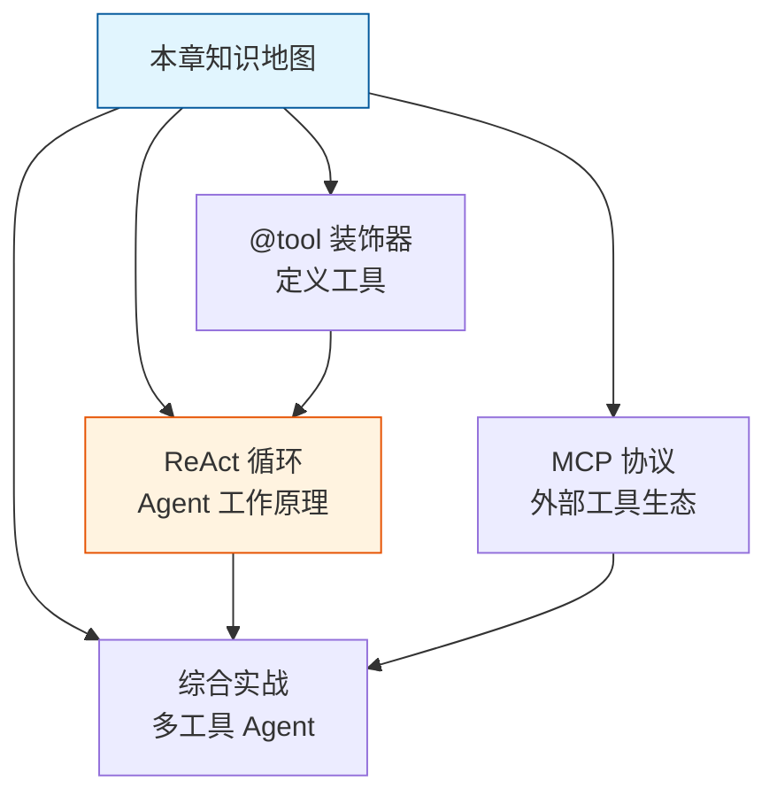
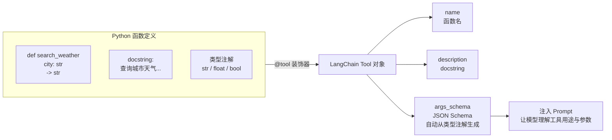
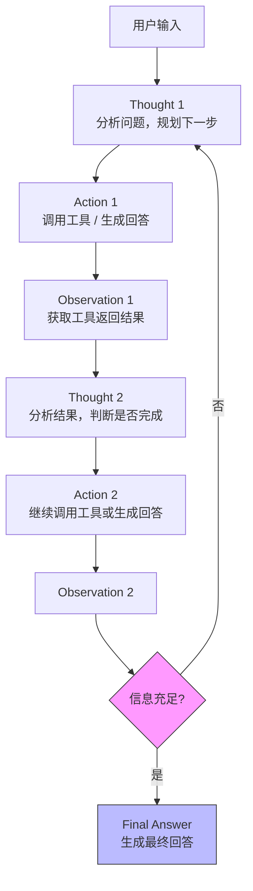
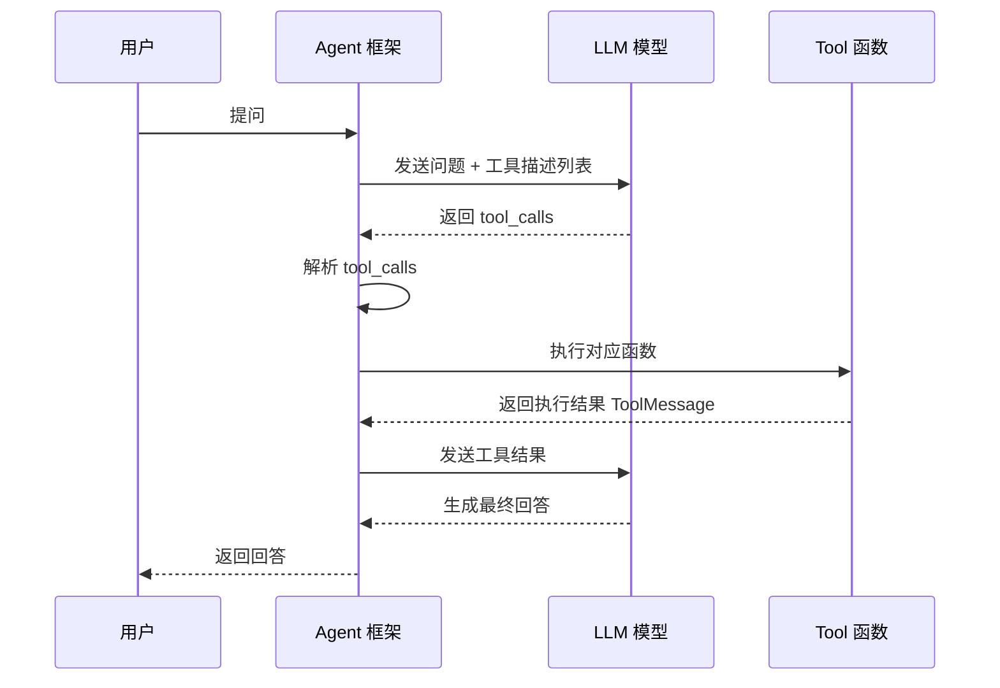
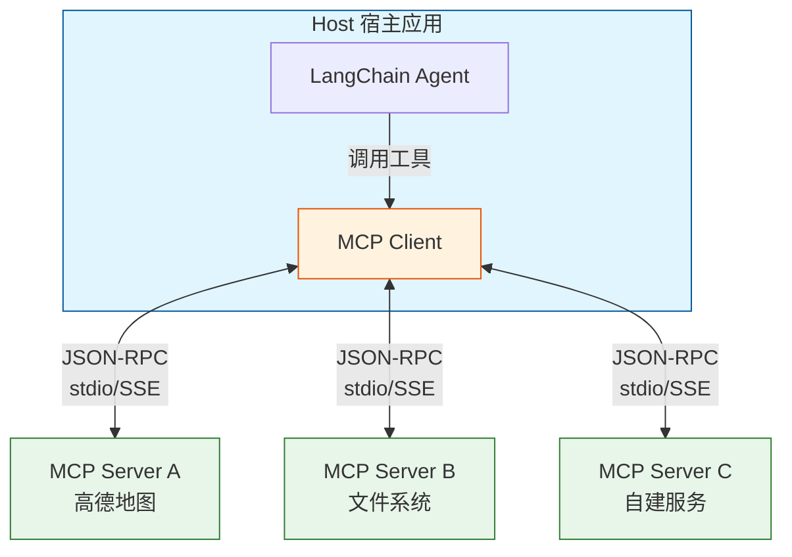
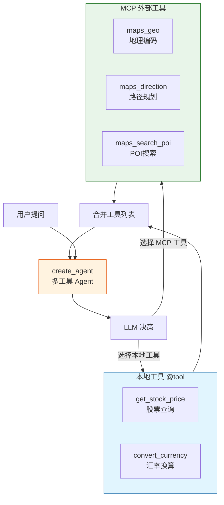

## 一、本章导学

在前几章中，我们已经能够调用大模型完成对话和文本生成。但大模型有一个根本性的局限：它只能生成文本。它不能上网搜索、不能做精确计算、不能读写文件、不能调用 API。它就像一个博学但被锁在房间里的人——什么都懂，但什么都做不了。

Tool（工具）就是给 AI 装上的"双手和眼睛"。通过 Tool，你可以让 Agent 搜索互联网、执行数学计算、读写数据库、发送邮件，或者调用任何业务系统中的 API。而 Agent 之所以能"自主决策"何时调用哪个工具，背后靠的是 ReAct（Reasoning + Acting）循环模式和 Tool-Calling 机制。

本章将系统讲解四大核心主题：`@tool` 装饰器的定义与使用、Agent 工作原理（ReAct 循环与 Tool-Calling）、MCP 协议入门，以及多工具 Agent 的综合实战。



## 二、@tool 装饰器：定义工具

### 2.1 基础用法

`@tool` 装饰器是 LangChain 中定义工具最简单的方式。它将普通 Python 函数转换为 Agent 可调用的 Tool 对象：

```python
from langchain.tools import tool

# 示例代码
@tool
def hello(name: str) -> str:
    """向指定的人打招呼。

    Args:
        name: 要打招呼的人的名字
    """
    return f"你好，{name}！欢迎来到 AI 的世界。"

print(hello.name)
print(hello.description)
```

运行结果：

```
hello
向指定的人打招呼。
```

就这几行代码，你就创建了一个可被 Agent 使用的工具。`@tool` 装饰器的工作过程是：函数签名中的类型注解（`name: str`、`-> str`）用于生成 JSON Schema，docstring 作为工具描述传递给模型。

### 2.2 docstring 设计原则

docstring 是模型理解工具的**唯一信息来源**。写好 docstring 至关重要，因为它直接决定了 Agent 能不能正确使用你定义的工具。

**核心原则：**
- 第一句话说明用途和**使用场景**
- 明确说明什么时候该用、什么时候不该用
- 参数描述包含取值范围和格式
- 保持简洁但完整（docstring 会占用 Prompt 的 Token 预算）

```python
from langchain.tools import tool

# 不好的 docstring
@tool
def search(query: str) -> str:
    """搜索"""
    ...

# 好的 docstring
@tool
def search_product_reviews(product_name: str, min_rating: float = 0) -> str:
    """搜索指定商品的用户评价。当用户想了解某款产品的口碑或
    使用体验时使用此工具。不要用于搜索商品价格或库存信息。

    Args:
        product_name: 商品名称或型号，越具体越好
        min_rating: 最低评分筛选，0-5分，默认0表示不筛选
    """
    ...
```

### 2.3 参数类型注解

类型注解不仅仅是代码规范，它直接决定了工具能否正确工作。LangChain 需要将工具信息转换为 JSON Schema 格式发送给模型，缺少类型注解会导致模型不知道该传什么类型的参数。

支持基本类型和复杂类型：

```python
from langchain.tools import tool
from typing import List, Dict, Literal

@tool
def filter_products(
    categories: List[str],
    price_range: Dict[str, float],
    sort_by: Literal["price_asc", "price_desc", "rating", "newest"],
) -> str:
    """搜索和筛选商品。

    Args:
        categories: 商品类别列表，如["电子产品", "手机"]
        price_range: 价格范围，格式为{"min": 最低价, "max": 最高价}
        sort_by: 排序方式
    """
    return (f"筛选条件: 类别={categories}, "
            f"价格范围={price_range['min']}-{price_range['max']}, "
            f"排序={sort_by}")

# 使用 Pydantic 模型获得更精确的参数描述和验证
from pydantic import BaseModel, Field

class FlightSearchInput(BaseModel):
    """航班搜索的输入参数"""
    origin: str = Field(description="出发城市代码，如 PEK（北京）")
    destination: str = Field(description="目的地城市代码")
    departure_date: str = Field(description="出发日期，格式 YYYY-MM-DD")
    passengers: int = Field(default=1, ge=1, le=9, description="乘客人数，1-9人")

@tool(args_schema=FlightSearchInput)
def search_flights(origin: str, destination: str, departure_date: str,
                   passengers: int = 1) -> str:
    """搜索航班信息。当用户需要查询机票时使用。"""
    return f"搜索航班: {origin} → {destination}, 出发: {departure_date}, {passengers}人"
```

### 2.4 返回值处理

工具的返回值必须是字符串（或可以序列化为字符串的类型）。返回有意义的错误信息比抛异常更友好——因为 Agent 需要将错误信息返回给模型，让模型决定如何处理：

```python
@tool
def divide_numbers(a: float, b: float) -> str:
    """将两个数相除。

    Args:
        a: 被除数
        b: 除数
    """
    if b == 0:
        return "错误：除数不能为零。请提供一个非零的除数。"
    return f"{a} ÷ {b} = {a / b}"

# 异步工具示例（适合 I/O 密集型操作）
import httpx

@tool
async def fetch_webpage(url: str) -> str:
    """异步获取网页内容。

    Args:
        url: 要获取的网页 URL
    """
    async with httpx.AsyncClient(timeout=10) as client:
        response = await client.get(url)
        response.raise_for_status()
        return response.text[:5000]
```

`@tool` 装饰器将 Python 函数转换为 Tool 描述的完整流程如下：



## 三、Agent 工作原理：ReAct 循环

### 3.1 Chain vs Agent

在理解 ReAct 之前，先要明白 Chain 和 Agent 的本质区别。
**Chain** 就像工厂的流水线——每一步做什么、按什么顺序执行，都在写代码时就确定了：

```python
from langchain_core.prompts import ChatPromptTemplate
from langchain_core.output_parsers import StrOutputParser
from langchain.chat_models import init_chat_model
import os
import dotenv

dotenv.load_dotenv()

model = init_chat_model(
	model=os.getenv("MODEL_NAME"), 
	api_key=os.getenv("API_KEY"), 
	base_url=os.getenv("BASE_URL"), 
	model_provider="openai"
)
prompt = ChatPromptTemplate.from_template("将以下内容翻译成{language}:\n{text}")
chain = prompt | model | StrOutputParser()

result = chain.invoke({"language": "英文", "text": "今天天气很好"})
print(result)
```

无论用户输入什么，Chain 的执行路径都是一样的：构造 Prompt → 调用模型 → 解析输出。
而**Agent** 就像自动驾驶——你只告诉它目的地，它自己决定怎么走：

```python
from langchain.agents import create_agent
# @tools
# ……

agent = create_agent(model, tools)
result = agent.invoke({"messages": [("user", "北京今天天气怎么样？")]})
```

面对这个问题，Agent 会自主判断需要调用天气工具、决定传什么参数，然后整合结果生成回答。
简单规则：**如果任务逻辑固定，用 Chain；如果任务需要灵活决策，用 Agent。**

### 3.2 ReAct 模式详解

ReAct（Reasoning + Acting）是目前最主流的 Agent 架构模式。它的核心思想是让模型交替进行**推理（Thought）**   和**行动（Action）**  ，形成 Think → Act → Observe 的闭环。

```
循环开始
  ├── Thought（思考）：分析当前情况，决定下一步做什么
  ├── Action（行动）：调用工具或生成回答
  └── Observation（观察）：获取工具的返回结果
       ↓
    回到 Thought，继续分析...
       ↓
    如果已经有足够信息 → 生成最终回答 → 循环结束
```

以"北京天气怎么样"为例，完整的执行流程：

```
用户输入: 北京天气怎么样？
  ↓
[Thought 1] 用户问北京天气，我需要调用天气工具
  ↓
[Action 1] get_weather("北京")
  ↓
[Observation 1] 晴，25°C，空气质量: 良
  ↓
[Thought 2] 我已经有了天气数据，可以回答用户了
  ↓
[Final Answer] 北京今天天气晴朗，气温25°C，空气质量良好。
```



上图为 ReAct 模式的核心循环——思考、行动、观察不断迭代，直到任务完成。这是所有现代 Agent 框架的基础架构。

下面用一个完整可运行的代码演示 ReAct 循环：

```python
# -*- encoding: utf-8 -*-
'''
@File        :   react_demo.py
@Time        :   2026/04/26 21:20:23
@Author      :   xcy.小相
@Version     :   1.0
@Description :   05-Tools让Agent拥有超能力
'''
from langchain.chat_models import init_chat_model
from langchain.tools import tool
from langchain.agents import create_agent
from dotenv import load_dotenv
import os

load_dotenv()

@tool
def get_weather(city: str) -> str:
    """查询指定城市的当前天气。

    Args:
        city: 城市名称
    """
    weather_db = {
        "北京": "晴，25°C，湿度 45%，空气质量: 良",
        "上海": "多云，28°C，湿度 72%，空气质量: 优",
        "广州": "雷阵雨，31°C，湿度 85%，空气质量: 中等",
    }
    return weather_db.get(city, f"未找到 {city} 的天气数据")

@tool
def get_distance(city_a: str, city_b: str) -> str:
    """查询两个城市之间的距离。

    Args:
        city_a: 第一个城市
        city_b: 第二个城市
    """
    distances = {
        ("北京", "上海"): "约 1200 公里",
        ("上海", "北京"): "约 1200 公里",
        ("北京", "广州"): "约 1900 公里",
        ("广州", "北京"): "约 1900 公里",
        ("上海", "广州"): "约 1200 公里",
        ("广州", "上海"): "约 1200 公里",
    }
    key = (city_a, city_b)
    return distances.get(key, f"未找到 {city_a} 和 {city_b} 之间的距离数据")

model = init_chat_model(
    model=os.getenv("MODEL_NAME"),
    api_key=os.getenv("API_KEY"),
    base_url=os.getenv("BASE_URL"),
    model_provider="openai"
)
agent = create_agent(
    model,
    [get_weather, get_distance],
    system_prompt="你是一个智能助手，擅长天气查询和地理信息查询。",
)

question = "我计划从北京去上海出差，请告诉我这两个城市今天的天气，以及它们之间的距离。"
result = agent.invoke({"messages": [("user", question)]})

print("=" * 60)
print(f"用户: {question}")
print("=" * 60)

for i, msg in enumerate(result["messages"]):
    msg_type = type(msg).__name__

    if msg_type == "HumanMessage":
        continue
    elif msg_type == "AIMessage" and hasattr(msg, "tool_calls") and msg.tool_calls:
        for tc in msg.tool_calls:
            print(f"\n[Thought] 我需要查询信息")
            print(f"[Action] 调用工具 '{tc['name']}'，参数: {tc['args']}")
    elif msg_type == "ToolMessage":
        print(f"[Observation] {msg.content}")
    elif msg_type == "AIMessage" and msg.content:
        print(f"\n[Final Answer] {msg.content}")
```

运行结果示例：

```bash
➜  uv run agent_tools.py
============================================================
用户: 我计划从北京去上海出差，请告诉我这两个城市今天的天气，以及它们之间的距离。
============================================================

[Thought] 我需要查询信息
[Action] 调用工具 'get_weather'，参数: {'city': '北京'}

[Thought] 我需要查询信息
[Action] 调用工具 'get_weather'，参数: {'city': '上海'}

[Thought] 我需要查询信息
[Action] 调用工具 'get_distance'，参数: {'city_a': '北京', 'city_b': '上海'}
[Observation] 晴，25°C，湿度 45%，空气质量: 良
[Observation] 多云，28°C，湿度 72%，空气质量: 优
[Observation] 约 1200 公里

[Final Answer] 根据今天的天气查询结果：

- **北京**：晴，气温25°C，湿度45%，空气质量良。
- **上海**：多云，气温28°C，湿度72%，空气质量优。

两地之间的距离约为 **1200公里**。

建议：
1. 出差前关注实时天气变化，北京昼夜温差较大，需准备薄外套；上海多云可能伴有湿度，建议携带雨具。
2. 长途旅行注意安全，建议提前规划路线并预留充足休息时间。祝您出差顺利！
```

注意看 Agent 自动决定了执行顺序：先查北京天气，再查上海天气，然后查距离，最后汇总。这就是 ReAct 模式的核心价值——Agent 自主规划了整个执行流程。

### 3.3 Tool-Calling 机制

Tool-Calling（也叫 Function Calling）是 ReAct 循环的技术基础。它的核心是让模型不再只输出纯文本，而是可以输出一种特殊的结构化格式，表示"我想调用某个函数，参数是这些"。

完整的 Tool-Calling 流程分四步：

1. **注入**：框架将工具信息（名称、描述、参数 Schema）注入到 Prompt 中
2. **决策**：模型分析用户问题，决定是否调用工具。如果决定调用，响应中包含 `tool_calls`
3. **执行**：框架解析 `tool_calls`，调用对应的 Python 函数
4. **反馈**：将结果作为 `ToolMessage` 追加到消息列表，再次调用模型

关键点在于：模型不需要知道工具的具体实现，它只需要知道工具的名字、描述和参数格式。

Agent 的消息流本质上就是消息在系统中流动的过程：

```
[1] SystemMessage: "你是一个天气助手..."
         ↓
[2] HumanMessage: "北京和上海今天天气怎么样？"
         ↓
[3] AIMessage (tool_calls): [get_weather("北京")]
         ↓
[4] ToolMessage: "晴，25°C"  (tool_call_id: call_001)
         ↓
[5] AIMessage (tool_calls): [get_weather("上海")]
         ↓
[6] ToolMessage: "多云，28°C"  (tool_call_id: call_002)
         ↓
[7] AIMessage (content): "北京今天晴朗25°C，上海多云28°C..."
```

### 3.4 Mermaid 图：ReAct 循环流程



上图为 Agent 调用工具的完整时序流程。Agent 框架在用户和 LLM 之间充当调度器，负责解析工具调用请求、执行函数、将结果反馈给模型。

## 四、MCP 协议入门

### 4.1 MCP 架构概述（Host/Client/Server）

`@tool` 装饰器适用于在代码中定义本地工具。但现实中的工具往往不在你的代码仓库里——高德地图的地理编码服务、Slack 的消息推送、GitHub 的 Issue 管理，这些能力分散在不同的平台和团队中。MCP（Model Context Protocol）正是为解决这个问题而生。

MCP 是由 Anthropic 在 2024 年底发布的开放协议，它为大模型和外部应用之间定义了一套标准化的接口规范。用一句话概括：**MCP 是大模型世界的 USB 接口标准。**

MCP 采用客户端-服务端架构，有三个核心角色：

- **Host（宿主应用）**  ：运行 Agent 的应用程序，如你的 LangChain 服务
- **MCP Client**：在 LangChain 侧运行，负责与 MCP Server 建立连接、发现工具、转发调用请求
- **MCP Server**：工具提供方运行的服务进程，暴露工具能力，接收并执行调用请求



上图为 MCP 三层架构。一个 Host 可以包含多个 Client，一个 Client 可以连接多个 Server。通信格式统一采用 JSON-RPC 2.0。

### 4.2 与 @tool 的对比

|维度|@tool 装饰器|MCP 协议|
| --------| ----------------| ------------------------|
|工具位置|本地 Python 函数|独立的服务进程|
|运行方式|同进程|跨进程（stdio/SSE）|
|复用性|仅当前应用|任何 MCP Client 都可接入|
|适用场景|简单、私有工具|第三方提供、多应用共享|
|类比|焊在主板上的芯片|USB 外设|

实际项目中两者往往共存：核心业务工具用 `@tool` 定义在应用内部，通用能力（地图、搜索）通过 MCP 接入外部 Server。对 Agent 来说，两种工具没有区别。

### 4.3 基础 MCP Server 搭建

使用 Python SDK 创建一个最简 MCP Server：

```bash
uv add mcp
```

```python
# math_server.py
from mcp.server.fastmcp import FastMCP

mcp = FastMCP("math-server")

@mcp.tool()
def add(a: int, b: int) -> int:
    """计算两个整数的和。"""
    return a + b

@mcp.tool()
def multiply(a: int, b: int) -> int:
    """计算两个整数的乘积。"""
    return a * b

if __name__ == "__main__":
    mcp.run(transport="stdio")
```

`FastMCP` 是官方提供的高层封装，类似 Flask 的设计哲学。`@mcp.tool()` 装饰器和 LangChain 的 `@tool` 用法几乎一样：函数签名定义参数，docstring 作为工具描述。

在 LangChain Agent 中使用这个 MCP Server：

```python
import asyncio
from langchain.chat_models import init_chat_model
from langchain.agents import create_agent
from langchain_mcp_adapters.client import MultiServerMCPClient
from dotenv import load_dotenv
import os

load_dotenv()

async def main():
    model = init_chat_model(
        model=os.getenv("MODEL_NAME"),
        api_key=os.getenv("API_KEY"),
        base_url=os.getenv("BASE_URL"),
        model_provider="openai",
        temperature=0,
    )

    async with MultiServerMCPClient(
        {
            "math": {
                "command": "python",
                "args": ["math_server.py"],
                "transport": "stdio",
            }
        }
    ) as client:
        tools = client.get_tools()
        print(f"已加载 {len(tools)} 个工具：")
        for t in tools:
            print(f"  - {t.name}: {t.description}")

        agent = create_agent(model, tools)
        result = agent.invoke(
            {"messages": [("user", "请计算 123 + 456 和 12 × 34")]}
        )

        for msg in result["messages"]:
            if msg.type == "ai" and msg.content:
                print(msg.content)

asyncio.run(main())
```

运行结果示例：

```
已加载 2 个工具：
  - add: 计算两个整数的和。
  - multiply: 计算两个整数的乘积。
123 + 456 = 579，12 × 34 = 408。
```

注意：本节只介绍 MCP 的基础概念和用法，不涉及与 LangGraph 的深度集成。MCP 的生产部署、安全策略、性能优化等高级内容将在后续章节中详细讨论。

## 五、代码实战：多工具 Agent

本节将 `@tool`、ReAct 循环和 MCP 基础融合为一个完整的多工具 Agent。这个 Agent 同时具备股票查询、汇率换算和地图服务三种能力，其中地图服务通过 MCP 接入。

首先定义本地工具和模型：

```python
# -*- encoding: utf-8 -*-
'''
@File        :   multi_tool_agent.py
@Time        :   2026/04/26 21:20:23
@Author      :   xcy.小相
@Version     :   1.0
@Description :   05-Tools让Agent拥有超能力
'''

import asyncio
from langchain.chat_models import init_chat_model
from langchain.tools import tool
from langchain.agents import create_agent
from langchain_mcp_adapters.client import MultiServerMCPClient
from dotenv import load_dotenv
import os

load_dotenv()

@tool
def get_stock_price(symbol: str) -> str:
    """获取股票的当前价格。当用户询问某只股票的价格时使用。

    Args:
        symbol: 股票代码，如"AAPL"（苹果）、"600519"（贵州茅台）
    """
    prices = {
        "AAPL": "$178.50",
        "TSLA": "$245.30",
        "600519": "¥1,856.00",
        "GOOGL": "$142.60",
    }
    price = prices.get(symbol.upper(), f"未找到股票 {symbol} 的价格数据")
    return f"股票 {symbol} 的当前价格: {price}"

@tool
def convert_currency(amount: float, from_currency: str, to_currency: str) -> str:
    """将一种货币转换为另一种货币。当用户需要汇率换算时使用。

    Args:
        amount: 要转换的金额
        from_currency: 源货币代码，如"USD"、"CNY"
        to_currency: 目标货币代码
    """
    rates = {"USD": 1.0, "CNY": 7.24, "EUR": 0.92, "JPY": 149.5}
    from_rate = rates.get(from_currency.upper())
    to_rate = rates.get(to_currency.upper())

    if not from_rate or not to_rate:
        return f"不支持的货币: {from_currency} 或 {to_currency}"

    result = amount * to_rate / from_rate
    return f"{amount} {from_currency} = {result:.2f} {to_currency}"

model = init_chat_model(
    model=os.getenv("MODEL_NAME"),
    api_key=os.getenv("API_KEY"),
    base_url=os.getenv("BASE_URL"),
    model_provider="openai"
)
```

然后结合 MCP 工具和本地工具，构建完整的多工具 Agent：

```python
async def main():
    local_tools = [get_stock_price, convert_currency]

    async with MultiServerMCPClient(
        {
            "amap": {
                "command": "npx",
                "args": [
                    "-y",
                    "@amap/amap-maps-mcp-server",
                    "--amap-key",
                    os.getenv("AMAP_API_KEY", "your-amap-key"),
                ],
                "transport": "stdio",
            }
        }
    ) as client:
        mcp_tools = client.get_tools()
        all_tools = local_tools + mcp_tools

        print(f"共加载 {len(all_tools)} 个工具：")
        for t in all_tools:
            print(f"  - {t.name}")

        agent = create_agent(
            model,
            all_tools,
            system_prompt="你是一个智能助手，擅长股票查询、汇率换算和地图服务。",
        )

        # 场景 1：纯本地工具
        result = agent.invoke(
            {"messages": [("user", "苹果股票多少钱？换算成人民币是多少？")]}
        )
        for msg in result["messages"]:
            if hasattr(msg, "tool_calls") and msg.tool_calls:
                print(f"[调用工具: {msg.tool_calls[0]['name']}]")
            elif hasattr(msg, "content") and msg.content and msg.type == "ai":
                print(f"[助手] {msg.content}")

        # 场景 2：MCP 工具
        result = agent.invoke(
            {"messages": [("user", "北京市朝阳区的经纬度是多少？")]}
        )
        for msg in result["messages"]:
            if hasattr(msg, "content") and msg.content and msg.type == "ai":
                print(f"[助手] {msg.content}")

asyncio.run(main())
```



上图为多工具 Agent 的架构。本地 `@tool` 和 MCP 工具被合并到同一个列表中，Agent 根据用户问题自主选择合适的工具。对 Agent 来说，两种工具没有区别——都是名称 + 描述 + 参数 Schema。

## 六、常见陷阱与调试

### 6.1 Agent 不调用工具

Agent 直接回答问题，明明应该调用工具却没有调用，通常有三个原因：

1. **docstring 不够清晰**——模糊的描述让模型无法判断该工具的适用场景
2. **模型不支持 Tool Calling**——需要使用 GPT-4o、Claude 3.5 等支持原生 Tool Calling 的模型
3. **问题本身不需要工具**——比如"1+1等于几"，不调用工具是正常行为

### 6.2 Agent 循环调用

Agent 反复调用同一个工具，陷入死循环。解决方案：

- 设置最大迭代次数（`recursion_limit` 参数）
- 检查工具的 docstring 是否有歧义

### 6.3 Agent 调用错误的工具

工具越多，模型选错的概率越高。解决思路：

- 减少工具数量，合并功能相近的工具
- 优化 docstring，明确区分不同工具的使用场景
- 使用 Pydantic 的 `Field(pattern=...)` 限制参数范围

### 6.4 调试技巧

打印完整的消息历史是调试的第一步：

```python
for msg in result["messages"]:
    msg_type = type(msg).__name__
    if msg_type == "AIMessage" and hasattr(msg, "tool_calls") and msg.tool_calls:
        for tc in msg.tool_calls:
            print(f"[Tool Call] {tc['name']}({tc['args']})")
    elif msg_type == "ToolMessage":
        print(f"[Tool Result] {msg.content[:100]}")
    elif msg_type == "AIMessage" and msg.content:
        print(f"[AI Response] {msg.content[:200]}")
```

## 七、本章小结

本章系统讲解了 Agent 工具能力的四大核心主题：

-  **@tool 装饰器**：将 Python 函数转换为 Agent 可调用的工具，docstring 是模型理解工具的唯一依据，类型注解决定了参数 Schema 的精确度
- **ReAct 循环**：Agent 通过 Think → Act → Observe 的循环自主规划执行流程，Tool-Calling 机制让模型输出结构化的工具调用请求
- **MCP 协议**：为大模型和外部应用之间定义了标准化的接口规范，实现工具的"即插即用"，与 @tool 可以自由组合
- **多工具 Agent**：本地工具和 MCP 工具合并到同一个列表中，Agent 根据问题自主选择合适的工具

无论使用 `@tool` 还是 MCP，有一点始终不变：**你给模型的信息（docstring + 参数描述）越清晰，模型就越能正确地使用工具。**   花时间写好工具的描述文档，是回报率最高的投入。

## 八、扩展阅读

- [LangChain 官方文档 - Tools](https://python.langchain.com/docs/concepts/tools/)
- [MCP 协议规范](https://modelcontextprotocol.io/)
- [ReAct 论文: Synergizing Reasoning and Acting in Language Models](https://arxiv.org/abs/2210.03629)
- [LangChain MCP Adapters](https://github.com/langchain-ai/langchain-mcp-adapters)
- [魔搭社区 MCP 广场](https://modelscope.cn/mcp)