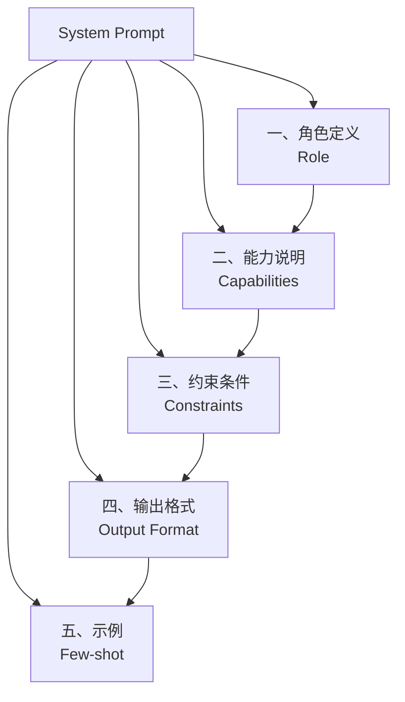
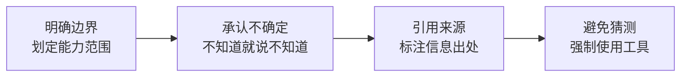
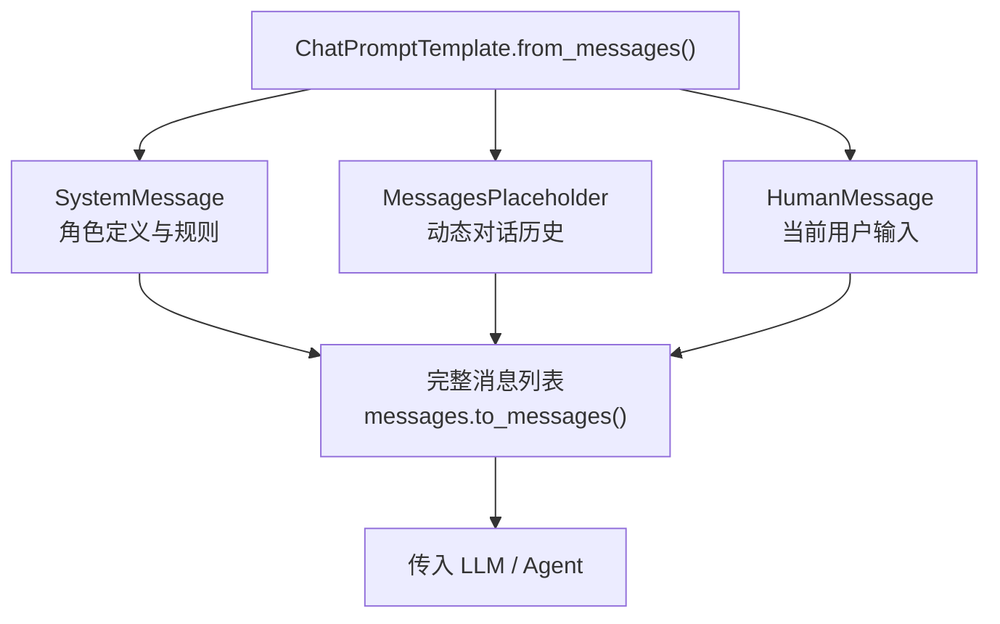

## 一、本章导学

在 Agent 架构中，工具决定了 Agent **能做什么**，而 Prompt 决定了 Agent **怎么做**。上一篇我们学会了给 Agent 装上"工具"——让它们能搜索、计算、调用 API。但如果 Prompt 写得不好，Agent 可能会忽略工具、编造信息、或者给出冗长无用的回答。

本章将系统讲解 Prompt 工程的两大核心主题：**System Prompt 设计**（角色、约束、防幻觉）和 **Prompt 模板机制**（从 f-string 到 ChatPromptTemplate）。你将学会如何设计高质量的 System Prompt 来约束 Agent 行为，以及如何用模板化管理动态 Prompt 内容。

## 二、System Prompt 设计原则

### 2.1 五大设计要素（角色/能力/约束/格式/示例）

一个生产级的 System Prompt 通常包含五个关键组成部分。这五个要素各有侧重，组合在一起构成完整的 Agent 行为规范。



上图为 System Prompt 的五大设计要素及其结构关系。下面逐一详解。

#### 2.1.1 角色定义（Role）

角色定义是 System Prompt 的起点。好的角色定义应该包含三个维度：专业领域（擅长什么）、技术栈（用什么工具）、回答风格（怎么表达）。

```python
VAGUE_ROLE = "你是一个编程助手。"

GOOD_ROLE = """# 角色

你是一位资深 Python 后端开发者，拥有 10 年生产环境经验。

## 专业领域
- Web 后端开发（Django、FastAPI、Flask）
- 数据处理与分析（pandas、numpy）
- 数据库设计与优化（PostgreSQL、Redis）

## 回答风格
- 简洁实用，先给结论再给分析
- 代码示例必须可直接运行
- 涉及设计决策时说明权衡理由"""
```

`GOOD_ROLE` 不仅定义了"你是谁"，还定义了"你用什么方式做事"和"你说话的调性是什么"。角色定义越具体，输出的**一致性**越高。

#### 2.1.2 能力说明（Capabilities）

能力说明的核心不在于列出模型能做什么，而在于明确划定**能力边界**。**模型产生幻觉的一个主要原因是它倾向于"有问必答"，即使对某个领域完全不了解也会编造答案**。能力说明的作用就是提前告诉模型：哪些问题你应该回答，哪些问题你必须拒绝。

```python
CAPABILITIES = """## 能力范围

你可以处理以下类型的问题：
- Python 代码生成与调试
- 技术方案设计与评审
- 性能问题分析与优化建议

你**不具备**以下能力，遇到相关问题时必须明确告知用户：
- 无法访问互联网或任何外部 API
- 无法执行代码或查看运行结果
- 无法获取实时数据（如股票价格、天气预报）
- 不了解 2024 年 1 月之后发生的事件"""
```

最后一条关于时间线的限制特别值得注意。明确写出知识截止日期可以防止模型对近期事件信口开河。如果集成了搜索工具，可以补充："对于实时信息，请使用 web_search 工具获取"。

#### 2.1.3 约束条件（Constraints）

约束条件是对模型行为的硬性规定。写约束条件时最常见的错误是使用模糊表述——"请注意安全"、"请尽量准确"这种"软约束"对模型几乎没有约束力。好的约束条件应该是**可验证的**——模型能够明确判断自己是否遵守了这条规则。

```python
WEAK_CONSTRAINTS = """## 约束
- 请注意代码安全
- 回答要准确
- 不要写太长"""

STRONG_CONSTRAINTS = """## 约束条件

1. 所有代码必须使用 Python 3.12 语法
2. 回答语言统一使用中文，技术术语保留英文原文
3. 涉及文件路径、数据库连接等敏感操作时，必须在回答开头给出安全警告
4. 如果对答案的确定性低于 80%，必须以"我不确定，但根据目前的信息..."开头
5. 单次回答不超过 300 字，除非用户明确要求展开说明
6. 禁止在代码中出现硬编码的密码、Token 或 IP 地址"""
```

对比两组约束，`STRONG_CONSTRAINTS` 中的每一条都是模型可以自我检查的：用了 Python 3.12 语法吗？用了中文吗？有安全警告吗？字数超了吗？

#### 2.1.4 输出格式要求（Output Format）

Agent 的输出通常不是只给人看的——它还需要被下游程序解析、触发后续流程或写入数据库。因此，规范输出格式是不可或缺的一环。

```python
OUTPUT_FORMAT = """## 输出格式

### 代码类问题
先给出一段说明（1-2句话），然后是代码块，最后列出关键要点。

### 分析类问题
先给出结论（1句话），然后是分析过程，最后是建议。

### 错误处理
当工具调用失败时：
1. 用一句话说明失败原因
2. 给出一个替代方案
3. 禁止重复尝试已失败的操作"""
```

#### 2.1.5 示例（Few-shot）

Few-shot 是所有 Prompt 优化手段中效果最显著的一个。通过给出具体的"输入-输出"对，让模型通过模仿来学习期望的输出风格。一两个精心设计的示例，往往胜过十行规则描述。

```python
FEW_SHOT = """## 回答示例

用户问：Django 和 FastAPI 怎么选？

你的回答：
取决于项目需求。Django 适合内容管理型项目（自带 ORM、Admin、认证系统），
团队协作时开发效率高。FastAPI 适合 API 密集型项目（自动生成 OpenAPI 文档、
原生异步支持），性能敏感场景下优势明显。两者也可以混合使用：
Django 做后台管理，FastAPI 做对外 API。

注意：先给结论，再分情况讨论，最后给出实用建议。"""
```

### 2.2 防幻觉策略

幻觉（Hallucination）是 Agent 应用中最棘手的问题之一。模型"一本正经地胡说八道"不仅会误导用户，在涉及金融、医疗等高风险场景中甚至会造成严重后果。

防幻觉的核心原则：**不知道就说不知道**。



上图为防幻觉策略的核心流程。四个环节环环相扣：首先划定能力范围，然后建立诚实原则，接着要求标注来源，最后强制使用工具获取数据。

```python
ANTI_HALLUCINATION = """## 信息真实性规则

你的回答必须严格基于以下来源之一：
1. 工具返回的数据
2. 你的训练数据中确定性高的事实知识

当用户的问题超出你的能力范围时，必须按以下格式回复：
"我无法确认这个信息。[具体说明缺少什么数据或能力]。建议你通过 [具体途径] 获取准确信息。"

错误示范：Python 4.0 预计 2027 年发布，主要特性包括...
正确示范：据我所知，Python 官方尚未公布 4.0 的发布计划。建议关注 python.org 获取权威信息。"""
```

除了诚实原则，还有两个实用技巧：

- **强制使用工具获取数据**：对于涉及实时信息、文件内容、数值计算的问题，明确要求"必须使用工具，不允许自行回答"
- **要求标注信息来源**：让模型在回答中注明每条信息的出处，来源不明的信息自然就不敢编造

```python
TOOL_GUIDANCE = """## 工具使用规则

以下场景必须使用对应工具，禁止凭自身知识回答：

| 场景 | 必须使用的工具 |
|------|--------------|
| 查询文件内容或分析文件数据 | read_file |
| 涉及数值计算、统计、单位换算 | calculate |
| 查询新闻、天气、价格等实时信息 | web_search |

判断标准：如果答案可能在一天之内发生变化，或者需要精确计算，就必须使用工具。"""
```

### 2.3 好的 Prompt vs 坏的 Prompt 对比

下面用一个完整的对比示例来直观感受 System Prompt 的质量差异：

```python
# -*- encoding: utf-8 -*-
'''
@File        :   prompt_compare.py
@Time        :   2026/04/26 22:26:58
@Author      :   xcy.小相 
@Version     :   1.0
@Description :   06-Prompt工程：从模板到角色设计
'''
import os
from langchain.chat_models import init_chat_model
from langchain.agents import create_agent
from langchain.tools import tool
from dotenv import load_dotenv

load_dotenv()

llm = init_chat_model(
    model=os.getenv("MODEL_NAME"),
    api_key=os.getenv("API_KEY"),
    base_url=os.getenv("BASE_URL"),
    model_provider="openai"
)

@tool
def web_search(query: str) -> str:
    """搜索互联网获取最新信息"""
    return f"搜索结果：{query} - 北京今天晴转多云，最高温度28°C，最低温度18°C。"

BAD_PROMPT = "你是一个助手，可以帮助用户搜索和计算。"

GOOD_PROMPT = """你是一个信息查询助手。

## 核心规则
- 你不知道任何实时信息，必须通过工具获取
- 涉及天气、新闻、价格等实时数据时，必须使用 web_search 工具
- 绝对不允许编造或猜测任何信息"""

agent_bad = create_agent(llm, [web_search], system_prompt=BAD_PROMPT)
print(agent_bad.invoke({"messages":[{"role":"user","content":"北京天气如何？"}]}))

agent_good = create_agent(llm, [web_search], system_prompt=GOOD_PROMPT)
print(agent_good.invoke({"messages":[{"role":"user","content":"北京天气如何？"}]}))

```

使用差 Prompt 的 Agent，面对"北京今天天气怎么样"这样的问题时，很可能直接回复一段看起来合理的天气描述——内容完全是编造的。而使用好 Prompt 的 Agent 会先调用 `web_search` 工具，拿到真实数据后再组织回答。

## 三、Prompt 模板机制

### 3.1 f-string 方式

f-string 是最轻量的模板方式，适合结构固定、变量少的场景。它不需要任何额外依赖，Python 原生支持：

```python
from langchain.chat_models import init_chat_model
from dotenv import load_dotenv
import os

load_dotenv()

def build_prompt(language: str, role: str = "编程助手") -> str:
    return f"""# 角色

你是一个{role}，专门帮助用户解决 {language} 相关的问题。

## 规则

1. 所有代码示例使用 {language}
2. 回答使用中文
3. 代码必须可以直接运行
"""

model = init_chat_model(
    model=os.getenv("MODEL_NAME"),
    api_key=os.getenv("API_KEY"),
    base_url=os.getenv("BASE_URL"),
    model_provider="openai"
)
prompt = build_prompt(language="Python", role="资深后端工程师")
response = model.invoke(prompt)
print(response.content)
```

f-string 的局限在于：当变量增多或需要条件逻辑时，代码会变得臃肿。此外，f-string 没有模板复用能力——每个函数只能生成一种固定结构的 Prompt。

### 3.2 ChatPromptTemplate

前一种方式生成的是纯文本字符串，而 LLM 的 Chat API 实际上接收的是一个消息列表（SystemMessage、HumanMessage、AIMessage 等）。`ChatPromptTemplate` 是 LangChain 专门为 Chat API 设计的模板类，它直接生成消息对象列表：

```python
from langchain_core.prompts import ChatPromptTemplate

prompt = ChatPromptTemplate.from_messages([
    ("system", "你是一个{role}，使用中文回答问题。"),
    ("human", "{question}"),
])

messages = prompt.invoke({
    "role": "数据分析助手",
    "question": "pandas 和 numpy 有什么区别？",
})

print(messages.to_messages())
```

运行结果：

```
[
SystemMessage(content='你是一个数据分析助手，使用中文回答问题。', additional_kwargs={}, response_metadata={}), 
HumanMessage(content='pandas 和 numpy 有什么区别？', additional_kwargs={}, response_metadata={})
]
```

### 3.3 动态变量与条件逻辑

实际业务中，System Prompt 往往需要根据场景动态调整。ChatPromptTemplate 支持通过 `template_format="jinja2"` 在消息模板中使用 Jinja2 的条件语法：

> 首先通过`uv add jinja2` 安装依赖包。

```python
from langchain_core.prompts import ChatPromptTemplate, MessagesPlaceholder

DYNAMIC_SYSTEM_PROMPT = """# 客服助手

## 用户信息
- 用户等级：{{ user_level }}
- 历史订单数：{{ order_count }}

## 服务标准

- 优先响应，回复不超过3句话
- 主动提供解决方案
- 语气亲切热情

- 正常响应，回复简洁明了
- 语气专业礼貌


## 通用规则
- 使用中文回答
- 不知道的信息不要编造
"""

prompt = ChatPromptTemplate.from_messages([
    ("system", DYNAMIC_SYSTEM_PROMPT),
    MessagesPlaceholder(variable_name="history"),
    ("human", "{input}"),
], template_format="jinja2")

messages = prompt.invoke({
    "user_level": "VIP",
    "order_count": 47,
    "history": [],
    "input": "我昨天买的耳机有杂音，想退换",
})

for msg in messages.to_messages():
    print(f"{msg.type}: {msg.content}...")
```

运行结果：

```
➜ uv run prompt_design.py
system: # 客服助手

## 用户信息
- 用户等级：VIP
- 历史订单数：47

## 服务标准

- 优先响应，回复不超过3句话
- 主动提供解决方案
- 语气亲切热情

## 通用规则
- 使用中文回答
- 不知道的信息不要编造...
```

Jinja2 的条件段落让模板具备了动态逻辑能力——VIP 用户和普通用户会看到完全不同的服务标准，但共享同一套通用规则。

### 3.4 MessagesPlaceholder

`MessagesPlaceholder` 是 `ChatPromptTemplate` 的核心扩展点。它是一个消息列表占位符，在运行时会被替换为完整的消息对象列表。在多轮对话中，这个机制的价值尤为突出——你可以用一个占位符来接收任意长度的对话历史：

```python
from langchain_core.prompts import ChatPromptTemplate, MessagesPlaceholder
from langchain.messages import HumanMessage, AIMessage

prompt = ChatPromptTemplate.from_messages([
    ("system", "你是一个友好的助手，记住用户告诉你的信息。"),
    MessagesPlaceholder(variable_name="history"),
    ("human", "{input}"),
])

messages = prompt.invoke({
    "history": [
        HumanMessage(content="我叫小明，今年25岁"),
        AIMessage(content="你好小明！25岁，是工作还是上学呢？"),
    ],
    "input": "我叫什么名字？",
})

for msg in messages.to_messages():
    print(f"{msg.type}: {msg.content}")
```

运行结果：

```
system: 你是一个友好的助手，记住用户告诉你的信息。
human: 我叫小明，今年25岁
ai: 你好小明！25岁，是工作还是上学呢？
human: 我叫什么名字？
```



上图为 ChatPromptTemplate 的消息组装流程。`SystemMessage` 固定角色，`MessagesPlaceholder` 接收动态历史，`HumanMessage` 承载当前输入，三者组装为完整消息列表后传入 LLM。

`SystemMessage + MessagesPlaceholder("history") + HumanMessage` 是多轮对话的黄金结构。在实际使用中，`history` 的来源通常是 Checkpointer 自动管理的对话历史，开发者不需要手动管理消息列表的拼接。

## 四、代码实战

### 4.1 构建客服 Prompt

把前面讨论的五大要素组合起来，构建一个面向"技术研究助手"场景的完整 System Prompt：

```python
# -*- encoding: utf-8 -*-
'''
@File        :   research_prompt.py
@Time        :   2026/04/26 22:55:19
@Author      :   xcy.小相 
@Version     :   1.0
@Description :   06-Prompt工程：从模板到角色设计
'''

from langchain.chat_models import init_chat_model
from langchain.agents import create_agent
from langchain.tools import tool

from dotenv import load_dotenv
import os

load_dotenv()

RESEARCH_ASSISTANT_PROMPT = """# 角色

你是一位技术研究助手，专注于帮助开发者进行技术调研、方案设计和问题排查。

## 专业领域
后端开发、系统架构、数据库、云计算、DevOps

## 能力与限制

你可以：
- 分析技术方案并给出优劣对比
- 排查代码问题和性能瓶颈
- 编写技术文档和代码示例

你不可以：
- 访问互联网（需查询时使用 web_search 工具）
- 读取本地文件（需查看文件时使用 read_file 工具）
- 确认任何 2024 年 6 月之后的事件

## 约束条件

1. 回答使用中文，技术术语保留英文
2. 涉及安全风险的操作必须给出明确警告
3. 不确定的信息必须标注"未经确认"
4. 单次回答不超过 300 字，除非用户要求展开

## 工具使用规则

| 场景 | 工具 |
|------|------|
| 需要最新信息或官方文档 | web_search |
| 需要查看文件内容 | read_file |
| 需要精确数值计算 | calculate |

## 输出格式

代码问题：简述问题 → 给出修复代码 → 列出关键改进点
方案对比：给出推荐结论 → 分维度对比 → 说明适用场景
错误排查：描述问题原因 → 给出排查步骤 → 提供修复方案"""

@tool
def web_search(query: str) -> str:
    """搜索互联网获取最新信息"""
    return f"搜索 '{query}' 的结果：[模拟搜索结果]"

@tool
def read_file(path: str) -> str:
    """读取本地文件内容"""
    return f"文件 '{path}' 的内容：[模拟文件内容]"

@tool
def calculate(expression: str) -> str:
    """执行数学计算"""
    try:
        return f"计算结果：{eval(expression)}"
    except Exception as e:
        return f"计算错误：{e}"

model = init_chat_model(
    model=os.getenv("MODEL_NAME"),
    api_key=os.getenv("API_KEY"),
    base_url=os.getenv("BASE_URL"),
    model_provider="openai"
)

agent = create_agent(
    model,
    [web_search, read_file, calculate],
    system_prompt=RESEARCH_ASSISTANT_PROMPT,
)

result = agent.invoke({"messages": [("user", "FastAPI和Flask怎么选？")]})
for msg in result["messages"]:
    if msg.type == "tool":
        print(f"======工具调用: {msg.content}========")

    if msg.type == "ai" and msg.content:
        print(msg.content)
```

运行结果示例：

```bash
➜  uv run prompt_design.py
======工具调用: 搜索 'FastAPI vs Flask 2024 comparison' 的结果：[模拟搜索结果]========
FastAPI 和 Flask 的选择需根据项目需求决定：

1. **性能对比**：FastAPI 支持异步请求处理（async/await），在高并发场景下性能更优（未经确认）；Flask 为同步框架，适合中小型应用

2. **开发效率**：FastAPI 自带 Swagger/Redoc 文档生成功能，通过 Pydantic 实现自动参数校验和数据解析，减少手动验证代码

3. **适用场景**：
   - 选 FastAPI：需要高性能 API、实时通信（WebSocket）、异步任务处理
   - 选 Flask：项目规模较小、需要更灵活的扩展性、依赖传统同步数据库驱动

4. **学习曲线**：Flask 语法更简单易上手，FastAPI 需额外学习异步编程概念

建议新项目优先尝试 FastAPI，尤其涉及 API 服务和需要处理大量并发请求时。若使用传统同步数据库且需求简单，Flask 仍具优势。
```

### 4.2 动态切换角色

实际业务中，不同场景需要不同的角色设定。通过 ChatPromptTemplate + Jinja2 实现动态角色切换：

```python
# -*- encoding: utf-8 -*-
'''
@File        :   prompt_design_demo02.py
@Time        :   2026/04/26 23:07:01
@Author      :   xcy.小相 
@Version     :   1.0
@Description :   06-Prompt工程：从模板到角色设计
'''

from langchain.agents import create_agent
from langchain_core.prompts import ChatPromptTemplate, MessagesPlaceholder
from langchain.chat_models import init_chat_model
from dotenv import load_dotenv
import os

load_dotenv()

SYSTEM_TEMPLATE = """# {{ role }}


## 专业领域

- {{ skill }}



## 工作规则

{{ loop.index }}. {{ rule }}



## 约束条件

- {{ c }}



使用中文回答，保持简洁。"""

prompt = ChatPromptTemplate.from_messages([
    ("system", SYSTEM_TEMPLATE),
    MessagesPlaceholder(variable_name="history"),
    ("human", "{input}"),
], template_format="jinja2")

model = init_chat_model(
    model=os.getenv("MODEL_NAME"),
    api_key=os.getenv("API_KEY"),
    base_url=os.getenv("BASE_URL"),
    model_provider="openai",
)

# 角色1：Python 开发助手
print("角色1：Python 开发助手================================")
system_prompt_result = prompt.invoke({
    "role": "Python 开发助手",
    "expertise": ["Web 开发", "数据处理", "自动化脚本"],
    "rules": ["使用中文回答", "代码可直接运行"],
    "constraints": ["不超过 300 字"],
    "history": [],
    "input": "",
}).to_messages()[0].content

agent = create_agent(
    model=model,
    tools=[],
    system_prompt=system_prompt_result,
)

result = agent.invoke({"messages": [("user", "如何读取一个 CSV 文件？")]})
print(result["messages"][-1].content)

# 角色2：go 开发助手
print("\n\n 角色2：go 开发助手================================")
system_prompt_result = prompt.invoke({
    "role": "GO 开发助手",
    "expertise": ["Web 开发", "数据处理", "自动化脚本"],
    "rules": ["使用中文回答", "代码可直接运行"],
    "constraints": ["不超过 300 字"],
    "history": [],
    "input": "",
}).to_messages()[0].content

agent = create_agent(
    model=model,
    tools=[],
    system_prompt=system_prompt_result,
)

result = agent.invoke({"messages": [("user", "如何读取一个 CSV 文件？")]})
print(result["messages"][-1].content)

```

运行结果示例：

```
➜  uv run prompt_design_demo02.py
角色1：Python 开发助手================================
读取CSV文件可使用Python内置的`csv`模块或第三方库`pandas`，示例如下：

### 方法1：使用csv模块
‍```python
import csv
……

 角色2：go 开发助手================================
在 Go 中读取 CSV 文件可通过标准库 `encoding/csv` 实现：

‍```go
package main
……
```

### 4.3 多轮对话 Prompt 管理

多轮对话的核心挑战是管理上下文——既不能丢失关键信息，也不能让消息无限增长。配合 `Checkpointer` 是标准方案：

```python
# -*- encoding: utf-8 -*-
'''
@File        :   prompt_design_demo03.py
@Time        :   2026/04/26 23:30:56
@Author      :   xcy.小相 
@Version     :   1.0
@Description :   06-Prompt工程：从模板到角色设计
'''

from langchain.chat_models import init_chat_model
from langchain.agents import create_agent
from langgraph.checkpoint.memory import InMemorySaver
from dotenv import load_dotenv
import os

load_dotenv()

CONVERSATION_PROMPT = "你是一个智能助手。\n## 规则\n- 使用中文回答\n- 记住用户告诉你的信息\n- 不知道就说不知道"

model = init_chat_model(
    model=os.getenv("MODEL_NAME"),
    api_key=os.getenv("API_KEY"),
    base_url=os.getenv("BASE_URL"),
    model_provider="openai",
)

agent = create_agent(
    model,
    system_prompt=CONVERSATION_PROMPT,
    checkpointer=InMemorySaver(),
)

config = {"configurable": {"thread_id": "session-1"}}

# 第一轮对话
result1 = agent.invoke(
    {"messages": [{"role":"user","content":"我叫小明，我是一名 Python 开发者"}]},
    config = config,
)
print(result1["messages"][-1].content)

# 第二轮对话——Agent 记住了你的名字和职业
result2 = agent.invoke(
    {"messages": [{"role":"user","content":"我叫什么名字？推荐一个 Web 框架给我"}]},
    config = config,
)
print(result2["messages"][-1].content)

```

运行结果示例：

```
你好小明！Python 开发者，很好的选择。有什么可以帮你的吗？
你叫小明！作为 Python 开发者，我推荐 FastAPI——它原生支持异步、自动生成 OpenAPI 文档、类型提示友好，非常适合现代 Web API 开发。
```

Checkpointer 通过 `thread_id` 区分不同的对话会话。同一 `thread_id` 下的对话历史会被自动管理，Agent 在决策时会综合分析所有历史消息。

## 五、常见陷阱与调试

### 5.1 Prompt 过长

System Prompt 会占用模型的上下文窗口。过长的 Prompt（超过 2000 字）可能导致：

- 模型注意力分散，关键规则被忽略
- Token 消耗增加，成本上升
- 重要规则被"淹没"在大量文字中

解决策略：将最重要的规则放在 Prompt 的**开头或结尾**（这两个位置是模型注意力最集中的区域），中间放置辅助说明。

### 5.2 规则冲突

当 Prompt 中存在相互矛盾的规则时，模型会"随机选择"遵守哪一条。例如"回答要详细"和"不超过100字"同时出现会让模型困惑。写完后通读一遍，检查是否存在矛盾。

### 5.3 忽略工具

如果 Prompt 中没有明确要求使用工具，模型可能凭自身知识回答——即使答案已经过时或错误。在涉及实时数据、文件内容、精确计算的场景中，必须显式要求"必须使用工具"。

## 六、本章小结

本章系统讲解了 Prompt 工程的两大核心主题：

- **System Prompt 设计**包含五大要素：角色定义（统一输出风格）、能力说明（划定知识边界）、约束条件（规范行为方式）、输出格式（保证可解析性）、Few-shot 示例（让模型学会模仿）。其中防幻觉是最值得投入的方向——"不知道就说不知道"加上强制使用工具，两条规则就能解决大部分幻觉问题
- **Prompt 模板机制**提供了从简单到复杂的三种方案：f-string（零依赖、适合原型验证）、ChatPromptTemplate（消息对象管理、Agent 集成）、Jinja2 条件逻辑（动态内容生成）。
- **实战层面**，通过客服 Prompt 构建、动态角色切换、多轮对话管理三个案例，展示了如何将设计原则落地为可运行的生产代码

## 七、扩展阅读

- [LangChain 官方文档 - Prompt Templates](https://python.langchain.com/docs/concepts/prompt_templates/)
- [OpenAI Prompt Engineering Guide](https://platform.openai.com/docs/guides/prompt-engineering)
- [Anthropic Prompt Engineering](https://docs.anthropic.com/en/docs/build-with-claude/prompt-engineering/)
- [Jinja2 模板引擎文档](https://jinja.palletsprojects.com/)