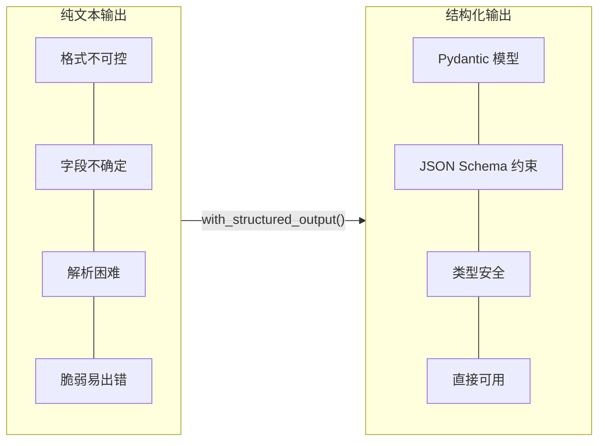
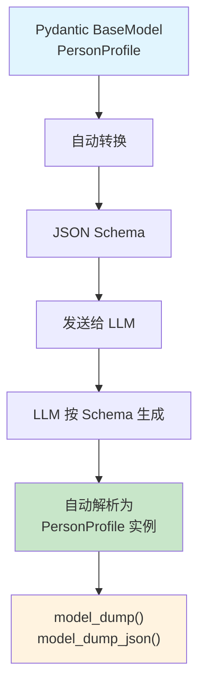
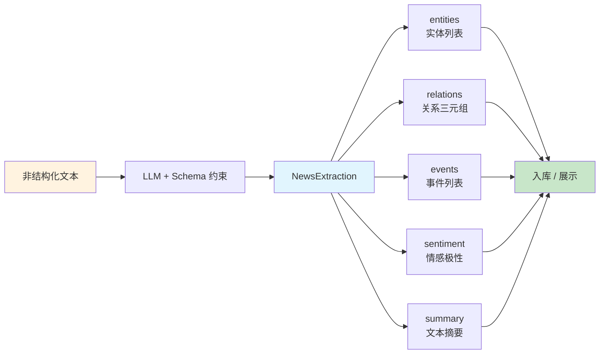

## 一、本章导学

前几篇中，Agent 的输出始终是纯文本。但在实际开发中，我们往往需要 Agent 返回结构化的数据——一段文本的情感极性、一份代码审查的评分和改进建议、一个用户信息的提取结果。纯文本输出在这些场景下显得力不从心。

本章将系统讲解 LangChain 中结构化输出的完整方案：从 Pydantic 模型定义，到 `with_structured_output()` 的底层原理，再到 Agent 级结构化输出的三种策略。学完本章后，你能让 Agent 返回任何你想要的数据结构，并保证类型安全。

## 二、为什么需要结构化输出

### 2.1 纯文本输出的痛点

LLM 默认返回的是一段自由格式的文本。对于人类阅读来说没问题，但当你的程序需要消费这些输出时，痛点就来了：

**格式不可控**。同一个问题，模型可能这次返回 JSON 格式，下次返回带 Markdown 的纯文本。你永远无法预测模型会以什么格式返回结果。

**字段不确定**。"情感分析"的结果中，这次有"置信度"字段，下次就没了。模型的输出是不确定的，字段的存在与否取决于模型的"心情"。

**解析困难**。你需要写正则表达式或者复杂的字符串处理逻辑来提取想要的信息。这种解析代码脆弱且不可维护。

```python
from langchain.chat_models import init_chat_model
from dotenv import load_dotenv
import os
import json

load_dotenv()

llm = init_chat_model(
    model=os.getenv("MODEL_NAME"),
    api_key=os.getenv("API_KEY"),
    base_url=os.getenv("BASE_URL"),
    model_provider="openai",
    temperature=0,
)

prompt = """请分析以下文本的情感，并以JSON格式返回。
JSON格式要求：
{
    "sentiment": "positive 或 negative 或 neutral",
    "confidence": 0.95,
    "reason": "判断理由"
}

文本：这款产品的用户体验非常棒，界面简洁，功能强大！

只返回JSON，不要返回其他内容。"""

response = llm.invoke(prompt)
print(response.content)
```

运行后，你可能会得到类似这样的输出：

```
‍```json
{
    "sentiment": "positive",
    "confidence": 0.92,
    "reason": "文本使用了'非常棒'、'简洁'、'强大'等积极词汇"
}
```

注意模型在 JSON 外面包了 Markdown 代码块标记。你需要手动剥离：

```python
content = response.content.strip()
if content.startswith("‍```"):
    lines = content.split("\n")
    content = "\n".join(lines[1:-1])

try:
    data = json.loads(content)
    print(data["sentiment"])
except json.JSONDecodeError:
    print("解析失败，原始输出：", response.content)
```

这种手动解析的方式脆弱且不可维护。随着业务复杂度增长，JSON 结构变得复杂，字段增多，手动解析的代码量会急剧膨胀，而且永远无法覆盖所有可能的异常情况。

### 2.2 Pydantic 的解决方案

Pydantic 是 Python 中最流行的数据验证库，LangChain 直接用它来定义结构化输出的 Schema。核心思路是：你用 Pydantic 定义一个数据模型，LangChain 把这个模型转换为 JSON Schema 发给 LLM，LLM 按照 Schema 约束返回结构化数据，LangChain 再将返回值解析为 Pydantic 对象。整个过程完全自动化，不需要手写任何解析逻辑。

下图对比了纯文本输出与结构化输出的差异：



## 三、Pydantic 模型定义

### 3.1 基础模型

Pydantic 模型定义就是结构化输出的 Schema。你只需要继承 `BaseModel`，用类型注解声明字段，LangChain 就能把这个模型转换为 JSON Schema，让模型按照这个格式返回数据。

以情感分析为例：

```python
from pydantic import BaseModel, Field

class SentimentAnalysis(BaseModel):
    text: str = Field(description="被分析的原始文本")
    sentiment: str = Field(description="情感极性，只能是 positive、negative 或 neutral")
    confidence: float = Field(description="情感判断的置信度，0到1之间")
    keywords: list[str] = Field(description="文本中反映情感的关键词列表")
```

每个字段的 `Field(description=...)` 既是给开发者的说明，也是给 LLM 的指引——模型会根据这些描述来理解每个字段应该填什么内容。这种双重价值是 Pydantic 方案的核心优势。

再看一个代码审查的场景：

```python
class CodeReview(BaseModel):
    file_path: str = Field(description="被审查的文件路径")
    overall_score: int = Field(description="整体评分，1到10分")
    issues: list[str] = Field(description="发现的问题列表，每条简洁描述")
    suggestions: list[str] = Field(description="改进建议列表")
    summary: str = Field(description="一段话的审查总结")
```

### 3.2 嵌套结构

真实业务中的数据结构往往不是扁平的。Pydantic 支持嵌套模型，让你表达任意复杂的数据层次：

```python
from typing import Optional, Literal
from pydantic import BaseModel, Field

class ContactInfo(BaseModel):
    phone: Optional[str] = Field(default=None, description="手机号码")
    email: Optional[str] = Field(default=None, description="邮箱地址")
    address: Optional[str] = Field(default=None, description="居住地址")

class WorkExperience(BaseModel):
    company: str = Field(description="公司名称")
    position: str = Field(description="职位")
    duration: str = Field(description="任职时长，如 2020-2023")
    description: str = Field(description="工作内容简述")

class PersonProfile(BaseModel):
    name: str = Field(description="姓名")
    age: Optional[int] = Field(default=None, description="年龄，如果文本中未提及则为null")
    gender: Literal["男", "女", "未知"] = Field(description="性别")
    occupation: str = Field(description="职业")
    contact: ContactInfo = Field(description="联系方式")
    experiences: list[WorkExperience] = Field(description="工作经历列表，按时间倒序排列")
    skills: list[str] = Field(description="专业技能列表")
    summary: str = Field(description="一句话概括此人背景")
```

`Optional` 表示字段可以为空，`Literal` 限制字段只能取枚举值，`list[WorkExperience]` 表示对象列表。这些类型约束最终都会转换为 JSON Schema 传给模型，帮助它更准确地填充数据。

下图展示了 Pydantic 模型到 JSON Schema 的转换过程：



### 3.3 字段验证与约束

`Field` 不仅提供 `description`，还支持各种数值和字符串约束。这些约束一方面用于数据校验，另一方面也会传递给模型作为生成指引：

```python
from pydantic import BaseModel, Field

class ProductReview(BaseModel):
    product_name: str = Field(description="产品名称")
    rating: int = Field(ge=1, le=5, description="评分，1到5分")
    price_satisfaction: int = Field(ge=1, le=10, description="价格满意度，1到10分")
    pros: list[str] = Field(
        min_length=1, max_length=5,
        description="优点列表，至少1条，最多5条"
    )
    cons: list[str] = Field(
        min_length=1, max_length=5,
        description="缺点列表，至少1条，最多5条"
    )
    recommend: bool = Field(description="是否推荐此产品")
    recommend_reason: str = Field(
        max_length=50,
        description="推荐或否定的理由，50字以内"
    )
```

`ge`（大于等于）和 `le`（小于等于）限制数值范围，`min_length` 和 `max_length` 限制列表长度或字符串长度。虽然 LLM 不一定能 100% 遵守所有约束（它毕竟不是编译器），但这些约束能显著提升输出质量。

### 3.4 自定义验证器

Pydantic V2 提供了 `@field_validator` 和 `@model_validator` 装饰器，允许你在模型层面定义复杂的校验逻辑。这在结构化输出场景中非常实用——模型返回的数据需要经过二次验证才能使用：

```python
from pydantic import BaseModel, Field, field_validator, model_validator
from typing import Optional

class EventInfo(BaseModel):
    name: str = Field(description="活动名称")
    start_date: str = Field(description="开始日期，格式 YYYY-MM-DD")
    end_date: Optional[str] = Field(default=None, description="结束日期，格式 YYYY-MM-DD")
    location: str = Field(description="举办地点")
    capacity: int = Field(ge=1, description="最大容纳人数")

    @field_validator("start_date", "end_date")
    @classmethod
    def validate_date_format(cls, v: Optional[str]) -> Optional[str]:
        if v is None:
            return v
        from datetime import datetime
        try:
            datetime.strptime(v, "%Y-%m-%d")
        except ValueError:
            raise ValueError(f"日期格式错误: {v}，应为 YYYY-MM-DD")
        return v

    @model_validator(mode="after")
    def validate_date_range(self):
        if self.end_date and self.end_date < self.start_date:
            raise ValueError("结束日期不能早于开始日期")
        return self
```

`@field_validator` 用于单个字段的校验（如日期格式检查），`@model_validator(mode="after")` 用于多字段联合校验（如起止日期的逻辑关系）。注意：这些验证器在 Pydantic 反序列化时执行，但 LLM 生成的数据如果违反约束，`with_structured_output()` 会抛出 `ValidationError`，你需要在调用层做错误处理。

### 3.5 Optional 字段与 Literal 枚举的最佳实践

在信息抽取场景中，原始文本通常不会包含所有字段。`Optional` 和 `default` 的正确使用至关重要：

```python
from typing import Optional, Literal
from pydantic import BaseModel, Field

class MedicalRecord(BaseModel):
    patient_name: str = Field(description="患者姓名")
    age: Optional[int] = Field(
        default=None,
        description="患者年龄，未提及则为null"
    )
    gender: Literal["男", "女", "未知"] = Field(
        default="未知",
        description="性别，只能选 男、女、未知"
    )
    symptoms: list[str] = Field(
        default_factory=list,
        description="症状列表，至少列出已提到的症状"
    )
    severity: Literal["轻度", "中度", "重度"] = Field(
        default="轻度",
        description="严重程度，未明确标注时默认为轻度"
    )
    diagnosis: Optional[str] = Field(
        default=None,
        description="诊断结果，如果文本中未提及则为null"
    )
    medications: list[str] = Field(
        default_factory=list,
        description="提到的药物列表"
    )
```

关键原则：**必须字段用 **​****​****​**​**​**​`str`​**​**​**​ ** 或 **​**​`int`​**​ **​ ****（无 ****​******​******​****​****​****​`default`​****​****​****​**​ **​ ****），可选字段用 ****​******​******​****​****​****​`Optional[T]`​****​****​****​**​ ** 并设 **​****​****​**​**​**​`default=None`​**​**​**。这告诉 LLM 哪些字段是必须从文本中提取的，哪些可以跳过。`Literal` 类型则用于限制枚举值，避免模型自创分类。

注意！`default_factory=list`​ 用于可变默认值。如果写成 `default=[]` 会导致数据错误，因为 Python 的可变默认值会在线程间共享。

> 关于Pydantic的更多用法，可以查看其[官方文档](https://docs.pydantic.dev/)，这里不再赘述。

## 四、with_structured_output

### 4.1 基础用法

`with_structured_output()` 是 LangChain 提供的核心方法，它能让模型直接返回 Pydantic 对象，而不是纯文本。底层实现是通过 Tool Calling 机制——LangChain 把你的 Pydantic 模型注册为一个"工具"，让模型以调用工具的方式返回结构化数据。

```python
# -*- encoding: utf-8 -*-
'''
@File        :   pydantic_structure.py
@Time        :   2026/04/27 10:49:59
@Author      :   xcy.小相 
@Version     :   1.0
@Description :   07-Pydantic结构化输出
'''
from pydantic import BaseModel, Field
from langchain.chat_models import init_chat_model
from dotenv import load_dotenv
import os

load_dotenv()

llm = init_chat_model(
    model=os.getenv("MODEL_NAME"),
    api_key=os.getenv("API_KEY"),
    base_url=os.getenv("BASE_URL"),
    model_provider="openai"
)

class MovieReview(BaseModel):
    title: str = Field(description="电影名称")
    director: str = Field(description="导演姓名")
    rating: float = Field(description="评分，0到10分")
    genre: list[str] = Field(description="电影类型标签")
    one_line_review: str = Field(description="一句话影评")

structured_llm = llm.with_structured_output(MovieReview)

result = structured_llm.invoke("评价一下电影《星际穿越》，导演是诺兰")
print(type(result))
print(result.model_dump_json(indent=2))
```

运行结果：

```
<class '__main__.MovieReview'>
{
  "title": "《星际穿越》：穿越时空的父爱与宇宙的诗意",
  "director": "克里斯托弗·诺兰",
  "rating": 9.1,
  "genre": [ "科幻", "剧情", "冒险" ],
  "one_line_review": "一部融合硬核科学与深沉情感的太空史诗，是诺兰最具哲学深度的电影之一。"
}
```

输出类型直接就是 `MovieReview` 实例。你可以通过 `.rating`、`.genre` 等属性直接访问字段，也可以用 `.model_dump()` 转为字典或 `.model_dump_json()` 转为 JSON 字符串。不再需要手写任何解析逻辑。

### 4.2 json_schema vs function_calling

`with_structured_output()` 的 `method` 参数控制底层实现方式，两种主要方法有各自的特点：

**​**​**​`method="function_calling"`​**​**​** （默认值）。将 Pydantic 模型注册为一个 Function Calling 的"工具"，模型通过"调用工具"的方式返回结构化数据。这是大多数支持 Tool Calling 的模型的默认方式，效果通常最好。

**​**​**​`method="json_schema"`​**​**​** 。将 Pydantic 模型转换为 JSON Schema，模型在响应中遵循 JSON Schema 结构输出。此模式不会将 Schema 传递给模型，仅在模型响应后用于解析和验证输出格式。适用于不支持 Tool Calling 但支持 JSON 输出的模型。

```python
structured_llm_json = llm.with_structured_output(MovieReview, method="json_schema")
structured_llm_func = llm.with_structured_output(MovieReview, method="function_calling")
```

实际选择时，大多数情况下使用默认的 `method="function_calling"` 即可。只有当模型不支持 Tool Calling 但能输出 JSON 时，才需要显式指定 `method="json_schema"`。

两种方法的详细对比：

|特性|`method="function_calling"`|`method="json_schema"`|
| ----------------| --------------------------------------| -------------------------------|
|底层机制|Function Calling，以"工具"形式返回|JSON Schema，模型响应后解析验证|
|输出纯净度|高，由框架解析后直接返回 Pydantic 实例|中，依赖模型自行遵循 JSON 格式|
|模型兼容性|需要模型显式支持 Tool Calling|大部分现代模型支持|
|并行输出|支持同时调用多个 Function|不支持并行多 Schema|
|Schema 复杂度|每个工具独立定义，无引用|支持 `$defs`/`$ref` 复用|
|输出包含思考过程|部分模型会附带推理文本|否，纯 JSON|
|推荐场景|支持 Tool Calling 的模型（默认首选）|不支持 Tool Calling 的模型|

在 LangGraph Agent 中，如果 Agent 同时使用了工具和结构化输出，`function_calling` 方式可能导致模型混淆"调工具"和"返回结构化数据"两种意图。此时 `json_schema` 更安全。

### 4.3 错误处理与重试

模型偶尔会返回不符合 Schema 的数据，尤其是在模型能力不足或 Schema 过于复杂时。`with_structured_output()` 在解析失败时会抛出异常，生产环境中必须处理这种情况：

```python
from pydantic import BaseModel, Field, ValidationError
from langchain.chat_models import init_chat_model
from dotenv import load_dotenv
import os

load_dotenv()

llm = init_chat_model(
    model=os.getenv("MODEL_NAME"),
    api_key=os.getenv("API_KEY"),
    base_url=os.getenv("BASE_URL"),
    model_provider="openai",
    temperature=0,
)

class ExtractionResult(BaseModel):
    company: str = Field(description="公司名称")
    position: str = Field(description="职位名称")
    salary_min: int = Field(description="最低薪资，单位元/月")
    salary_max: int = Field(description="最高薪资，单位元/月")

structured_llm = llm.with_structured_output(ExtractionResult)

text = "某互联网大厂招聘高级Python工程师，薪资范围30k-50k，要求3年以上经验。"

try:
    result = structured_llm.invoke(f"从以下文本中提取招聘信息：\n{text}")
    print(result.model_dump())
except ValidationError as e:
    print(f"结构验证失败: {e}")
    fallback_result = ExtractionResult(
        company="未知",
        position="未知",
        salary_min=0,
        salary_max=0,
    )
except Exception as e:
    print(f"调用失败: {e}")
```

一种实用的降级策略是：结构化解析失败时，回退到纯文本模式，再用正则或简单的字符串匹配提取关键信息。虽然不完美，但总比直接报错好。

## 五、代码实战

### 5.1 信息提取 Agent

下面是一个完整的"简历信息提取 Agent"，展示了嵌套 Pydantic 模型在 Agent 中的实际应用：

```python
# -*- encoding: utf-8 -*-
'''
@File        :   pydantic_structure_demo01.py
@Time        :   2026/04/27 10:49:59
@Author      :   xcy.小相 
@Version     :   1.0
@Description :   07-Pydantic结构化输出
'''
from pydantic import BaseModel, Field
from typing import Optional, Literal
from langchain.chat_models import init_chat_model
from langchain.agents import create_agent
from langchain.tools import tool
from dotenv import load_dotenv
import os

load_dotenv()

class ContactInfo(BaseModel):
    phone: Optional[str] = Field(default=None, description="手机号码")
    email: Optional[str] = Field(default=None, description="邮箱地址")

class WorkExperience(BaseModel):
    company: str = Field(description="公司名称")
    position: str = Field(description="职位")
    duration: str = Field(description="任职时长")
    description: str = Field(description="工作内容简述")

class PersonProfile(BaseModel):
    name: str = Field(description="姓名")
    age: Optional[int] = Field(default=None, description="年龄")
    gender: Literal["男", "女", "未知"] = Field(default="未知", description="性别")
    occupation: str = Field(description="当前职业")
    contact: ContactInfo = Field(description="联系方式")
    experiences: list[WorkExperience] = Field(description="工作经历列表")
    skills: list[str] = Field(description="专业技能列表")
    summary: str = Field(description="一句话概括此人背景")

@tool
def search_linkedin(query: str) -> str:
    """搜索 LinkedIn 上的公开信息。"""
    mock_data = {
        "张三": "张三，高级后端工程师，曾在字节跳动（2年）和阿里巴巴（3年）工作，擅长 Python、Go 和系统设计。",
        "李四": "李四，产品经理，5年经验，专注于 AI 产品方向，曾主导过多个大模型应用的落地。",
    }
    for name, info in mock_data.items():
        if name in query:
            return info
    return f"未找到与 '{query}' 相关的公开信息。"

llm = init_chat_model(
    model=os.getenv("MODEL_NAME"),
    api_key=os.getenv("API_KEY"),
    base_url=os.getenv("BASE_URL"),
    model_provider="openai"
)

agent = create_agent(
    model=llm,
    tools=[search_linkedin],
    system_prompt="你是一个专业的 LinkedIn 搜索助手，能够根据用户的问题搜索 LinkedIn 上的公开信息，并将结果整理为结构化的人物档案。",
    response_format=PersonProfile,
)

response = agent.invoke({"messages": [{"role": "user", "content": "搜索张三的 LinkedIn 信息"}]})
print(response["messages"][-1].content_blocks[0].model_dump_json(indent=2, ensure_ascii=False))
```

运行结果示例：

```json
{
  "name": "张三",
  "age": null,
  "gender": "未知",
  "occupation": "高级后端工程师",
  "contact": {
    "phone": null,
    "email": null
  },
  "experiences": [
    {
      "company": "字节跳动",
      "position": "后端工程师",
      "duration": "2年",
      "description": "负责核心业务系统的架构设计与开发，使用Python和Go语言实现高并发服务"
    },
    {
      "company": "阿里巴巴",
      "position": "高级后端工程师",
      "duration": "3年",
      "description": "主导分布式系统开发，优化支付系统性能，提升用户体验"
    }
  ],
  "skills": [
    "Python",
    "Go",
    "系统设计",
    "分布式系统",
    "高并发架构"
  ],
  "summary": "拥有5年互联网行业经验的高级后端工程师，擅长使用Python和Go语言开发高性能系统，具备丰富的分布式架构设计经验。"
}
```

### 5.2 自然语言信息抽取 Agent

以下是一个更实用的完整示例——从非结构化的自然语言中批量抽取结构化数据。这种场景在实际业务中极为常见：从客户反馈中抽取产品评价、从新闻中抽取事件信息、从邮件中抽取工单数据。

```python
# -*- encoding: utf-8 -*-
'''
@File        :   pydantic_structure_demo02.py
@Time        :   2026/04/27 10:49:59
@Author      :   xcy.小相 
@Version     :   1.0
@Description :   07-Pydantic结构化输出
'''
from pydantic import BaseModel, Field
from typing import Optional, Literal
from langchain.chat_models import init_chat_model
from dotenv import load_dotenv
import os

load_dotenv()

class ExtractedEntity(BaseModel):
    name: str = Field(description="实体名称，如人名、公司名、产品名")
    entity_type: Literal["人名", "公司", "产品", "地点", "日期", "其他"] = Field(
        description="实体类型"
    )
    description: str = Field(description="对该实体的简要描述")

class ExtractedRelation(BaseModel):
    subject: str = Field(description="关系主体")
    predicate: str = Field(description="关系类型，如'就职于'、'开发了'、'位于'")
    object: str = Field(description="关系客体")

class ExtractedEvent(BaseModel):
    event_type: Literal["收购", "发布", "合作", "人事变动", "其他"] = Field(
        description="事件类型"
    )
    summary: str = Field(description="事件的一句话概括")
    date: Optional[str] = Field(default=None, description="事件日期，格式 YYYY-MM-DD")
    participants: list[str] = Field(description="参与方列表")
    impact: Optional[str] = Field(default=None, description="事件影响评估")

class NewsExtraction(BaseModel):
    entities: list[ExtractedEntity] = Field(description="文本中提到的所有关键实体")
    relations: list[ExtractedRelation] = Field(description="实体之间的关系")
    events: list[ExtractedEvent] = Field(description="文本中描述的事件")
    sentiment: Literal["正面", "负面", "中性"] = Field(description="文本整体情感倾向")
    summary: str = Field(description="文本的三句话摘要")

llm = init_chat_model(
    model=os.getenv("MODEL_NAME"),
    api_key=os.getenv("API_KEY"),
    base_url=os.getenv("BASE_URL"),
    model_provider="openai",
    max_tokens=16384,
)

structured_llm = llm.with_structured_output(NewsExtraction)

news_text = """
2025年3月15日，智谱AI正式发布GLM-5大模型，该模型在多项基准测试中超越了GPT-4o。
智谱AI CEO张鹏在发布会上表示，GLM-5已在多个企业客户中部署，包括字节跳动和阿里巴巴。
分析师认为，此举将加速国内大模型产业的竞争格局变化，对OpenAI的市场份额形成压力。
市场反应积极，智谱AI估值已突破200亿美元。
"""

result = structured_llm.invoke(
    f"从以下新闻文本中抽取结构化信息：\n\n{news_text}"
)

print("=" * 60)
print("实体抽取结果：")
for entity in result.entities:
    print(f"  [{entity.entity_type}] {entity.name} - {entity.description}")

print(f"\n关系抽取结果（共 {len(result.relations)} 条）：")
for rel in result.relations:
    print(f"  {rel.subject} → [{rel.predicate}] → {rel.object}")

print(f"\n事件抽取结果：")
for event in result.events:
    print(f"  [{event.event_type}] {event.summary}")
    print(f"    日期: {event.date}, 参与方: {', '.join(event.participants)}")

print(f"\n情感倾向: {result.sentiment}")
print(f"摘要: {result.summary}")

```

运行结果示例：

```
============================================================
实体抽取结果：
  [公司] 智谱AI - 智谱AI
  [公司] 智谱AI - 北京智谱人工智能技术有限公司
  [产品] GLM-5 - GLM-5
  [产品] GPT-4o - GPT-4o
  [人名] 张鹏 - 张鹏
  [公司] 字节跳动 - 字节跳动
  [公司] 阿里巴巴 - 阿里巴巴
  [公司] OpenAI - OpenAI

关系抽取结果（共 8 条）：
  智谱AI → [发布] → GLM-5
  市场反应 → [导致] → 估值突破200亿美元
  GLM-5发布 → [影响] → 加速产业竞争
  国内大模型产业竞争 → [影响] → 形成压力
  智谱AI → [部署] → GLM-5
  GLM-5发布 → [分析师认为] → 国内大模型产业竞争
  智谱AI → [估值] → 200亿美元
  GLM-5 → [超越] → GPT-4o

事件抽取结果：
  [发布] 智谱AI正式发布GLM-5大模型，该模型在多项基准测试中超越了GPT-4o。
    日期: 2025年3月, 参与方: 智谱AI, GLM-5, GPT-4o
  [合作] 分析师认为GLM-5的发布将加速国内大模型产业竞争，对OpenAI市场份额形成压力。
    日期: 2025年3月（发布后）, 参与方: 智谱AI, OpenAI, GLM-5
  [合作] 智谱AI CEO张鹏宣布GLM-5已在字节跳动和阿里巴巴等企业客户中部署。
    日期: 2025年3月（发布后）, 参与方: 智谱AI, 字节跳动, 阿里巴巴
  [其他] 市场对GLM-5的积极反应使智谱AI估值突破200亿美元。
    日期: 2025年3月（发布后）, 参与方: 智谱AI

情感倾向: 正面
摘要: 智谱科技近期推出GLM-5大模型，该模型在基准测试中超越GPT-4o，并已与字节跳动、阿里巴巴等企业达成合作部署协议。行业分析师指出，这一进展或将强化国内大模型产业的市场动能并动摇OpenAI在海外竞争者的主导地位，资本市场对此积极响应，直接推动该公司估值突破200亿美元门槛。
```

这个示例展示了嵌套 Pydantic 模型的真正威力：`NewsExtraction` 包含三个嵌套模型列表（实体、关系、事件），每个都有自己的字段约束和枚举值。LLM 在一次调用中就完成了实体识别、关系抽取、事件抽取、情感分析和摘要生成五个 NLP 任务。

下图展示了信息抽取 Agent 的完整数据处理流程：



## 六、常见陷阱与调试

**字段太多导致质量下降**。当 Pydantic 模型超过 20 个字段时，LLM 的输出质量往往会下降，表现为字段为空、类型错误或内容不准确。解决方案是拆分为多个小模型，分步骤提取。

**​**​**​`description`​**​**​**​ ** 写得太模糊**。模型依赖 `Field(description=...)` 来理解每个字段的含义。如果描述模糊不清，模型的输出也会模糊不清。好的描述应该具体、明确、带有约束条件。

**模型不支持 Tool Calling**。`with_structured_output()` 底层依赖模型的 Function Calling 或 JSON Mode 能力。如果使用的模型不支持这些能力，调用会失败。建议使用 Qwen3 系列、GPT-4o、Claude 3.5 等明确支持 Tool Calling 的模型。

**嵌套层级过深**。三层以上的嵌套结构会让模型的输出质量急剧下降。如果业务确实需要深层嵌套，考虑在 Agent 层面分步处理：先提取外层结构，再逐层填充。

**​**​**​`temperature`​**​**​**​ ** 设置不当**。结构化输出场景建议将 `temperature` 设为 0。较高的温度会增加模型的随机性，导致输出格式不稳定。

**模型幻觉导致输出不符合 Schema**。这是结构化输出中最隐蔽的陷阱。模型可能"编造" Schema 中不存在的字段，或者给枚举字段填入不在枚举列表中的值。例如，你定义了 `Literal["正面", "负面", "中性"]`，但模型返回了 `"偏正面"`。这类问题的根源在于：LLM 本质上是语言模型而非约束求解器，它只是"尽量"遵循 Schema，并不能 100% 保证。

应对幻觉的策略：

```python
from pydantic import BaseModel, Field, ValidationError
from langchain.chat_models import init_chat_model
from dotenv import load_dotenv
import os

load_dotenv()

llm = init_chat_model(
    model=os.getenv("MODEL_NAME"),
    api_key=os.getenv("API_KEY"),
    base_url=os.getenv("BASE_URL"),
    model_provider="openai",
    temperature=0,
)

class StrictSentiment(BaseModel):
    sentiment: str = Field(
        description="情感极性",
        json_schema_extra={"enum": ["正面", "负面", "中性"]},
    )
    confidence: float = Field(ge=0, le=1, description="置信度")

structured_llm = llm.with_structured_output(StrictSentiment)

text = "这个产品还行吧，不算特别好也不算特别差，中等水平。"

max_retries = 3
for attempt in range(max_retries):
    try:
        result = structured_llm.invoke(f"分析情感：{text}")
        if result.sentiment not in ["正面", "负面", "中性"]:
            raise ValueError(f"非法情感值: {result.sentiment}")
        print(f"第 {attempt + 1} 次成功: {result.sentiment} ({result.confidence})")
        break
    except (ValidationError, ValueError) as e:
        print(f"第 {attempt + 1} 次失败: {e}")
        if attempt == max_retries - 1:
            fallback = StrictSentiment(sentiment="中性", confidence=0.5)
            print(f"降级为默认值: {fallback.model_dump()}")
```

运行结果示例：

```
第 1 次成功: 中性 (0.7)
```

**字段缺失的处理**。当源文本确实不包含某字段的信息时，模型可能返回空字符串 `""` 而不是 `null`，或者编造一个看似合理的值。这是信息抽取场景中最常见的陷阱。解决方案：

```python
from typing import Optional
from pydantic import BaseModel, Field

class RobustExtraction(BaseModel):
    company: Optional[str] = Field(
        default=None,
        description="公司名称。如果文本中未明确提到公司名，返回null，不要猜测。"
    )
    revenue: Optional[float] = Field(
        default=None,
        description="营收金额，单位亿元。如果文本中未提及具体数字，返回null。"
    )
    source: str = Field(
        description="你所填写的每个字段值的原文依据，引用原文片段"
    )
```

关键技巧：在 `description` 中明确告诉模型"如果未提及则返回 null，不要猜测"。同时增加一个 `source` 字段，要求模型标注信息来源——这能有效抑制幻觉，因为模型被迫提供"证据"。

**​**​**​`list`​**​**​**​ ** 字段返回空列表还是 null**。当文本中没有相关信息时，模型可能返回 `[]`（空列表）或 `null`。在 Schema 中明确用 `default_factory=list` 并在描述中写清楚期望行为，可以消除这种歧义。

## 七、本章小结

本章系统讲解了 LangChain 结构化输出的完整方案：

|概念|要点|
| ----------------| -----------------------------------------|
|Pydantic 模型|用 `BaseModel` + `Field` 定义输出 Schema|
|嵌套结构|`Optional`、`Literal`、`list[T]` 表达复杂数据|
|字段约束|`ge`/`le`/`min_length`/`max_length` 提升输出质量|
|自定义验证器|`@field_validator` 和 `@model_validator` 做二次校验|
|`with_structured_output()`|模型级结构化输出，返回 Pydantic 实例|
|method 对比|`function_calling`（默认首选）vs `json_schema`（不支持 Tool Calling 时）|
|Agent 结构化输出|`create_agent(response_format=Model)`|
|错误处理|`try/except` + 重试 + 降级策略|
|幻觉防御|`source` 字段标注来源 + `description` 中明确 null 策略|

核心原则：**能用 Pydantic 定义就不要手写解析，能用 **​****​****​**​**​**​`with_structured_output()`​**​**​** ** 就不要在 Prompt 中要求 JSON 格式**。

## 八、扩展阅读

- [Pydantic V2 官方文档](https://docs.pydantic.dev/) — Pydantic 模型定义与验证的权威参考
- [LangChain Structured Output 指南](https://python.langchain.com/docs/how_to/structured_output/) — LangChain 官方结构化输出教程
- [JSON Schema 规范](https://json-schema.org/) — 理解 Pydantic 模型背后的 Schema 标准
- [OpenAI Function Calling](https://platform.openai.com/docs/guides/function-calling) — Tool Calling 底层机制的原始文档

‍