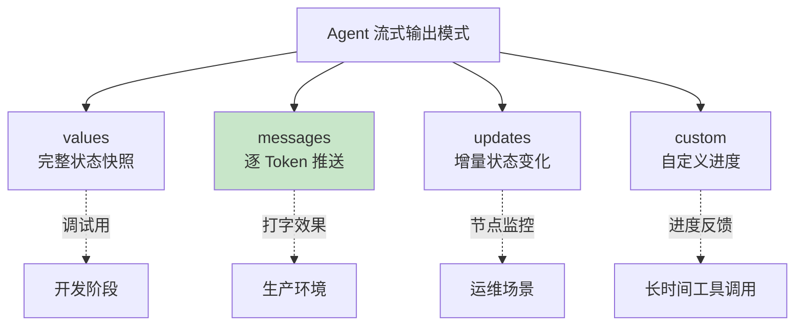
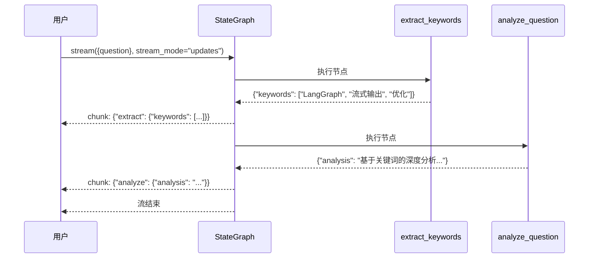
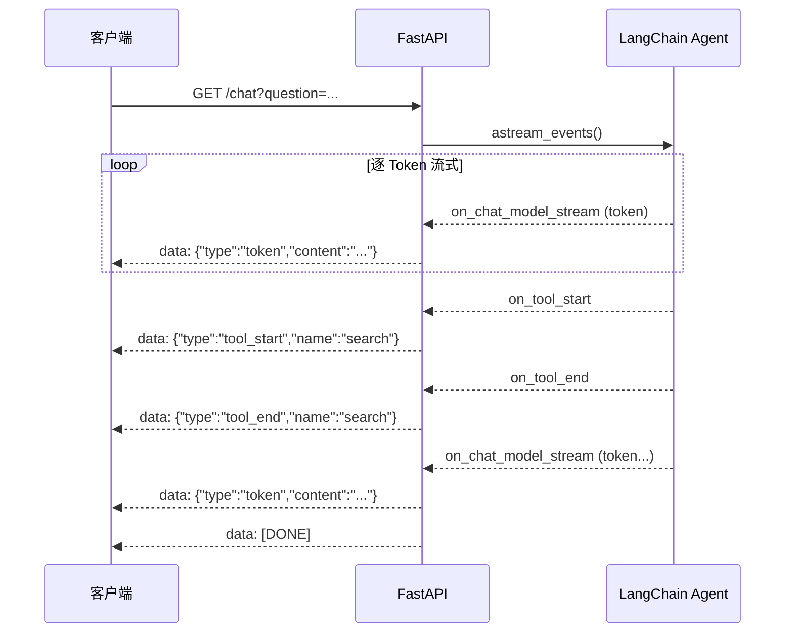
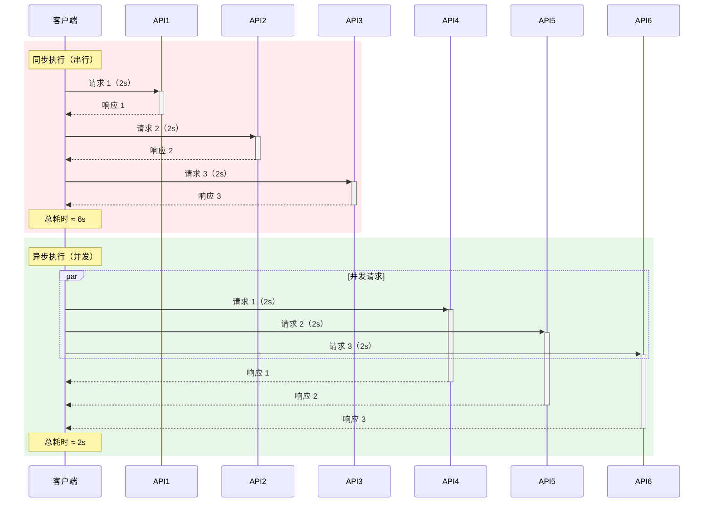

> 注意，为保证文章主题集中，当前文档含有部分 `LangGraph` 相关知识，该部分可先作为了解，后续再回顾即可。

## 一、本章导学

用大模型构建应用时，用户体验的分水岭往往不在于模型有多聪明，而在于用户要等多久才能看到第一个字。一次普通的 Agent 调用可能需要 10-30 秒才能返回完整结果，在这段时间里用户面对的是空白页面或转圈动画。流式输出（Streaming）从根本上改变了这个体验——模型边生成边返回，用户从第一秒就能看到内容在逐步呈现。

本章将从 LangChain 的模型级流式 API 讲起，逐步深入到 LangGraph Agent 的四种流式模式、Token 级事件流、FastAPI SSE 实战，以及异步处理。学完本章后，你能构建出用户体验流畅的实时 AI 应用。

## 二、流式输出基础

### 2.1 为什么需要流式输出

调用 `invoke()` 时，整个执行流程是阻塞的：模型生成完整响应、工具调用返回、最终结果拼接——全部完成后才一次性返回。对于简单问答（3-5 秒内返回），用户尚可接受。但涉及多工具调用的 Agent 场景，等待时间很容易超过 15 秒。在 Web 应用中，超过 5 秒无反馈就会让用户怀疑是否卡死了。

流式输出将"一次性返回"变为"逐步推送"。用户能看到模型正在思考、正在调用工具、正在生成回答。这带来了两个实质性的改善：首次响应时间（Time to First Token, TTFT）从秒级降到毫秒级；长时间生成过程中用户不会焦虑，因为内容在不断更新，系统"活着"的信号是明确的。

判断是否需要流式输出的标准很简单：**用户是否在等待这个结果**。如果是，就用流式。后台批处理、数据管道、链式调用中的中间步骤，`invoke()` 反而更简单。

### 2.2 stream() 与 astream()

`init_chat_model`​ 原生支持流式输出。调用 `stream()`​ 方法时，模型不再返回一个完整的 `AIMessage`​，而是逐 Token 返回 `AIMessageChunk` 对象：

```python
from langchain.chat_models import init_chat_model
from dotenv import load_dotenv
import os

load_dotenv()

model = init_chat_model(
    model=os.getenv("MODEL_NAME"),
    api_key=os.getenv("API_KEY"),
    base_url=os.getenv("BASE_URL"),
    model_provider="openai"
)
for chunk in model.stream("用三句话解释什么是机器学习"):
    print(chunk.content, end="", flush=True)
print()
```

每个 `chunk` 的 `content` 字段包含当前 Token 的文本片段。用 `end=""` 和 `flush=True` 确保输出不换行且实时刷新到终端。运行后你会看到文字像打字机一样逐字出现。

`astream()` 是 `stream()` 的异步版本，返回一个异步迭代器，适合 Web 服务场景：

```python
import asyncio
from langchain.chat_models import init_chat_model
from dotenv import load_dotenv
import os

load_dotenv()

model = init_chat_model(
    model=os.getenv("MODEL_NAME"),
    api_key=os.getenv("API_KEY"),
    base_url=os.getenv("BASE_URL"),
    model_provider="openai"
)

async def stream_response(prompt: str):
    async for chunk in model.astream(prompt):
        print(chunk.content, end="", flush=True)
    print()

asyncio.run(stream_response("解释一下 RAG 技术的原理"))
```

### 2.3 四种 stream_mode 详解

模型级流式只能获取单个 LLM 的 Token 输出。当使用 `create_agent` 构建了带有工具调用能力的 Agent 后，你需要更高维度的流式控制。LangGraph 提供了四种核心流式模式：



> 图 8-1：Agent 流式输出的四种模式及其适用场景。`messages` 是面向终端用户的核心模式，`values` 和 `updates` 适合调试与监控，`custom` 用于自定义进度推送。

先用一个带工具的 Agent 作为后续示例的基础：

```python
# -*- encoding: utf-8 -*-
'''
@File        :   stream_output_demo01.py
@Time        :   2026/04/27 13:46:08
@Author      :   xcy.小相 
@Version     :   1.0
@Description :   08-流式输出从Token到SSE
'''

from langchain.chat_models import init_chat_model
from langchain.tools import tool
from langchain.agents import create_agent
from dotenv import load_dotenv
import os

load_dotenv()

model = init_chat_model(
    model=os.getenv("MODEL_NAME"),
    api_key=os.getenv("API_KEY"),
    base_url=os.getenv("BASE_URL"),
    model_provider="openai"
)

@tool
def search_knowledge(query: str) -> str:
    """搜索内部知识库，返回相关文档摘要。"""
    return f"关于「{query}」的知识库搜索结果：LangGraph 是 LangChain 团队开发的图编排框架。"

@tool
def calculate(expression: str) -> str:
    """计算数学表达式。"""
    try:
        return str(eval(expression))
    except Exception as e:
        return f"计算错误：{e}"

agent = create_agent(model, [search_knowledge, calculate])
```

四种模式的详细对比：

|模式|输出内容|数据粒度|数据量|典型用途|
| ----| -------------| ----------------| ----------------| --------------------|
|`values`|完整状态快照|粗（每节点一次）|大（含全部历史）|调试、状态回放|
|`messages`|逐 Token 推送|细（每个 Token）|小（仅增量文本）|终端用户展示|
|`updates`|增量状态变化|中（每节点增量）|中（仅变化部分）|节点监控、日志|
|`custom`|开发者自定义|自定义|自定义|长任务进度、中间数据|

**选择指南**：给用户看的用 `messages`，调试用 `values`，监控节点用 `updates`，长任务进度用 `custom`。可以同时启用多种模式，在一次流式迭代中获取不同粒度的数据。

#### values 模式

`stream_mode="values"` 在每个节点执行完毕后，输出当前的**完整状态快照**：

```python
for state in agent.stream(
    {"messages": [("user", "LangGraph 和 LangChain 的关系是什么？")]},
    stream_mode="values",
):
    messages = state["messages"]
    latest = messages[-1]
    print(f"[{latest.type}] {latest.content[:100]}")
    print("---")
```

输出结果

```bash
[human] LangGraph 和 LangChain 的关系是什么？
---
[ai] 
---
[tool] 关于「LangGraph 和 LangChain 的关系」的知识库搜索结果：LangGraph 是 LangChain 团队开发的图编排框架。
---
[ai] LangGraph 和 LangChain 是由相同团队（LangChain 团队）开发的两个相关项目，但它们的定位和功能有所不同：

1. **LangChain**  
   是一个通用框架，主要……
---
```

每次输出的是整个 `messages` 列表的当前状态，而不仅仅是增量更新。非常适合调试——你能观察到 Agent 每一步决策时的完整上下文。

#### messages 模式

`stream_mode="messages"` 是面向终端用户的核心模式，提供**逐 Token 的模型输出流**：

```python
for msg, metadata in agent.stream(
    {"messages": [("user", "用通俗的语言解释量子计算")]},
    stream_mode="messages",
):
    if msg.content:
        print(msg.content, end="", flush=True)
    if metadata.get("langgraph_node") == "tools":
        print(f"\n[工具调用完成: {metadata.get('langgraph_triggers', [])}]")
```


运行代码，可以看到模型的文本响应被逐 Token 推送，实现类似 ChatGPT 的打字效果。同时你还能通过 `metadata`​ 中的 `langgraph_node` 字段判断当前 Token 来自哪个节点。

#### updates 模式

`stream_mode="updates"` 只传输**状态的变化部分**，而非完整状态：

```python
for update in agent.stream(
    {"messages": [("user", "123 * 456 等于多少？")]},
    stream_mode="updates",
):
    for step, data in update.items():
        print(f"step: {step}")
        print(f"content: {data['messages'][-1].content_blocks}")
```

```bash
step: model
content: [{'type': 'tool_call', 'name': 'calculate', 'args': {'expression': '123 * 456'}, 'id': '019dcdb1ce12351701d494dae16aeeca'}]
step: tools
content: [{'type': 'text', 'text': '56088'}]
step: model
```

与 `values`​ 模式的区别：`values`​ 输出完整状态（包含历史消息），`updates`​ 只输出当前节点的增量变化。在消息列表很长的情况下，`updates` 的数据量更小。

#### custom 模式

当你需要在工具执行过程中插入自定义的进度信息时，可以通过 `get_stream_writer()` 在节点内部主动推送：

```python
from langgraph.config import get_stream_writer
import time

@tool
def search_with_progress(query: str) -> str:
    """搜索知识库，带进度反馈。"""
    writer = get_stream_writer()

    writer({"step": "start", "message": f"开始搜索：{query}"})
    time.sleep(1)

    writer({"step": "searching", "message": "正在检索内部知识库..."})
    time.sleep(1)

    writer({"step": "done", "message": "搜索完成，正在整理结果..."})
    return f"关于「{query}」的搜索结果：LangGraph 是一个用于构建有状态、多参与者应用的框架，核心功能包括：\n1. 流式输出（Streaming）\n2. 持久化（Persistence）\n3. 人机协作（Human-in-the-loop）\n4. 子图编排（Subgraphs）"

agent_v2 = create_agent(model, [search_with_progress, calculate])

print("=" * 60)
print("【custom 模式】只接收 writer() 推送的自定义事件")
print("=" * 60)

for chunk in agent_v2.stream(
    {"messages": [("user", "搜索LangGraph 有哪些核心功能？")]},
    stream_mode="custom",
    version="v2",
):
    # v2 格式：chunk 是 StreamPart dict，用 chunk["type"] 区分
    # chunk["type"] == "custom" 时，chunk["data"] 就是 writer() 传入的原始数据
    if chunk["type"] == "custom":
        event = chunk["data"]
        print(f"  [自定义事件] step={event.get('step')}, message={event.get('message')}")
    else:
        print(f"  [{chunk['type']}] {chunk['data']}")

print()
```

#### custom + messages 组合模式　　

　　　　 同时接收自定义事件和 LLM token。实际开发中最常用的方式，既能拿到工具的进度反馈，又能逐 token 输出 LLM 回复。

```python
@tool
def search_with_progress(query: str) -> str:
    """搜索知识库，带进度反馈。"""
    writer = get_stream_writer()

    writer({"step": "start", "message": f"开始搜索：{query}"})
    time.sleep(1)

    writer({"step": "searching", "message": "正在检索内部知识库..."})
    time.sleep(1)

    writer({"step": "done", "message": "搜索完成，正在整理结果..."})
    return f"关于「{query}」的搜索结果：LangGraph 是一个用于构建有状态、多参与者应用的框架，核心功能包括：\n1. 流式输出（Streaming）\n2. 持久化（Persistence）\n3. 人机协作（Human-in-the-loop）\n4. 子图编排（Subgraphs）"

agent_v2 = create_agent(model, [search_with_progress, calculate])

print("=" * 60)
print("【custom + messages 组合模式】进度事件 + LLM token 同时输出")
print("=" * 60)

for mode, chunk in agent_v2.stream(
    {"messages": [("user", "搜索LangGraph 有哪些核心功能？")]},
    stream_mode=["custom", "messages"],
):
    if mode == "custom":
        print(f"  [进度] {chunk.get('message')}")
    elif mode == "messages":
        msg, metadata = chunk
        if msg.content:
            print(msg.content, end="", flush=True)

print("\n")
```

输出结果

```bash
============================================================
【custom + messages 组合模式】进度事件 + LLM token 同时输出
============================================================

  [进度] 开始搜索：LangGraph 核心功能
  [进度] 正在检索内部知识库...
  [进度] 搜索完成，正在整理结果...
关于「LangGraph 核心功能」的搜索结果：LangGraph 是一个用于构建有状态、多参与者应用的框架，核心功能包括：
1. 流式输出（Streaming）
2. 持久化（Persistence）
……
```

## 三、LangGraph 场景下的流式

> 当前章节含有LangGraph相关的知识，可先作为了解。

### 3.1 节点级流式更新

在多步骤工作流中，用户关心的往往不是完整状态，而是当前正在执行的那个节点产出了什么。使用 LangGraph 的 `StateGraph` 构建多节点工作流后，`stream_mode="updates"` 能精确捕获每个节点的输出：

```python
# -*- encoding: utf-8 -*-
'''
@File        :   stream_output_demo02.py
@Time        :   2026/04/27 13:46:08
@Author      :   xcy.小相 
@Version     :   1.0
@Description :   08-流式输出从Token到SSE
'''
from typing import TypedDict
from langgraph.graph import StateGraph, START, END
from langchain.messages import SystemMessage, HumanMessage
from langchain.chat_models import init_chat_model
from dotenv import load_dotenv
import os

load_dotenv()

llm = init_chat_model(
    model=os.getenv("MODEL_NAME"),
    api_key=os.getenv("API_KEY"),
    base_url=os.getenv("BASE_URL"),
    model_provider="openai"
)

class AnalysisState(TypedDict):
    question: str
    keywords: list[str]
    analysis: str

def extract_keywords(state: AnalysisState) -> dict:
    response = llm.invoke([
        SystemMessage(content="从用户问题中提取3-5个关键词，用逗号分隔，只输出关键词"),
        HumanMessage(content=state["question"]),
    ])
    keywords = [k.strip() for k in response.content.split(",")]
    return {"keywords": keywords}

def analyze_question(state: AnalysisState) -> dict:
    kw = ", ".join(state["keywords"])
    response = llm.invoke([
        SystemMessage(content=f"基于关键词「{kw}」对问题进行深度分析"),
        HumanMessage(content=state["question"]),
    ])
    return {"analysis": response.content}

builder = StateGraph(AnalysisState)
builder.add_node("extract", extract_keywords)
builder.add_node("analyze", analyze_question)
builder.add_edge(START, "extract")
builder.add_edge("extract", "analyze")
builder.add_edge("analyze", END)

graph = builder.compile()

for chunk in graph.stream(
    {"question": "LangGraph 的流式输出在生产环境中如何优化？"},
    stream_mode="updates",
):
    for node_name, update in chunk.items():
        print(f"\n[节点: {node_name}]")
        for key, value in update.items():
            if isinstance(value, str) and len(value) > 80:
                print(f"  {key}: {value[:80]}...")
            else:
                print(f"  {key}: {value}")
```

```bash
[节点: extract]
  keywords: ['LangGraph', '流式输出', '生产环境', '性能优化', '资源管理']

[节点: analyze]
  analysis: 

在生产环境中优化 LangGraph 的流式输出，需要从**框架设计、资源管理、性能调优和系统可靠性**四个维度综合分析，结合技术实现细节，提出具体的优化方...
```

每个 chunk 对应一个节点的执行结果，你可以在前端实时展示"正在提取关键词..."、"正在分析..."等进度。下图展示了节点级流式更新的时序关系：



> 图 8-4：StateGraph 节点级流式更新的时序。每个节点执行完毕后立即推送增量结果，用户无需等待全部节点完成。

### 3.2 自定义流式数据

有些场景下节点需要在执行过程中持续推送中间数据。LangGraph 的 `get_stream_writer` 可以在节点执行的任意时刻推送自定义内容：

```python
# -*- encoding: utf-8 -*-
'''
@File        :   stream_output_demo03.py
@Time        :   2026/04/27 13:46:08
@Author      :   xcy.小相 
@Version     :   1.0
@Description :   08-流式输出从Token到SSE
'''
from typing import TypedDict
from langgraph.graph import StateGraph, START, END
from langgraph.config import get_stream_writer
from langchain.chat_models import init_chat_model
from langchain.messages import SystemMessage, HumanMessage
import asyncio
from dotenv import load_dotenv
import os

load_dotenv()

llm = init_chat_model(
    model=os.getenv("MODEL_NAME"),
    api_key=os.getenv("API_KEY"),
    base_url=os.getenv("BASE_URL"),
    model_provider="openai"
)

class SummaryState(TypedDict):
    article: str
    summary: str

async def summarize_node(state: SummaryState) -> dict:
    writer = get_stream_writer()
    paragraphs = state["article"].split("\n\n")
    summaries = []

    writer({"type": "progress", "total": len(paragraphs), "current": 0})

    for i, para in enumerate(paragraphs):
        if not para.strip():
            continue
        writer({
            "type": "progress",
            "total": len(paragraphs),
            "current": i + 1,
            "paragraph_preview": para[:50],
        })

        response = await llm.ainvoke([
            SystemMessage(content="用一句话概括以下段落的核心内容"),
            HumanMessage(content=para),
        ])
        summaries.append(response.content)
        await asyncio.sleep(0)

    final_summary = "\n".join(f"{i+1}. {s}" for i, s in enumerate(summaries))
    writer({"type": "done", "summary_length": len(final_summary)})
    return {"summary": final_summary}

builder = StateGraph(SummaryState)
builder.add_node("summarize", summarize_node)
builder.add_edge(START, "summarize")
builder.add_edge("summarize", END)

graph = builder.compile()

article = (
    "大语言模型正在重塑软件开发的方式。传统编码需要开发者逐行编写逻辑，"
    "而大语言模型可以根据自然语言描述自动生成代码。\n\n"
    "然而，AI 生成的代码并不总是可靠的。模型可能产生看似合理但包含逻辑错误的代码。\n\n"
    "未来，软件开发的趋势是人机协作。开发者负责架构设计，AI 负责重复性工作。"
)

async def run_stream():
    async for msg in graph.astream(
        {"article": article, "summary": ""},
        stream_mode="custom",
    ):
        if msg["type"] == "progress":
            print(f"[进度] {msg['current']}/{msg['total']}")
        elif msg["type"] == "done":
            print(f"[完成] 摘要长度: {msg['summary_length']} 字符")

asyncio.run(run_stream())
```


### 3.3 Token 级事件流

`astream_events()` 是 LangChain 中粒度最细的流式 API。它将整个执行过程拆解为一系列事件，每个事件包含事件名称、来源组件、数据载荷等结构化信息，可以穿透到链式调用的每一层：

```python
# -*- encoding: utf-8 -*-
'''
@File        :   stream_output_demo04.py
@Time        :   2026/04/27 13:46:08
@Author      :   xcy.小相 
@Version     :   1.0
@Description :   08-流式输出从Token到SSE
'''
import asyncio
from langchain.chat_models import init_chat_model
from langchain.tools import tool
from langchain.agents import create_agent
from dotenv import load_dotenv
import os

load_dotenv()

model = init_chat_model(
    model=os.getenv("MODEL_NAME"),
    api_key=os.getenv("API_KEY"),
    base_url=os.getenv("BASE_URL"),
    model_provider="openai"
)

@tool
def search_info(query: str) -> str:
    """搜索信息。"""
    return f"搜索结果：{query} 相关的信息摘要内容。"

agent = create_agent(model, [search_info])

async def stream_with_events():
    async for event in agent.astream_events(
        {"messages": [("user", "什么是流式输出？")]},
        version="v2",
    ):
        kind = event["event"]
        name = event["name"]
        data = event["data"]

        if kind == "on_chat_model_stream":
            token = data["chunk"].content
            if token:
                print(token, end="", flush=True)
                
        elif kind == "on_tool_start":
            print(f"\n[工具开始] {name}: {data.get('input', {})}")
            
        elif kind == "on_tool_end": 
            print(f"[工具结束] {name}: {data.get('output', {})}")

asyncio.run(stream_with_events())

```

```bash
[工具开始] search_info: {'query': '流式输出 定义 应用场景 技术'}
[工具结束] search_info: content='搜索结果：流式输出 定义 应用场景 技术 相关的信息摘要内容。' name='search_info' tool_call_id='019dce02d8a8024dfd8e471ed8bc4d5c'

流式输出（Streaming Output）是一种按需逐步传输数据的技术……
```

常用事件类型一览：

|事件类型|触发时机|用途|
| --------| ------------------| -------------------------|
|`on_chat_model_stream`|LLM 输出每个 Token|实现打字机效果|
|`on_chat_model_start`|LLM 调用开始|显示"正在思考..."|
|`on_chat_model_end`|LLM 调用结束|记录 Token 使用量|
|`on_tool_start`|工具调用开始|显示"正在调用搜索工具..."|
|`on_tool_end`|工具调用结束|显示"搜索完成"|
|`on_chain_start`|链/节点执行开始|粗粒度进度|
|`on_chain_end`|链/节点执行结束|粗粒度进度|



> 图 8-2：Token 级事件流的完整数据流。Agent 在执行过程中产生多种事件（Token 流、工具调用），服务端将每种事件编码为 SSE 格式推送给客户端。

## 四、FastAPI SSE 实战

### 4.1 完整的 SSE 服务端代码

Server-Sent Events（SSE）是浏览器原生支持的流式通信协议。基于 HTTP、单向推送（服务端到客户端）、自动重连。对于 LLM 流式输出这种场景，SSE 是最合适的选择。

```python
# -*- encoding: utf-8 -*-
'''
@File        :   stream_output_demo05.py
@Time        :   2026/04/27 13:46:08
@Author      :   xcy.小相 
@Version     :   1.0
@Description :   08-流式输出从Token到SSE
'''
import asyncio
import json
from fastapi import FastAPI
from fastapi.responses import StreamingResponse
from langchain.chat_models import init_chat_model
from langchain.tools import tool
from langchain.agents import create_agent
from dotenv import load_dotenv
import os

load_dotenv()

app = FastAPI()

model = init_chat_model(
    model=os.getenv("MODEL_NAME"),
    api_key=os.getenv("API_KEY"),
    base_url=os.getenv("BASE_URL"),
    model_provider="openai"
)

@tool
def search_knowledge(query: str) -> str:
    """搜索知识库。"""
    return f"关于「{query}」的搜索结果摘要。"

@tool
def calculate(expression: str) -> str:
    """计算数学表达式。"""
    try:
        return str(eval(expression))
    except Exception as e:
        return f"错误：{e}"

agent = create_agent(model, [search_knowledge, calculate])

async def generate_stream(question: str):
    yield f"data: {json.dumps({'type': 'start', 'question': question}, ensure_ascii=False)}\n\n"

    async for event in agent.astream_events(
        {"messages": [("user", question)]},
        version="v2",
    ):
        kind = event["event"]

        if kind == "on_chat_model_stream":
            token = event["data"]["chunk"].content
            if token:
                payload = json.dumps(
                    {"type": "token", "content": token},
                    ensure_ascii=False,
                )
                yield f"data: {payload}\n\n"

        elif kind == "on_tool_start":
            payload = json.dumps({
                "type": "tool_start",
                "name": event["name"],
                "input": event["data"].get("input", {}),
            }, ensure_ascii=False)
            yield f"data: {payload}\n\n"

        elif kind == "on_tool_end":
            payload = json.dumps({
                "type": "tool_end",
                "name": event["name"],
            }, ensure_ascii=False)
            yield f"data: {payload}\n\n"

    yield "data: [DONE]\n\n"

@app.get("/chat")
async def chat(question: str):
    return StreamingResponse(
        generate_stream(question),
        media_type="text/event-stream",
        headers={
            "Cache-Control": "no-cache",
            "Connection": "keep-alive",
            "X-Accel-Buffering": "no",
        },
    )

if __name__ == "__main__":
    import uvicorn
    uvicorn.run(app, host="0.0.0.0", port=8000)
```

启动服务后，用浏览器或 `curl` 测试：

```bash
curl "http://localhost:8000/chat?question=LangGraph是什么"
```

你会看到 SSE 格式的流式输出：

```
data: {"type":"start","question":"LangGraph是什么"}

data: {"type":"token","content":"Lang"}

data: {"type":"token","content":"Graph"}

data: {"type":"token","content":"是"}

data: {"type":"token","content":"一个..."}

data: [DONE]
```

### 4.2 SSE 格式规范

SSE 的数据格式有三个要点：

每条消息以 `data: ` 开头，以 `\n\n`（两个换行符）结尾。这是 SSE 协议的硬性规定。

`X-Accel-Buffering: no` 是 Nginx 反向代理的关键 header。Nginx 默认会缓冲响应，加上这个 header 后 Nginx 会直接转发每个 chunk。

`Cache-Control: no-cache` 防止中间代理缓存流式响应。

### 4.3 前端消费 SSE

前端有两种方式消费 SSE 流。简单场景用 `EventSource`：

```javascript
const source = new EventSource(
    `/chat?question=${encodeURIComponent("LangGraph是什么")}`
);
source.onmessage = (event) => {
    if (event.data === "[DONE]") {
        source.close();
        return;
    }
    const data = JSON.parse(event.data);
    if (data.type === "token") {
        document.getElementById("output").textContent += data.content;
    } else if (data.type === "tool_start") {
        console.log(`调用工具: ${data.name}`);
    }
};
```

需要 POST 请求时用 `fetch` + `ReadableStream`：

```javascript
async function chat(question) {
    const response = await fetch("/chat", {
        method: "POST",
        headers: { "Content-Type": "application/json" },
        body: JSON.stringify({ question }),
    });

    const reader = response.body.getReader();
    const decoder = new TextDecoder();
    let buffer = "";

    while (true) {
        const { done, value } = await reader.read();
        if (done) break;

        buffer += decoder.decode(value, { stream: true });
        const lines = buffer.split("\n");
        buffer = lines.pop();

        for (const line of lines) {
            if (!line.startsWith("data: ")) continue;
            const payload = line.slice(6);
            if (payload === "[DONE]") break;

            const data = JSON.parse(payload);
            if (data.type === "token") {
                document.getElementById("output").textContent += data.content;
            } else if (data.type === "tool_start") {
                console.log(`调用工具: ${data.name}`);
            }
        }
    }
}
```

### 4.4 完整的 SSE 客户端页面

以下是一个可以直接在浏览器中运行的完整 HTML 页面，消费上文的 FastAPI SSE 服务：

```html
<!DOCTYPE html>
<html lang="zh-CN">
<head>
    <meta charset="UTF-8">
    <title>AI 流式对话</title>
    <style>
        * { margin: 0; padding: 0; box-sizing: border-box; }
        body { font-family: -apple-system, sans-serif; background: #f5f5f5; padding: 20px; }
        #container { max-width: 800px; margin: 0 auto; }
        #messages { height: 500px; overflow-y: auto; background: white;
                    border-radius: 8px; padding: 16px; margin-bottom: 16px; }
        .msg { margin-bottom: 12px; line-height: 1.6; }
        .msg.user { text-align: right; color: #666; }
        .msg.ai { text-align: left; color: #333; }
        .msg.tool { color: #888; font-size: 0.85em; font-style: italic; }
        .cursor { display: inline-block; width: 2px; height: 1em;
                  background: #333; animation: blink 1s infinite; vertical-align: text-bottom; }
        @keyframes blink { 50% { opacity: 0; } }
        #input-area { display: flex; gap: 8px; }
        #input { flex: 1; padding: 10px; border: 1px solid #ddd;
                 border-radius: 6px; font-size: 16px; }
        #send { padding: 10px 24px; background: #1976d2; color: white;
                border: none; border-radius: 6px; cursor: pointer; font-size: 16px; }
        #send:disabled { background: #bbb; cursor: not-allowed; }
    </style>
</head>
<body>
    <div id="container">
        <div id="messages"></div>
        <div id="input-area">
            <input id="input" placeholder="输入你的问题..." autofocus />
            <button id="send" onclick="sendMessage()">发送</button>
        </div>
    </div>

    <script>
        const messagesEl = document.getElementById('messages');
        const inputEl = document.getElementById('input');
        const sendBtn = document.getElementById('send');
        let currentAiEl = null;

        inputEl.addEventListener('keydown', (e) => {
            if (e.key === 'Enter') sendMessage();
        });

        async function sendMessage() {
            const question = inputEl.value.trim();
            if (!question) return;

            inputEl.value = '';
            sendBtn.disabled = true;

            const userDiv = document.createElement('div');
            userDiv.className = 'msg user';
            userDiv.textContent = question;
            messagesEl.appendChild(userDiv);

            const aiDiv = document.createElement('div');
            aiDiv.className = 'msg ai';
            const cursor = document.createElement('span');
            cursor.className = 'cursor';
            aiDiv.appendChild(cursor);
            messagesEl.appendChild(aiDiv);
            currentAiEl = aiDiv;
            messagesEl.scrollTop = messagesEl.scrollHeight;

            try {
                const response = await fetch(
                    `http://localhost:8000/chat?question=${encodeURIComponent(question)}`
                );
                const reader = response.body.getReader();
                const decoder = new TextDecoder();
                let buffer = '';

                while (true) {
                    const { done, value } = await reader.read();
                    if (done) break;

                    buffer += decoder.decode(value, { stream: true });
                    const lines = buffer.split('\n');
                    buffer = lines.pop();

                    for (const line of lines) {
                        if (!line.startsWith('data: ')) continue;
                        const payload = line.slice(6);
                        if (payload === '[DONE]') break;

                        const data = JSON.parse(payload);
                        if (data.type === 'token') {
                            const textNode = document.createTextNode(data.content);
                            aiDiv.insertBefore(textNode, cursor);
                            messagesEl.scrollTop = messagesEl.scrollHeight;
                        } else if (data.type === 'tool_start') {
                            const toolDiv = document.createElement('div');
                            toolDiv.className = 'msg tool';
                            toolDiv.textContent = `[正在调用工具: ${data.name}]`;
                            messagesEl.appendChild(toolDiv);
                        } else if (data.type === 'tool_end') {
                            const toolDiv = document.createElement('div');
                            toolDiv.className = 'msg tool';
                            toolDiv.textContent = `[工具 ${data.name} 执行完成]`;
                            messagesEl.appendChild(toolDiv);
                        }
                    }
                }
            } catch (err) {
                aiDiv.textContent = `[错误] ${err.message}`;
            } finally {
                const c = aiDiv.querySelector('.cursor');
                if (c) c.remove();
                sendBtn.disabled = false;
                inputEl.focus();
            }
        }
    </script>
</body>
</html>
```

将此文件保存为 `index.html`，通过 FastAPI 的静态文件服务或任何 HTTP 服务器托管后访问，即可获得类似 ChatGPT 的流式对话体验。打字光标动画、工具调用状态提示、自动滚动等细节都已内置。

## 五、异步处理

### 5.1 async/await 基础

在生产环境中，一个 Web 服务通常需要同时处理多个用户的流式请求。Python 的 `asyncio` 天然适合这种并发场景——每个请求是一个独立的异步任务，事件循环在它们之间自动调度。

LangGraph 的节点既可以是普通函数（`def`），也可以是异步函数（`async def`）。当节点被定义为 `async def` 时，LangGraph 会在异步上下文中自动调度它：

```python
from typing import TypedDict
from langgraph.graph import StateGraph, START, END
from langchain.chat_models import init_chat_model
from langchain.messages import SystemMessage, HumanMessage
import asyncio
from dotenv import load_dotenv
import os

load_dotenv()

llm = init_chat_model(
    model=os.getenv("MODEL_NAME"),
    api_key=os.getenv("API_KEY"),
    base_url=os.getenv("BASE_URL"),
    model_provider="openai",
)

class WorkflowState(TypedDict):
    topic: str
    outline: str
    content: str
    review: str

async def generate_outline(state: WorkflowState) -> dict:
    response = await llm.ainvoke([
        SystemMessage(content="为给定主题生成一个3级大纲"),
        HumanMessage(content=state["topic"]),
    ])
    return {"outline": response.content}

async def write_content(state: WorkflowState) -> dict:
    response = await llm.ainvoke([
        SystemMessage(content="根据大纲撰写详细的技术文章"),
        HumanMessage(content=f"主题：{state['topic']}\n大纲：\n{state['outline']}"),
    ])
    return {"content": response.content}

async def review_content(state: WorkflowState) -> dict:
    response = await llm.ainvoke([
        SystemMessage(content="审查技术文章，给出改进建议，不超过100字"),
        HumanMessage(content=state["content"]),
    ])
    return {"review": response.content}

builder = StateGraph(WorkflowState)
builder.add_node("outline", generate_outline)
builder.add_node("write", write_content)
builder.add_node("review", review_content)
builder.add_edge(START, "outline")
builder.add_edge("outline", "write")
builder.add_edge("write", "review")
builder.add_edge("review", END)

graph = builder.compile()

async def run_workflow():
    result = await graph.ainvoke({
        "topic": "LangGraph 状态管理的最佳实践",
        "outline": "",
        "content": "",
        "review": "",
    })
    print("大纲：", result["outline"][:200], "...")
    print("审阅意见：", result["review"])

asyncio.run(run_workflow())
```

### 5.2 异步工作流

当需要同时处理多个用户的请求时，`asyncio.gather` 可以将多个协程打包并发执行：

```python
from typing import TypedDict
from langgraph.graph import StateGraph, START, END
from langchain.chat_models import init_chat_model
from langchain.messages import SystemMessage, HumanMessage
import asyncio
import time
from dotenv import load_dotenv
import os

load_dotenv()

llm = init_chat_model(
    model=os.getenv("MODEL_NAME"),
    api_key=os.getenv("API_KEY"),
    base_url=os.getenv("BASE_URL"),
    model_provider="openai",
)

class SimpleState(TypedDict):
    question: str
    answer: str

async def answer_node(state: SimpleState) -> dict:
    response = await llm.ainvoke([
        SystemMessage(content="简洁回答，不超过50字"),
        HumanMessage(content=state["question"]),
    ])
    return {"answer": response.content}

builder = StateGraph(SimpleState)
builder.add_node("answer", answer_node)
builder.add_edge(START, "answer")
builder.add_edge("answer", END)

graph = builder.compile()

questions = [
    "什么是向量数据库？",
    "RAG 的全称是什么？",
    "LangGraph 和 LangChain 的关系？",
    "什么是 Agent？",
    "Token 是什么？",
]

async def single_request(question: str) -> dict:
    result = await graph.ainvoke({"question": question, "answer": ""})
    return {"question": question, "answer": result["answer"]}

async def concurrent_requests():
    start = time.time()
    results = await asyncio.gather(*[single_request(q) for q in questions])
    elapsed = time.time() - start

    for r in results:
        print(f"Q: {r['question']}")
        print(f"A: {r['answer']}\n")

    print(f"总耗时: {elapsed:.2f}s（{len(questions)} 个请求并发）")

asyncio.run(concurrent_requests())
```

`asyncio.gather` 将多个协程打包并发执行。5 个请求串行执行可能需要 10 秒，并发执行时总耗时接近最慢的那个请求（约 2-3 秒）。

### 5.3 并发调用多个模型

在实际生产中，一个常见场景是同时调用多个模型，比较它们的输出质量或实现模型级冗余。`asyncio.gather` 配合 `return_exceptions=True` 可以优雅地处理部分模型调用失败的情况：

```python
import asyncio
from langchain.chat_models import init_chat_model
from langchain.messages import HumanMessage
from dotenv import load_dotenv
import os
import time

load_dotenv()

def create_model(model_name: str):
    return init_chat_model(
        model=model_name,
        api_key=os.getenv("API_KEY"),
        base_url=os.getenv("BASE_URL"),
        model_provider="openai",
        temperature=0,
    )

async def query_model(model_name: str, question: str) -> dict:
    model = create_model(model_name)
    start = time.time()
    try:
        response = await model.ainvoke([HumanMessage(content=question)])
        elapsed = time.time() - start
        return {
            "model": model_name,
            "answer": response.content,
            "tokens": response.usage_metadata or {},
            "time": f"{elapsed:.2f}s",
            "error": None,
        }
    except Exception as e:
        elapsed = time.time() - start
        return {
            "model": model_name,
            "answer": None,
            "tokens": {},
            "time": f"{elapsed:.2f}s",
            "error": str(e),
        }

async def compare_models(question: str):
    models = [
        "Qwen/Qwen3-8B",
        "Qwen/Qwen3-14B",
        "deepseek/deepseek-r1",
    ]

    print(f"问题: {question}")
    print(f"并发调用 {len(models)} 个模型...\n")

    start = time.time()
    results = await asyncio.gather(
        *[query_model(m, question) for m in models],
        return_exceptions=True,
    )
    total_time = time.time() - start

    for r in results:
        if isinstance(r, Exception):
            print(f"  [异常] {r}")
            continue
        status = "成功" if r["error"] is None else f"失败: {r['error']}"
        print(f"  [{r['model']}] {status} ({r['time']})")
        if r["answer"]:
            print(f"    回答: {r['answer'][:100]}...")
            tokens = r["tokens"]
            if tokens:
                print(f"    Token: in={tokens.get('input_tokens', '?')} "
                      f"out={tokens.get('output_tokens', '?')}")
        print()

    print(f"总耗时: {total_time:.2f}s（{len(models)} 个模型并发）")

asyncio.run(compare_models("用三句话解释什么是 Transformer 架构"))
```

运行结果示例：

```
问题: 用三句话解释什么是 Transformer 架构
并发调用 3 个模型...

  [Qwen/Qwen3-8B] 成功 (2.31s)
    回答: Transformer 是一种基于自注意力机制的深度学习架构，能够并行处理序列中的所有位置。...
    Token: in=22 out=85

  [Qwen/Qwen3-14B] 成功 (3.87s)
    回答: Transformer 是2017年由Google提出的深度学习架构，核心创新是自注意力机制。...
    Token: in=22 out=92

  [deepseek/deepseek-r1] 成功 (4.52s)
    回答: Transformer 是一种基于注意力机制的神经网络架构，最初用于自然语言处理。...
    Token: in=22 out=78

总耗时: 4.53s（3 个模型并发）
```

`return_exceptions=True` 确保即使某个模型调用失败，也不会影响其他模型的调用。结果中的 `error` 字段可以用来判断哪些模型可用。



> 图 8-3：同步执行与异步执行的对比。同步模式下请求串行排队，总耗时是各请求之和；异步模式下请求并发执行，总耗时接近最慢的单个请求。

在生产环境中需要控制并发数，`asyncio.Semaphore` 是常用的限流手段：

```python
semaphore = asyncio.Semaphore(5)

async def rate_limited_request(question: str) -> dict:
    async with semaphore:
        return await single_request(question)
```

## 六、常见陷阱与调试

**Token 级流式有性能开销**。每个 Token 都是一次网络往返。对于高频调用的 API，考虑在 Token 之间加入小缓冲——比如每 50ms 或每 5 个 Token 刷新一次。

**流式连接中途断开**。网络抖动、客户端主动关闭、服务端异常都可能导致流式中断。在 `async for` 循环外层包一层 `try/except`，捕获断开后的清理工作：

```python
async def safe_stream(agent, input_data, timeout: int = 60):
    try:
        async with asyncio.timeout(timeout):
            async for chunk in agent.astream(input_data, stream_mode="messages"):
                msg, metadata = chunk
                if msg.content:
                    yield msg.content
    except asyncio.TimeoutError:
        yield "\n[超时] 响应时间过长，请重试"
    except Exception as e:
        yield f"\n[错误] {e}"
```

**custom 模式只能通过 astream 获取**。同步 `stream()` 不支持 `custom` 模式，因为它依赖异步上下文。

**astream_events 与 custom 模式的事件重复**。如果在节点内部使用了 `llm.astream()`，`astream_events` 仍然会捕获这些 LLM 的事件，同一个 Token 会出现两次。解决方案是只用 `custom` 模式，不混用 `events`。

**Nginx 缓冲导致流式无效**。如果在 Nginx 反向代理后面部署 SSE 服务，必须添加 `X-Accel-Buffering: no` header，否则 Nginx 会缓冲所有响应直到连接结束。

## 七、本章小结

本章从三个层次梳理了流式输出的完整技术栈：

|层次|技术|适用场景|
| --------| -------------| ----------------------|
|模型层|`stream()` / `astream()`|单个 LLM 的 Token 流式|
|Agent 层|四种 `stream_mode`|Agent 多步骤的流式控制|
|事件层|`astream_events()`|最细粒度的事件追踪|
|传输层|FastAPI + SSE|Web 服务的流式推送|
|并发层|`asyncio.gather`|多用户并发请求|

选择流式策略的核心判断：给人看的用 `messages`，给调试用的用 `values`，给程序用的用 `updates` 或 `astream_events`。

## 八、扩展阅读

- [MDN: Server-Sent Events](https://developer.mozilla.org/zh-CN/docs/Web/API/Server-sent_events) — SSE 协议的浏览器原生 API 文档
- [LangGraph Streaming 指南](https://langchain-ai.github.io/langgraph/how-tos/streaming-tokens/) — LangGraph 官方流式输出教程
- [FastAPI StreamingResponse](https://fastapi.tiangolo.com/advanced/custom-response/#streamingresponse) — FastAPI 流式响应的官方文档
- [Python asyncio 官方文档](https://docs.python.org/zh-cn/3/library/asyncio.html) — 异步编程的权威参考