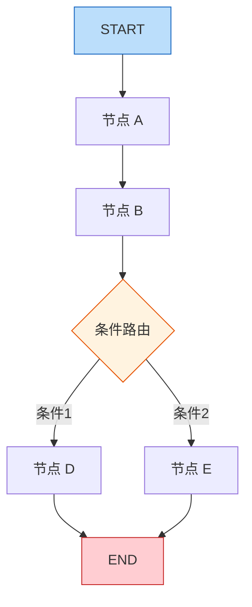
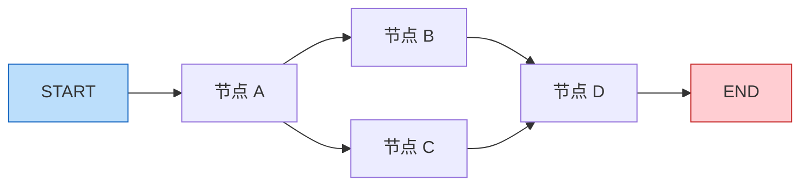
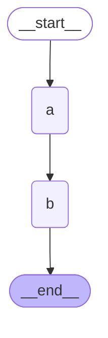
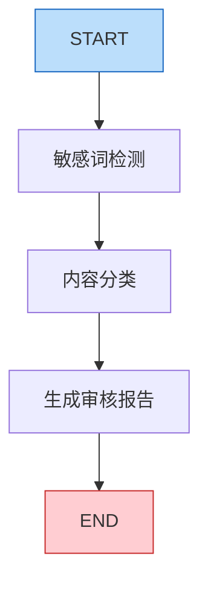

# 10-LangGraph入门

# LangGraph 入门：状态图与节点编排

## 一、本章导学

　　　　经过前 9 篇的学习，你已经掌握了 LangChain 的核心能力：模型调用、Prompt 模板、工具定义、RAG 检索增强，以及用 `create_agent` 快速搭建 Agent。但当你面对条件分支、多步审批、循环迭代等复杂流程时，`create_agent` 就显得力不从心了——它的 ReAct 循环是写死的，你无法在中间插入自定义步骤。

　　　　LangGraph 就是为解决这类问题而生的。它把工作流建模为一张**有状态图**（Stateful Graph），图中的节点是处理逻辑，边定义执行顺序，状态在节点之间流转。本篇将从核心概念讲起，带你构建第一个 LangGraph 工作流。最终效果：一个可以编译运行的内容审核状态图，包含条件路由和多节点协作。

---

## 二、LangGraph 核心概念

### 2.1 为什么需要 LangGraph

　　`create_agent`​ 底层其实就是一个 LangGraph 图——它封装了固定的 ReAct 循环：用户输入进图，LLM 节点思考，工具节点执行，结果回到 LLM，如此反复直到 LLM 认为任务完成。这个循环写死在 `create_agent` 内部，你无法插入自定义的中间步骤。

　　具体来说，`create_agent` 创建的图结构大致是这样的：

```
用户输入 → LLM 节点 → [调用工具 → LLM 节点]循环 → 最终回答
```

　　LLM 节点内部的条件判断只有两种：调用工具，或者给出最终回答。你无法在这个循环中插入一个"先检查结果是否合规"的节点，也无法在某个步骤后暂停等待人工确认。

　　实际业务中，很多场景无法用一个简单循环表达。内容审核需要先做敏感词检测，再做内容分类，然后根据分类结果走不同的审核流程；数据处理场景中，清洗流程可能是多轮迭代的——第一轮清洗掉格式问题，检查结果后如果发现还有数据质量问题，就进入第二轮清洗；客服系统中，用户要求退款时，系统应该暂停等待人工客服确认。这些场景的共同特征是：执行路径不是固定的，而是由运行时的状态决定的。

　　LangGraph 的核心思路是把工作流建模为一张**有状态图**。图中的每个节点是一段处理逻辑，边定义节点之间的执行顺序，状态在节点之间流转。你可以用条件边实现 if-else 分支，用循环边实现迭代，用中断机制实现人机协作。

### 2.2 状态图（StateGraph）基本模型

　　理解 LangGraph 最好的方式是把它和编程语言做类比。LangGraph 本质上是一种用于构建智能体的"编程语言"：

|编程语言要素|LangGraph 对应概念|说明|
| ------------------------| --------------------| --------------------------------------|
|数据（Data）|状态（State）|工作流执行过程中传递和更新的信息载体|
|函数（Function）|节点（Node）|对状态进行操作的基本单元|
|控制逻辑（Control Flow）|边（Edge）|决定节点间执行顺序，支持条件分支和循环|
|存储（Storage）|检查点（Checkpoint）|状态的持久化机制，允许暂停和恢复|
|中断（Interrupt）|人在回路（HITL）|在关键环节引入人工审核的能力|

　　`StateGraph`​ 是图的构建器。你向它添加节点和边，最后调用 `compile()` 编译为可运行的图。这个模型并不新鲜——传统编程语言用函数和控制流语句来定义程序的执行逻辑，LangGraph 把函数换成了节点，把控制流语句换成了边。好处是：图结构天然可视化，你画出来的流程图就是代码的实际执行路径。



　　上图展示了一个典型的 StateGraph 结构：START 是入口，节点 A 和 B 顺序执行，节点 B 之后通过条件路由决定走 D 还是 E，最终都汇聚到 END。这个结构用 LangGraph 的 API 只需要几行代码就能定义。

### 2.3 State、Node、Edge 三要素

　　　　LangGraph 只有三个核心概念需要掌握：**状态（State）**  、**节点（Node）**   和**边（Edge）**  。理解了这三个东西，就能构建任意复杂的工作流。

- **状态**是图在工作流执行过程中共享的数据。所有节点都从状态中读取输入，处理完成后把结果写回状态。状态通常用 Python 的 `TypedDict` 定义。

- **节点**就是普通的 Python 函数。它接收当前状态作为参数，返回一个字典表示要更新的字段。节点不需要继承任何基类，不需要实现特定接口。
- **边**定义节点之间的连接关系。普通边定义固定的执行顺序，条件边根据运行时状态动态决定下一步路径。

---

## 三、State 定义与 reducer

### 3.1 TypedDict 状态定义

　　　　状态是整个图的数据核心。定义状态的第一步是用 `TypedDict` 声明字段结构：

```python
from typing import TypedDict

class WorkflowState(TypedDict):
    content: str
    category: str
    is_safe: bool
    result: str
```

　　`TypedDict`​ 提供类型提示但不做运行时检查。状态中的每个字段都会在工作流的节点之间传递和更新。调用 `graph.invoke({"content": "hello"})`​ 时，只有 `content` 字段有值，其他字段的初始值取决于具体实现。

　　每个节点可以只更新状态中的部分字段。比如某个节点只负责分类，它只需要返回 `{"category": "tech"}`，其他字段保持不变。LangGraph 会在节点执行完后，把返回的字典合并到当前状态中。这种部分更新机制让每个节点只需关注自己负责的字段。

### 3.2 reducer 机制

　　这带来一个问题：如果某个字段需要累积（比如收集多个节点的输出或记录执行日志），而不是被覆盖，怎么办？LangGraph 用 `Annotated` + reducer 机制解决：

```python
import operator
from typing import TypedDict, Annotated

class State(TypedDict):
    items: Annotated[list, operator.add]
    step_count: Annotated[int, operator.add]
```

　　`Annotated[list, operator.add]`​ 告诉 LangGraph：当节点返回 `items`​ 的新值时，不要覆盖旧值，而是调用 `operator.add` 把新旧值合并。没有标注 reducer 的字段默认行为是覆盖。

　　下面用一个完整的例子演示 reducer 的效果：

```python
# -*- encoding: utf-8 -*-
'''
@File        :   demo10-langGraph_reducer.py
@Time        :   2026/04/28 14:56:10
@Author      :   xcy.小相 
@Version     :   1.0
@Description :   LangGraph入门状态图与节点编排
'''

import operator
from typing import TypedDict,Annotated
from langgraph.graph import START, END, StateGraph

class State(TypedDict):
    """
    状态定义
    """
    items:Annotated[list,operator.add]
    
def node_a(state: State) -> State:
    """
    节点A
    """
    print("节点A接收到状态:", state)
    return State(items=["A"])

def node_b(state: State) -> State:
    """
    节点B
    """
    print("节点B接收到状态:", state)
    return State(items=["B"])

# 添加节点
builder = StateGraph(State)
builder.add_node("a", node_a)
builder.add_node("b", node_b)
# 添加边
builder.add_edge(START,"a" )
builder.add_edge("a","b")
builder.add_edge("b",END)
graph  = builder.compile()
# 运行
result = graph.invoke(State(items=["START"]))
print(result)

```

　　运行结果：

```
节点A接收到状态: {'items': ['START']}
节点B接收到状态: {'items': ['START', 'A']}
{'items': ['START', 'A', 'B']}
```

　　可以看到，`items` 列表在每个节点执行后都被追加了新值，而不是被覆盖。这正是 reducer 的作用。

　　除了 `operator.add`​，你也可以使用任意满足 `f(old_value, new_value) -> merged_value` 签名的二元函数作为 reducer。以下是几个常用示例：

|Reducer 函数|适用数据类型|主要行为|典型应用场景|
| ------------| ------------| --------------------| ----------------|
|`operator.add`|`int`, `float`, `list`|数值累加 / 列表追加|计数器、收集结果|
|`operator.extend`|`List[T]`|列表扩展（`list.extend`）|收集搜索条目|
|`operator.or_`|`Set[T]`|集合取并集，自动去重|收集标签|

　　对于 Agent 系统中的消息列表，LangGraph 提供了专用的 `add_messages`​ reducer（`from langgraph.graph.message import add_messages`​），它基于消息 ID 进行去重和更新，而非简单追加。在涉及人在回路（HITL）修改历史消息的场景中，必须使用 `add_messages`​ 而非 `operator.add`，否则会导致消息重复。

　　你也可以自定义 reducer 函数，只要它接收两个参数（旧值和新值）并返回合并结果即可：

```python
def deduplicate_merge(old_list: list, new_list: list) -> list:
    combined = old_list + new_list
    return list(dict.fromkeys(combined))

class State(TypedDict):
    unique_items: Annotated[list, deduplicate_merge]
```

### 3.3 常见状态设计模式

　　在实际开发中，状态设计直接影响图的清晰度。以下是几种常见的模式：

- **输入-处理-输出模式**是最基础的状态结构。`input`​ 字段承载原始输入，中间处理节点写入 `intermediate`​ 字段，最终节点产出 `output`。这种模式适合线性的工作流。
- **消息列表模式**是 Agent 系统中最常见的状态设计。`messages`​ 字段用 `Annotated[list, add_messages]`​ 累积所有对话消息，每个节点往列表中追加新消息。`add_messages`​ 是 LangGraph 专用的 reducer，它基于消息 ID 进行智能合并——如果新消息与已有消息 ID 相同则覆盖，否则追加。`create_agent` 内部用的就是这种模式。
- **控制标记模式**在状态中设置 `needs_review`​、`retry_count` 等布尔值或数值字段，用于条件路由函数判断执行路径。这种模式让控制逻辑集中在路由函数中，状态变化一目了然。

```python
class ContentReviewState(TypedDict):
    content: str
    has_sensitive_words: bool
    category: str
    needs_review: bool
    review_note: str
    final_status: str
```

　　上面这个状态定义综合了多种模式：`content`​ 是输入，`has_sensitive_words`​ 和 `category`​ 是中间处理结果，`needs_review`​ 是控制标记，`final_status` 是最终输出。

---

## 四、节点与边

### 4.1 add_node 注册节点

　　节点就是普通的 Python 函数。它接收当前状态作为参数，返回一个字典表示要更新的字段：

```python
def categorize(state: WorkflowState) -> dict:
    content = state["content"]
    if "技术" in content or "编程" in content:
        return {"category": "tech"}
    elif "财经" in content or "股票" in content:
        return {"category": "finance"}
    else:
        return {"category": "general"}
```

　　　　节点不需要继承任何基类，不需要实现特定接口，只要参数是状态字典、返回值是字典就行。这意味着你可以把任何已有的 Python 函数直接作为节点使用。如果节点需要调用 LLM，也一样直接：

```python
from langchain.chat_models import init_chat_model

llm = init_chat_model(
        model=os.getenv("MODEL_NAME"),
        api_key=os.getenv("OPENAI_API_KEY"),
        base_url=os.getenv("OPENAI_BASE_URL"),
        model_provider="openai"
   )

def analyze_content(state: WorkflowState) -> dict:
    response = llm.invoke(f"请判断以下内容是否安全：\n{state['content']}")
    is_safe = "安全" in response.content
    return {"is_safe": is_safe}
```

　　有一点需要注意：节点函数应该是纯函数风格，不要直接修改传入的 `state` 字典。返回一个新字典让 LangGraph 去更新状态，而不是原地修改。

　　用 `add_node` 注册节点，第一个参数是节点名称（在图中唯一标识），第二个参数是节点函数：

```python
builder.add_node("categorize", categorize)
builder.add_node("analyze", analyze_content)
```

### 4.2 add_edge 固定边

　　普通边定义固定的执行顺序。从节点 A 到节点 B 的普通边，意味着 A 执行完后一定执行 B：

```python
builder.add_edge("categorize", "review")
```

　　一个节点也可以同时拥有多条出边，指向不同的后续节点。LangGraph 运行时会在当前节点完成后，**同时触发**所有后续节点的执行，实现**并行**：

```python
builder.add_edge("a", "b")
builder.add_edge("a", "c")
```

　　上面两行代码表示节点 A 执行完后，B 和 C 同时执行。这就是普通边实现并行的方式——不需要特殊 API，只需要给同一个节点添加多条出边。

### 4.3 START 和 END 节点

　　`START`​ 和 `END` 是 LangGraph 内置的特殊节点，分别表示图的入口和出口：

```python
from langgraph.graph import StateGraph, START, END

builder.add_edge(START, "categorize")
builder.add_edge("publish", END)
```

　  `add_edge(START, "categorize")`​ 表示图从 `categorize` 节点开始执行。图执行到 END 节点时结束，返回最终状态。每个图必须至少有一条从 START 出发的边和一条到达 END 的边（或通过条件边到达 END）。



　　　　上图展示了一个包含并行结构的图：START → A → [B, C 并行] → D → END。节点 B 和 C 同时执行，都完成后才执行 D。

---

## 五、编译与运行

### 5.1 builder.compile()

　　`compile()` 做验证和优化，生成可执行的图对象。它会检查图的完整性：是否所有节点都可达，是否有悬空的边，条件路由的目标节点是否都已注册。如果发现问题，会抛出明确的错误信息。

```python
graph = builder.compile()
```

　　编译后的 `graph` 对象是一个可调用的工作流。在 Jupyter Notebook 中，你可以直接渲染图的结构：

```python
from IPython.display import Image, display

display(Image(graph.get_graph().draw_mermaid_png()))
```

　　也可以导出 Mermaid 格式，粘贴到 Mermaid Live Editor（mermaid.live）查看：

```python
print(graph.get_graph().draw_mermaid())
```



### 5.2 graph.invoke() 同步调用

　　`invoke` 是最基本的调用方式，传入初始状态，返回最终状态：

```python
result = graph.invoke({"content": "hello"})
print(result)
```

　　除了 `invoke`​，LangGraph 还支持 `stream`​（流式输出每个节点的结果）和 `astream`​（异步流式输出）。`stream` 在调试时特别有用：

```python
for event in graph.stream({"content": "hello"}):
    print(event)
```

　　输出类似：

```
{'detect': {'has_sensitive_words': False}}
{'categorize': {'category': 'tech'}}
{'publish': {'final_status': '已发布，分类：tech'}}
```

　　每个事件是一个字典，键是节点名称，值是该节点返回的状态更新。通过观察这个输出，你可以确认每个节点的执行顺序和输出是否符合预期。

### 5.3 完整代码实战

下面构建一个完整的内容审核工作流。这个例子综合运用了本篇学过的所有概念：TypedDict 状态定义、reducer 机制、节点函数、普通边连接、编译与运行。流程是一个线性管道：

```
接收内容 → 敏感词检测 → 内容分类 → 生成审核报告
```



　　上图是一个纯线性工作流：内容依次经过敏感词检测、分类、最终汇总为审核报告。每个节点只关注自己的职责，通过状态传递数据。

　　　　**状态定义：**

```python
# -*- encoding: utf-8 -*-
'''
@File        :   demo10-langGraph_start.py
@Time        :   2026/04/28 14:56:10
@Author      :   xcy.小相 
@Version     :   1.0
@Description :   LangGraph入门状态图与节点编排
'''

import operator
from typing import TypedDict,Annotated
from langgraph.graph import START, END, StateGraph
from langchain.chat_models import init_chat_model
from langchain.agents import create_agent
from dotenv import load_dotenv
import os

class ContentReviewState(TypedDict):
    content: str
    has_sensitive_words: bool
    found_words: Annotated[list, operator.add]
    category: str
    report: str

```

​`found_words`​ 使用了 reducer（`operator.add`），让检测节点和分类节点都能往列表中追加内容，而不互相覆盖。　　　　

**节点实现：**

```python
def detect_sensitive_words(state: ContentReviewState) -> dict:
    """
    检测敏感词
    """
    SENSITIVE_WORDS = ["违规", "赌博", "色情", "诈骗", "暴力"]
    content = state["content"]
    found = [word for word in SENSITIVE_WORDS if word in content]
    return {
        "has_sensitive_words": len(found) > 0,
        "found_words": found,
    }
    

def categorize_content(state: ContentReviewState) -> dict:
    """
    分类内容
    """
    prompt = f"""
    请判断以下内容属于哪个类别，只返回类别名称（tech/finance/entertainment/lifestyle/other）：
        {state['content']}
    """

    response = llm.invoke(prompt)
    category = response.content.strip().lower()

    valid_categories = ["tech", "finance", "entertainment", "lifestyle", "other"]
    if category not in valid_categories:
        category = "other"

    return {"category": category}

def generate_report(state: ContentReviewState) -> dict:
    """
    生成报告
    """
    parts = [f"内容：{state['content'][:50]}..."]
    if state["found_words"]:
        parts.append(f"命中敏感词：{', '.join(state['found_words'])}")
    else:
        parts.append("未命中敏感词")
    parts.append(f"分类结果：{state['category']}")
    report = "\n".join(parts)
    return {"report": report}
```

　　**图的组装与运行：**

```python
if __name__ == '__main__':

    load_dotenv()

    llm = init_chat_model(
        model=os.getenv("MODEL_NAME"),
        api_key=os.getenv("OPENAI_API_KEY"),
        base_url=os.getenv("OPENAI_BASE_URL"),
        model_provider="openai"
    )

    builder = StateGraph(ContentReviewState)
    # 添加节点
    builder.add_node("detect", detect_sensitive_words) 
    builder.add_node("categorize", categorize_content)
    builder.add_node("generate", generate_report)

    # 编排节点
    builder.add_edge(START, "detect")
    builder.add_edge("detect", "categorize")
    builder.add_edge("categorize", "generate")
    builder.add_edge("generate", END)
    graph = builder.compile()

    # 执行状态图
    result = graph.invoke({"content": "这是一条包含违规内容的文章"})
    print(result)
    print(result["report"])

```

　　运行结果：

```
内容：这是一条包含违规内容的文章...
命中敏感词：违规
分类结果：other
```

　　　这个例子用到的全部是本篇学过的知识：`TypedDict`​ 定义状态、`Annotated[list, operator.add]`​ 的 reducer、节点函数返回部分更新字典、`add_edge`​ 串联节点、`compile()`​ 编译、`invoke()` 运行。下一篇我们会学习条件边，届时就能让工作流根据状态动态选择不同的执行路径。

---

## 六、常见陷阱与调试

　　**状态字段遗漏**。如果你在 `TypedDict`​ 中定义了字段但 `invoke`​ 时没有传值，该字段的初始值取决于 Python 的默认行为。对于 `str`​ 类型默认是空字符串，对于 `bool`​ 默认是 `False`​，对于 `list`​ 默认是空列表。但这不是 LangGraph 的保证，而是 Python 的行为。建议在调用 `invoke` 时显式传入所有字段。

　　**原地修改状态**。节点函数应该返回一个新字典，而不是修改传入的 `state`。LangGraph 内部可能对状态做快照（用于 Checkpointing 和调试），原地修改会导致快照数据不一致。

　　**条件路由返回值不匹配**。`add_conditional_edges` 的第三个参数是映射字典，路由函数的返回值必须在映射字典的键中存在，否则编译阶段或运行时会报错。

　　**调试建议**。`stream` 模式是最实用的调试工具。它能让你看到每个节点执行后更新的状态片段：

```python
for event in review_graph.stream({"content": "Python 异步编程教程"}):
    print(event)
```

　　输出：

```
{'detect': {'has_sensitive_words': False}}
{'categorize': {'category': 'tech'}}
{'publish': {'final_status': '已发布，分类：tech'}}
```

　　如果某个节点输出了意外的结果，问题就定位在那个节点的逻辑中。对于更复杂的调试需求，LangSmith 提供了完整的链路追踪能力，包括每个节点的输入输出、执行耗时、Token 消耗等详细信息。

---

## 七、本章小结

　　本篇从 LangGraph 的定位和核心概念讲起，系统介绍了状态图的构建方法。

　　**LangGraph 的定位**：LangChain 提供基础组件，`create_agent` 封装通用 ReAct Agent，LangGraph 则是更底层的编排引擎，让你用图的方式自由组合组件。

　　**三要素**：状态（State）用 `TypedDict` 定义，支持 reducer 机制实现字段累积；节点（Node）是普通 Python 函数，返回状态更新字典；边（Edge）分为普通边（固定顺序）和条件边（动态路由）。

　　**核心流程**：定义状态 → 实现节点函数 → 用 `add_node`​ 注册 → 用 `add_edge`​ / `add_conditional_edges`​ 连接 → `compile()`​ 编译 → `invoke()` 运行。

　　**与 create_agent 的关系**：如果你的工作流可以用"LLM 反复思考 + 调用工具直到完成"来描述，用 `create_agent`。如果工作流有明确的阶段划分和条件分支，用自建 LangGraph 图。两者不是替代关系，而是互补关系。

---

## 八、扩展阅读

- LangGraph 官方文档：[https://langchain-ai.github.io/langgraph/](https://langchain-ai.github.io/langgraph/)
- StateGraph API 参考：Graph Construction 和 State Management 章节
- 本系列下一篇：条件边与循环——让工作流动起来
- 进阶阅读：LangGraph Checkpointing 和持久化机制
