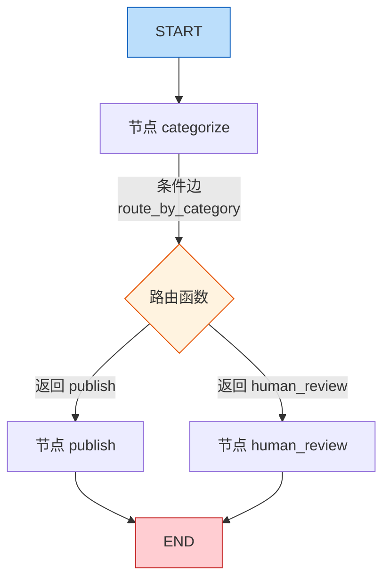
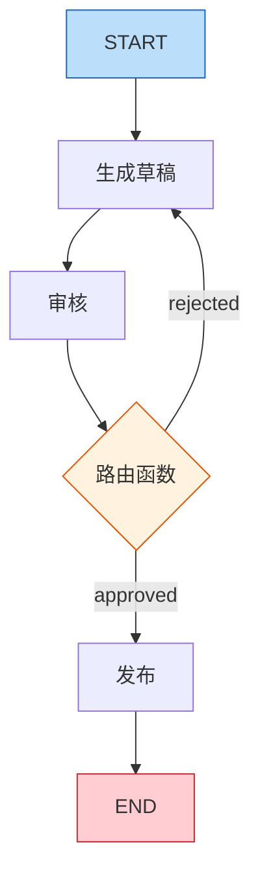
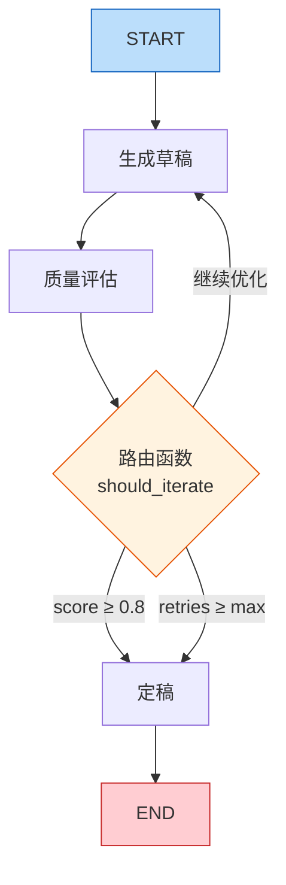

# 11-条件边与循环

# 条件边与循环：让工作流动起来

## 一、本章导学

　　　　上一篇我们掌握了 LangGraph 的基础：状态定义、节点注册、普通边连接，以及 `compile()`​ + `invoke()` 的编译运行流程。但那只构建了一个"直来直去"的线性工作流——检测、分类、发布，一条路走到底。

　　　　现实中的工作流远比线性复杂。你需要根据运行时的状态动态选择执行路径——如果内容安全就走发布分支，如果不安全就走审核分支。你还需要在结果不理想时回退重试——生成草稿，审核不通过，修改后重新生成。这些"条件分支"和"循环迭代"的能力，是让工作流真正"流动"起来的关键。

　　　　本篇将系统讲解条件边`add_conditional_edges`​和 `Command` 对象两种路由方式，以及循环控制、错误恢复等进阶技巧。最终效果：一个包含智能路由和迭代优化的完整工作流。

---

## 二、条件边

### 2.1 add_conditional_edges 基础

　　　　条件边根据当前状态决定下一个节点。你需要提供一个**路由函数**，它接收状态，返回下一个节点的名称：

```python
def route_by_category(state: ContentReviewState) -> str:
    if state["needs_review"]:
        return "human_review"
    return "publish"

builder.add_conditional_edges("categorize", route_by_category, {
    "publish": "publish",
    "human_review": "human_review",
})
```

　　　　`add_conditional_edges`​ 接收三个参数：源节点名称、路由函数、**可选的**映射字典。映射字典定义了路由函数的返回值与目标节点名称的对应关系。路由函数返回 `"publish"`​ 就执行 `publish`​ 节点，返回 `"human_review"`​ 就执行 `human_review`​ 节点。**如果省略映射字典，路由函数的返回值会被直接作为目标节点名称。**

　　　　条件边是 LangGraph 实现分支逻辑的核心机制。它让你把 if-else 从代码层面提升到图层面——分支逻辑集中在一个路由函数中，工作流的拓扑结构在图的定义中一目了然。



　　　上图展示了条件边的工作方式：`categorize`​ 节点执行完后，路由函数 `route_by_category`​ 根据状态中的 `needs_review`​ 字段决定走 `publish`​ 还是 `human_review` 分支。

### 2.2 路由函数设计

　　　路由函数的设计直接影响图的可读性和可维护性。以下是几种常见的路由函数模式：

　　**简单布尔路由**是最常见的模式，根据一个布尔标记决定走哪条分支：

```python
def route_after_review(state: ReviewState) -> str:
    if state["approved"]:
        return "publish"
    return "revise"
```

　　**多值枚举路由**根据状态中的枚举值选择分支：

```python
from typing import Literal

def route_by_type(state: DispatchState) -> Literal["email", "sms", "push"]:
    msg_type = state["message_type"]
    if msg_type == "urgent":
        return "sms"
    elif msg_type == "normal":
        return "email"
    else:
        return "push"
```

　　**嵌套条件路由**在路由函数内部做更复杂的判断，但建议保持简洁——如果逻辑太复杂，考虑拆分为多个节点：

```python
def route_by_content(state: ContentState) -> str:
    if state["has_sensitive_words"]:
        return "human_review"
    elif state["category"] == "finance":
        return "compliance_check"
    else:
        return "publish"
```

　　　　映射字典可以省略。如果省略第三个参数，LangGraph 会把路由函数的返回值直接作为目标节点名称。但显式指定映射字典有助于编译阶段检查路由函数的返回值是否合法。

### 2.3 Command 对象

　　　　除了 `add_conditional_edges`​，LangGraph 还提供了另一种控制流方式：`Command`​ 对象。它允许节点函数在返回时不仅更新状态，还能**显式指定接下来要执行的节点**。

```python
from langgraph.types import Command
from typing import Literal

def node_a(state: State) -> Command[Literal["b", "c", "__end__"]]:
    select = state["nList"][-1]
    if select == "b":
        next_node = "b"
    elif select == "c":
        next_node = "c"
    else:
        next_node = "__end__"

    return Command(
        update={"nList": [select]},
        goto=next_node,
    )
```

　　　　`Command`​ 对象有两个关键字段：`update`​ 用于更新状态，`goto` 用于指定下一个节点。这意味着路由逻辑被内置到了节点函数中，不需要在图中单独定义条件边。

　　　　使用 `Command` 时，图定义可以简化为：

```python
builder = StateGraph(State)
builder.add_node("a", node_a)
builder.add_node("b", node_b)
builder.add_node("c", node_c)
builder.add_edge(START, "a")
builder.add_edge("b", END)
builder.add_edge("c", END)
graph = builder.compile()
```

　　　注意使用 `Command`​ 时不需要调用 `add_conditional_edges`，因为路由逻辑已经内置在节点函数中了。

　　　**两种方式如何选择？**   推荐优先使用 `add_conditional_edges`​。原因在于**关注点分离**——将"做什么"（节点逻辑）和"接下来去哪"（路由逻辑）分开定义，使得图的结构更加清晰。图的 `builder`​ 本身就能完整反映业务逻辑的流转，而不是将控制流隐藏在节点的实现细节里。`Command` 更适合作为高级场景下的补充手段。

---

## 三、循环控制

### 3.1 while 循环模式

　　　　　　条件边也可以实现循环。如果路由函数返回的节点名称是图中之前已经执行过的节点，LangGraph 会回到那个节点重新执行。这为"检查-处理-再检查"这类迭代模式提供了天然支持。



　　　　　　上图展示了一个生成-审核循环：`generate` 节点生成草稿，`review` 节点审核，如果不通过就回到 `generate` 重新生成。这个循环会一直进行，直到审核通过或达到最大重试次数。

### 3.2 计数器退出

　　　　　　循环必须有退出条件，否则会无限运行。最常见的退出方式是用计数器：

```python
class IterationState(TypedDict):
    content: str
    draft: str
    retry_count: int
    max_retries: int
    quality_score: float

def should_continue(state: IterationState) -> str:
    if state["quality_score"] >= 0.8:
        return "publish"
    if state["retry_count"] >= state["max_retries"]:
        return "give_up"
    return "regenerate"
```

　　　　`retry_count`​ 在每次循环时递增，当达到 `max_retries` 时强制退出。这是防御性编程的基本做法——即使业务逻辑判断永远不会触发无限循环，计数器也能作为安全兜底。

　　　　在节点中更新计数器：

```python
def regenerate(state: IterationState) -> dict:
    new_count = state["retry_count"] + 1
    response = llm.invoke(f"请修改以下内容：{state['draft']}")
    return {"draft": response.content, "retry_count": new_count}
```

### 3.3 条件退出

　　　　除了计数器，还可以基于业务条件退出循环。典型的做法是用一个质量评分或审核标记：

```python
def evaluate_quality(state: IterationState) -> dict:
    prompt = f"请给以下内容打分（0-1），只返回数字：\n{state['draft']}"
    response = llm.invoke(prompt)
    try:
        score = float(response.content.strip())
    except ValueError:
        score = 0.0
    return {"quality_score": score}

def should_iterate(state: IterationState) -> str:
    if state["quality_score"] >= 0.8:
        return "publish"
    if state["retry_count"] >= state["max_retries"]:
        return "end"
    return "regenerate"
```

　　　　这种模式在 AI 生成内容的场景中很常见：生成 → 评估 → 不满意则修改后重新生成。每次循环都由 LLM 自动评估质量，只有达到阈值才通过。

---

## 四、错误恢复

### 4.1 节点级错误处理

　　　　在实际运行中，节点可能因为各种原因失败：LLM API 超时、网络错误、数据格式异常。LangGraph 本身不会自动处理节点内部的异常——节点函数抛出异常时，图的执行会中断。因此，**错误处理应该在节点函数内部完成**。

```python
def safe_analyze(state: WorkflowState) -> dict:
    try:
        response = llm.invoke(state["content"])
        result = response.content.strip()
    except Exception as e:
        result = f"分析失败：{str(e)}"
    return {"analysis_result": result}
```

　　　　对于可能失败但不致命的操作，节点可以返回一个错误标记而不是抛出异常：

```python
def classify_content(state: WorkflowState) -> dict:
    try:
        response = llm.invoke(f"分类：{state['content']}")
        category = response.content.strip().lower()
        if category not in ["tech", "finance", "other"]:
            category = "other"
        return {"category": category, "error": None}
    except Exception as e:
        return {"category": "other", "error": str(e)}
```

　　　　然后在路由函数中根据 `error` 字段决定后续路径：

```python
def route_after_classify(state: WorkflowState) -> str:
    if state.get("error"):
        return "fallback"
    return "process"
```

### 4.2 重试策略

　　　　　结合循环控制和错误处理，可以实现自动重试策略：

```python
import time

class RetryState(TypedDict):
    task: str
    result: str
    retry_count: int
    max_retries: int
    last_error: str

def execute_with_retry(state: RetryState) -> dict:
    try:
        response = llm.invoke(state["task"])
        return {"result": response.content, "last_error": "", "retry_count": state["retry_count"] + 1}
    except Exception as e:
        return {
            "result": "",
            "last_error": str(e),
            "retry_count": state["retry_count"] + 1,
        }

def route_after_execution(state: RetryState) -> str:
    if state["result"]:
        return "success"
    if state["retry_count"] >= state["max_retries"]:
        return "fail"
    return "execute"

builder = StateGraph(RetryState)
builder.add_node("execute", execute_with_retry)
builder.add_node("success", lambda s: {"final_status": "完成：" + s["result"]})
builder.add_node("fail", lambda s: {"final_status": "失败：" + s["last_error"]})

builder.add_edge(START, "execute")
builder.add_conditional_edges("execute", route_after_execution, {
    "success": "success",
    "fail": "fail",
    "execute": "execute",
})
builder.add_edge("success", END)
builder.add_edge("fail", END)
```

---

## 五、代码实战

### 5.1 智能路由工作流

　　　　下面构建一个智能客服路由系统。根据用户消息的内容和类型，自动分配到不同的处理通道：

```python
# -*- encoding: utf-8 -*-
'''
@File        :   demo11_conditional_edges_demo01.py
@Time        :   2026/04/28 16:45:35
@Author      :   xcy.小相 
@Version     :   1.0
@Description :   11-条件边与循环
'''
from typing import TypedDict, Literal
from langchain_openai import ChatOpenAI
from langgraph.graph import StateGraph, START, END
from langchain.chat_models import init_chat_model
from dotenv import load_dotenv
import os

load_dotenv()

llm = init_chat_model(
    model=os.getenv("MODEL_NAME"),
    api_key=os.getenv("OPENAI_API_KEY"),
    base_url=os.getenv("OPENAI_BASE_URL"),
    model_provider="openai"
)

class DispatchState(TypedDict):
    message: str
    category: str
    priority: str
    response: str

def classify_message(state: DispatchState) -> dict:
    prompt = f"""请判断以下用户消息的类别和优先级。

消息：{state['message']}

请用以下格式回复（只返回这两行）：
类别：technical/billing/complaint/other
优先级：high/medium/low"""

    response = llm.invoke(prompt)
    content = response.content.strip()

    category = "other"
    priority = "medium"

    for line in content.split("\n"):
        if "类别" in line:
            cat = line.split("：")[-1].strip().lower()
            if cat in ["technical", "billing", "complaint", "other"]:
                category = cat
        if "优先级" in line:
            pri = line.split("：")[-1].strip().lower()
            if pri in ["high", "medium", "low"]:
                priority = pri

    return {"category": category, "priority": priority}

def handle_technical(state: DispatchState) -> dict:
    return {"response": f"[技术支持] 已为您创建技术工单，问题：{state['message'][:50]}"}

def handle_billing(state: DispatchState) -> dict:
    return {"response": f"[账单服务] 已转交财务团队处理，问题：{state['message'][:50]}"}

def handle_complaint(state: DispatchState) -> dict:
    return {"response": f"[投诉处理] 已升级为高优先级工单，问题：{state['message'][:50]}"}

def handle_other(state: DispatchState) -> dict:
    return {"response": f"[通用服务] 已记录您的问题，将尽快回复：{state['message'][:50]}"}

def route_by_category(state: DispatchState) -> str:
    return state["category"]

builder = StateGraph(DispatchState)
builder.add_node("classify", classify_message)
builder.add_node("technical", handle_technical)
builder.add_node("billing", handle_billing)
builder.add_node("complaint", handle_complaint)
builder.add_node("other", handle_other)

builder.add_edge(START, "classify")
builder.add_conditional_edges("classify", route_by_category, {
    "technical": "technical",
    "billing": "billing",
    "complaint": "complaint",
    "other": "other",
})
builder.add_edge("technical", END)
builder.add_edge("billing", END)
builder.add_edge("complaint", END)
builder.add_edge("other", END)

dispatch_graph = builder.compile()

messages = [
    "我的应用突然无法连接数据库了，报错 Connection Timeout",
    "上个月的账单多扣了我200块钱，请帮我核实",
    "你们的服务太差了，我要投诉",
    "你们几点下班？",
]

for msg in messages:
    result = dispatch_graph.invoke({
        "message": msg, "category": "", "priority": "", "response": ""
    })
    print(f"消息：{msg[:30]}...")
    print(f"结果：{result['response']}")
    print()
```

　　　　运行结果：

```
消息：我的应用突然无法连接数据库了，报错...
结果：[技术支持] 已为您创建技术工单，问题：我的应用突然无法连接数据库了，报错 Connection Timeout

消息：上个月的账单多扣了我200块钱，请帮我核实...
结果：[账单服务] 已转交财务团队处理，问题：上个月的账单多扣了我200块钱，请帮我核实

消息：你们的服务太差了，我要投诉...
结果：[投诉处理] 已升级为高优先级工单，问题：你们的服务太差了，我要投诉

消息：你们几点下班？...
结果：[通用服务] 已记录您的问题，将尽快回复：你们几点下班？
```

### 5.2 迭代优化循环

　　　下面构建一个文章生成系统，LLM 生成草稿后自动评估质量，不达标则修改后重新生成：

```python
# -*- encoding: utf-8 -*-
'''
@File        :   demo11_conditional_edges_demo02.py
@Time        :   2026/04/28 16:45:35
@Author      :   xcy.小相 
@Version     :   1.0
@Description :   11-条件边与循环
'''
from typing import TypedDict
from langgraph.graph import StateGraph, START, END
from langchain.chat_models import init_chat_model
from dotenv import load_dotenv
import os
from pydantic import BaseModel, Field

load_dotenv()

llm = init_chat_model(
    model=os.getenv("MODEL_NAME"),
    api_key=os.getenv("OPENAI_API_KEY"),
    base_url=os.getenv("OPENAI_BASE_URL"),
    model_provider="openai",
    timeout=120,
)

class ArticleScore(BaseModel):
    """
    文章质量评分
    """
    score: float = Field(description="文章质量评分")
    feedback: str = Field(description="文章质量反馈和修改建议")
    

class WritingState(TypedDict):
    """
    文章创作状态
    """
    topic: str
    draft: str
    feedback: str
    quality_score: float
    retry_count: int
    max_retries: int
    final_article: str
    

def generate_draft(state: WritingState) -> dict:
    """
    生成草稿
    """
    retry_count = state.get("retry_count", 0)

    if retry_count == 0:
        prompt = f"请为以下话题撰写一篇 100 字左右的短文：\n{state['topic']}"
    else:
        prompt = (
            f"请根据反馈修改文章：\n"
            f"话题：{state['topic']}\n"
            f"上一版草稿：{state['draft']}\n"
            f"修改建议：{state['feedback']}\n\n"
            f"请修改后重新输出完整文章。"
        )

    response = llm.invoke(prompt)
    return {
        "draft": response.content,
        "retry_count": retry_count + 1,
    }

def evaluate_quality(state: WritingState) -> dict:
    """
    评估文章质量
    """
    prompt = f"""请给以下文章打分（0到1之间的数字），评估其内容质量、结构清晰度和语言流畅度。并给出修改建议。

        文章：
        {state['draft']}"""
    structed_llm = llm.with_structured_output(ArticleScore)
    response = structed_llm.invoke(prompt)
    
    try:
        score = response.score
        score = max(0.0, min(1.0, score))
    except ValueError:
        score = 0.5
        
    feedback = response.feedback

    return {"quality_score": score, "feedback": feedback}

def should_iterate(state: WritingState) -> str:
    """
    判断是否继续迭代
    """
    print(f"判断是否继续迭代，当前质量评分：{state['quality_score']}, 当前重试次数：{state['retry_count']}, 修复建议：{state['feedback']}")

    if state["quality_score"] >= 0.8:
        return "finalize"
    if state["retry_count"] >= state["max_retries"]:
        return "finalize"
    return "regenerate"

def finalize(state: WritingState) -> dict:
    """
    最终化文章创作
    """
    note = ""
    if state["quality_score"] < 0.8:
        note = f"（质量评分 {state['quality_score']}，已达到最大重试次数）"
    else:
        note = f"（质量评分 {state['quality_score']}）"
    return {"final_article": state["draft"] + "\n\n" + note}

builder = StateGraph(WritingState)
builder.add_node("generate", generate_draft)
builder.add_node("evaluate", evaluate_quality)
builder.add_node("finalize", finalize)

builder.add_edge(START, "generate")
builder.add_edge("generate", "evaluate")
builder.add_conditional_edges("evaluate", should_iterate, {
    "regenerate": "generate",
    "finalize": "finalize",
})
builder.add_edge("finalize", END)

writing_graph = builder.compile()

result = writing_graph.invoke({
    "topic": "人工智能对日常生活的影响",
    "draft": "",
    "feedback": "",
    "quality_score": 0.0,
    "retry_count": 0,
    "max_retries": 3,
    "final_article": "",
})

print(f"最终文章：\n{result['final_article']}")
```



　　　　上图展示了迭代优化循环的完整流程：生成草稿 → 质量评估 → 根据评分决定是继续优化还是定稿。循环在质量达标或达到最大重试次数时退出。

---

## 六、常见陷阱与调试

　　　　**无限循环**。循环必须有退出条件。即使你确信业务逻辑不会无限循环，也要加一个计数器兜底。无限循环的图会持续消耗 API 额度和计算资源，直到超时。

　　　　**路由函数返回值不在映射中**。`add_conditional_edges`​ 的映射字典必须覆盖路由函数所有可能的返回值。如果有遗漏，运行时会抛出 `ValueError`​。建议在路由函数中使用 `Literal` 类型标注，让 IDE 提醒你所有可能的分支。

　　　　**循环中状态的副作用**。每次循环迭代都会更新状态。如果某个字段在循环中被修改但没有重置，可能导致意外的累积效果。比如 `retry_count` 应该在进入循环前初始化为 0，而不是依赖前一次调用的值。

　　　　**调试循环**。`stream` 模式在调试循环时特别有用——你可以看到每一轮迭代的状态变化：

```python
for event in writing_graph.stream({
    "topic": "AI", "draft": "", "feedback": "",
    "quality_score": 0.0, "retry_count": 0,
    "max_retries": 3, "final_article": "",
}):
    node_name = list(event.keys())[0]
    print(f"[{node_name}] {event[node_name]}")
```

---

## 七、本章小结

　　　　本篇从条件边的基础用法讲到循环控制和错误恢复，覆盖了 LangGraph 工作流从静态走向动态的核心能力。

　　　　　　**条件边**是 LangGraph 实现动态路由的核心机制。`add_conditional_edges` 配合路由函数将分支逻辑从代码提升到图层面，`Command` 对象则将路由逻辑内置到节点中。两者各有适用场景，推荐优先使用 `add_conditional_edges` 以保持关注点分离。

　　　　**循环控制**通过条件边返回之前已执行的节点来实现。必须有退出条件：计数器退出是最基本的安全兜底，条件退出根据业务逻辑判断。两者的组合是循环设计的标准模式。

　　　　**错误恢复**在节点函数内部完成。节点可以返回错误标记而不是抛出异常，让路由函数根据错误状态决定后续路径。结合循环控制可以实现自动重试。

---

## 八、扩展阅读

- LangGraph 官方文档 Conditional Edges 章节：[https://langchain-ai.github.io/langgraph/](https://langchain-ai.github.io/langgraph/)
- Command 对象 API 参考：`langgraph.types.Command`
- 本系列下一篇：子图与并行——模块化与性能
- 进阶阅读：LangGraph 人在回路与 `interrupt` 机制

　　‍
