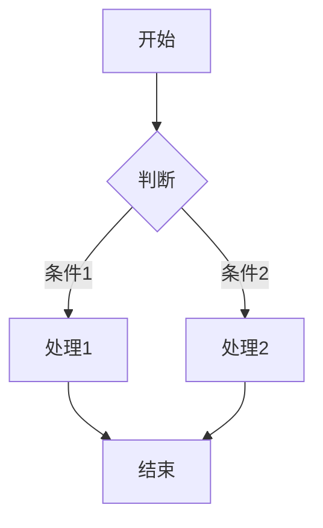
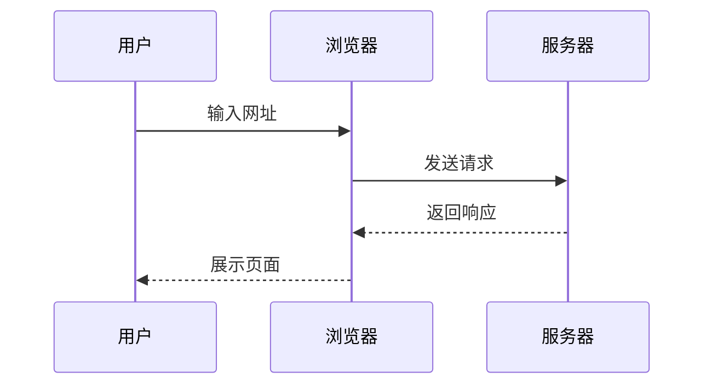
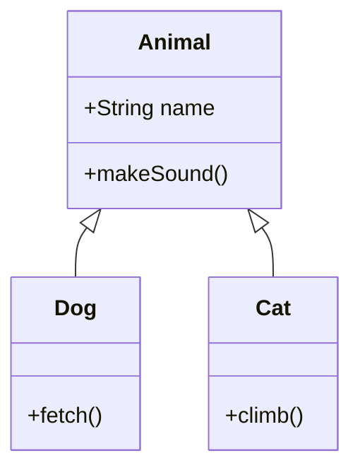

# Mermaid 测试页面

本页面用于测试 Mermaid 图表是否正常渲染。

## 流程图

```mermaid
flowchart TD
    A[开始] --> B{判断}
    B -->|条件1| C[处理1]
    B -->|条件2| D[处理2]
    C --> E[结束]
    D --> E
```

## 时序图

```mermaid
sequenceDiagram
    participant 用户
    participant 浏览器
    participant 服务器

    用户->>浏览器: 输入网址
    浏览器->>服务器: 发送请求
    服务器-->>浏览器: 返回响应
    浏览器-->>用户: 展示页面
```

## 类图

```mermaid
classDiagram
    class Animal {
        +String name
        +makeSound()
    }
    class Dog {
        +fetch()
    }
    class Cat {
        +climb()
    }
    Animal <|-- Dog
    Animal <|-- Cat
```
